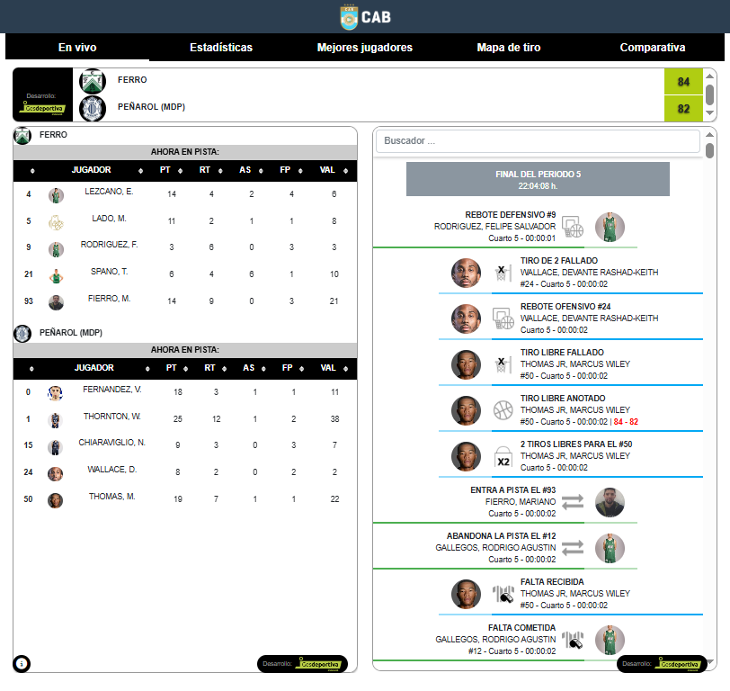
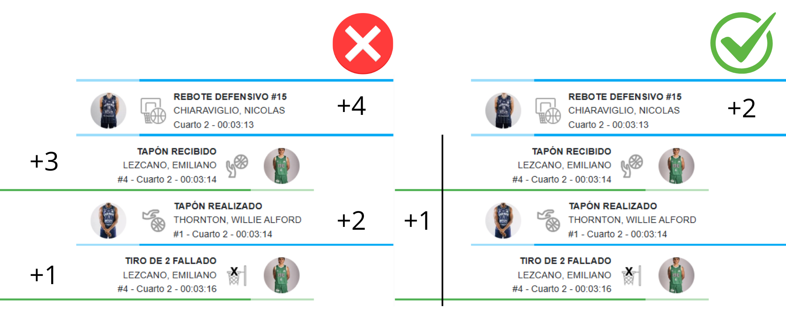

## Generación y preprocesamiento de la base de datos

Una parte central de esta tesina estará dedicada a la construcción de una base de datos *play-by-play* correspondiente a la temporada 2024/2025 de la Liga Nacional de Básquetbol de Argentina (LNB). Este tipo de base registra de manera secuencial todas las acciones ocurridas dentro de un partido. Dado que no existe una fuente oficial que provea los datos en formato estructurado y descargable para su análisis estadístico, fue necesario diseñar y ejecutar un proceso de *web scraping* que permita recolectar, integrar y depurar la información de manera sistemática y reproducible. Los datos necesarios se extrajeron del [Sitio Oficial de la Liga Nacional de Básquet](https://www.laliganacional.com.ar/laliga/) , utilizando librerías de Python como `Selenium` y `BeautifulSoup`.

Posteriormente, se realizó un preprocesamiento orientado a transformar los eventos crudos en un *dataset* apto para la aplicación de los modelos mencionados anteriormente. Como resultado, se obtuvo una tabla ordenada cronológicamente en la cual cada fila corresponde a una posesión del partido, contabilizando los puntos anotados durante esa posesión y los jugadores que formaron parte de la misma, diferenciando sus roles ofensivos y defensivos. Debido a que bajo está metodología se registran cada una de las posesiones del partido de manera secuencial, se denominó a esta estructura final como: base de datos *poss-by-poss*.

### Generación de los datos a partir de técnicas de Web Scraping

#### Listado de links de los partidos

El primer paso consistió en la identificación y recopilación de los enlaces individuales de todos los partidos incluidos en el período de estudio (378 partidos de temporada regular). Para ello, se accedió a la página de la Liga Nacional, [sección Fixture](https://www.laliganacional.com.ar/laliga/fixture), la cual presenta una tabla dinámica con los encuentros disputados.

```{r, echo=FALSE, fig.cap="Fixture dentro de la página web de la LNB.", out.width="70%", fig.align="center"}
knitr::include_graphics("imagen links partidos.png")
```

Dado que la tabla de partidos no se encuentra disponible en el código HTML inicial de la página, sino que es incorporada una vez que el navegador ejecuta los scripts del sitio, fue necesario utilizar Selenium para acceder al contenido en un entorno de navegación real. Este enfoque permitió cargar la página de la misma forma en que lo haría un usuario, esperar a que la tabla de partidos estuviera efectivamente disponible y, recién entonces, extraer el código HTML final.

Una vez hecho esto, se identificaron todas las etiquetas HTML que contenían enlaces a las estadísticas detalladas de cada partido, reconociendo un patrón común en las URLs asociadas a los encuentros individuales: "estadisticascabb.gesdeportiva.es/partido/". Estos enlaces fueron almacenados en una estructura de datos, evitando duplicaciones, y posteriormente volcados a un archivo de texto (.txt). Dicho archivo constituyó el insumo básico para el proceso posterior de scraping masivo, sobre los cuales se iterará para obtener así la información correspondiente a cada una de las acciones de cada partido.

Esta estrategia permitió, además, asegurar la reproducibilidad del proceso, ya que el listado de partidos es eliminado de la página web una vez terminada la temporada, quedando fijado y documentado de manera explícita para su uso, en caso de ser requerido.

#### Base de datos *play-by-play*

Una vez obtenido el listado completo de enlaces correspondientes a cada uno de los partidos en el período de estudio, se procedió a la extracción del registro de acciones del partido (*play-by-play*) para cada uno de ellos. Para esto, se accedió individualmente a la página de estadísticas, particularmente a la pestaña denominada “en vivo”, donde se presenta el detalle secuencial de los eventos del encuentro.

Esta sección del sitio web contiene una tabla que se genera dinámicamente y que registra, en orden cronológico, todas las acciones ocurridas durante el partido.

```{r, echo=FALSE, fig.cap="Pestaña en vivo dentro de la página web de estadísticas de un partido", out.width="70%", fig.align="center"}

```

En dicha tabla, cada acción del partido se encuentra representada como un elemento ordenado de manera cronológica que incluye información textual sobre el tipo de acción (por ejemplo, lanzamiento convertido, falta, pérdida, etc), el jugador que realiza dicha acción, el cuarto de juego, el tiempo restante en el cuarto y , en caso de ser una acción donde se generan puntos, el marcador parcial en ese momento del partido. Esta información fue sistemáticamente extraída y almacenada en una estructura tabular, conservando el orden temporal de las acciones.

Este procedimiento se aplicó de forma idéntica a todos los partidos de la temporada analizada, utilizando como insumo los enlaces previamente identificados. Finalmente, los registros de acciones obtenidos para cada encuentro fueron concatenados en una única base de datos de *play-by-play*, incorporando un identificador de partido que permite distinguir y vincular las acciones correspondientes a cada juego.

Cabe destacar que, el *play-by-play* resultante constituye una secuencia detallada de eventos, pero en su forma original no incluye una identificación explícita del equipo asociado a cada acción, lo cual resulta indispensable a la hora de poder determinar a todos los jugadores presentes, tanto de manera ofensiva como defensiva, en cada una de las acciones del partido.

#### Tabla de jugadores-equipos

Para resolver este problema, se obtuvo dicha información a partir de los datos provenientes del *Box Score*, los cuales se encuentran en la pestaña "Estadísticas" de la página web del partido. Aquí encontraremos información referida a cada uno de los jugadores anotados en la plantilla de ambos equipos.

```{r, echo=FALSE, fig.cap="Ejemplo del Box Score de un partido", out.width="70%", fig.align="center"}
knitr::include_graphics("imagen box score.png")
```

En esta pestaña, la información se organiza en dos tablas con estadísticas individuales de los jugadores, una correspondiente al equipo local y otra al equipo visitante, las cuales aparecen en el mismo orden en que se muestran los nombres de los equipos en la interfaz del sitio web. A partir de esta estructura, se extrajo para cada jugador su nombre completo ,el equipo al que pertenece y la cantidad de minutos disputados en dicho partido, generándose así una tabla de correspondencia jugador–equipo.

Esta tabla constituye un diccionario que permite asociar a cada jugador con su respectivo equipo, y es utilizada posteriormente como insumo para realizar dicha correspondencia en cada acción de la base *play-by-play*. A su vez, mediante la adición de la cantidad de minutos en el partido se podrá realizar un filtrado de jugadores que hayan participado menos de cierto umbral requerido de tiempo durante la temporada, cuestión fundamental a tratar posteriormente en este trabajo.

### Preprocesamiento de los datos

#### Integración del box score con el play-by-play

Una vez construida la tabla jugadores-equipos, se procedió a integrar dicha información con la base de datos play-by-play. Para ello, los nombres de los jugadores fueron previamente normalizados con el objetivo de reducir posibles inconsistencias de formato (espacios adicionales, diferencias menores de escritura), y luego se utilizó la correspondencia jugador–equipo para asignar a cada acción del *play-by-play* el equipo del jugador involucrado.

De este modo, cada acción queda asociada explícitamente a uno de los dos equipos del partido, aun cuando dicha información no se encuentre disponible de forma directa en el registro original del *play-by-play*. Este procedimiento permite identificar que jugadores estarán en cancha para cada uno de los equipos, permitiendo construir los quintetos en cada momento del partido.

#### Identificación de los quintetos en cancha al momento de la acción

A partir de la nueva tabla generada, se procedió a construir la presencia de los jugadores en cancha a lo largo del partido. Para ello, se identificaron las acciones asociadas a sustituciones, distinguiendo entre entradas (acción = ENTRA A PISTA) y salidas de jugadores (acción = ABANDONA LA PISTA).

```{r, echo=FALSE, fig.cap="Ejemplo de secuencia de acciones con sustitución", out.width="50%", fig.align="center"}
knitr::include_graphics("imagen sustitucion.png")
```

\newpage

El conjunto de jugadores en cancha se actualiza a medida que se recorren las acciones del partido, reiniciándose al comienzo de cada cuarto. De este modo, para cada instante del juego se obtiene el conjunto de jugadores activos en cancha.

Utilizando la tabla jugadores-equipos construida previamente, cada jugador en cancha fue asignado al equipo local o visitante, permitiendo reconstruir los quintetos de ambos equipos en cada acción del partido. Este paso resulta esencial para caracterizar el contexto en el que ocurre cada acción, ya que al conocer el equipo al que pertenece el jugador que realiza la acción podemos inferir simultáneamente los jugadores ofensivos y defensivos presentes en cancha en cada momento.

Una vez reconstruidos los quintetos en cancha para cada acción, se incorporó un control de consistencia basado en la cantidad total de jugadores activos. Dado que una situación de juego regular involucra diez jugadores (cinco por equipo), se podrán identificar aquellas acciones en las que la cantidad total de jugadores en cancha fuera superior o inferior a dicho umbral.

#### Detección de errores en la carga de los datos

Un factor importante a tener en cuenta es que los datos que se encuentran en el *play-by-play* son cargados de manera manual por las mesas de control a medida que se desarrolla el partido. Esta tarea se realiza en el contexto altamente dinámico de un partido, donde las acciones se suceden con rapidez, lo que puede dar lugar a ciertos errores en la registración de eventos. En consecuencia, el conjunto de datos original puede contener inconsistencias que deben ser identificadas y corregidas antes de su utilización en este trabajo.

Para intentar detectar posibles errores en la conformación de los quintetos en cancha, se construyó , tal como se menciono anteriormente, una variable que contabiliza la cantidad de jugadores presentes en cada quinteto en cada una de las acciones del partido. Dicha variable debería contabilizar sistemáticamente el valor cinco (5) para ambos equipos en todas las acciones registradas.

De esta manera se detectó un caso puntual en el partido de ZARATE BASKET vs ATENAS (C), donde el quinteto local registraba 6 jugadores en cancha. Esta inconsistencia se observó desde el inicio del segundo cuarto (con 10:00 minutos restantes) hasta el minuto 4:42 del mismo período.

Para subsanar este inconveniente, se realizó una revisión manual del play-by-play original disponible en la página web y se pudo identificar que al comienzo del segundo cuarto se había registrado incorrectamente el ingreso de seis jugadores en lugar de cinco, lo cual constituye un error atribuible a la mesa de control. Una vez identificada esta problemática, se reviso el contexto de las siguientes jugadas y pudo determinarse que el jugador MERCHANT, EDGAR HENRY no se encontraba realmente en cancha durante ese tramo del partido.

En consecuencia, se procedió a corregir el error eliminando al jugador mencionado de la variable correspondiente al quinteto local en las acciones afectadas, así como ajustando el conteo de jugadores en cancha. De esta manera, se restauró la consistencia lógica de los quintetos y se garantizó la validez de la información utilizada en las etapas posteriores del análisis.

### Generación de la base de datos *poss-by-poss*

Como resultado de las etapas anteriores, pudimos obtener una base de datos unificada donde cada fila se corresponde con cada una de las jugadas o acciones que suceden dentro del partido, incluyendo información relevante para este trabajo como lo es el marcador del partido al momento de la acción, la composición de los quintetos en cancha y la condición de local o visitante. Sin embargo, para poder aplicar los modelos estadísticos mencionados en esta tesina de grado, resulta necesario agrupar estas acciones en **posesiones**, entendidas como el conjunto de acciones ocurridas antes de que cambie el control de la pelota.

Para llevar a cabo este proceso fue necesario definir una metodología adecuada que permita diferenciar qué acciones pertenecían a una misma posesión, y en que momento comenzaba una distinta.

#### Eliminación de acciones no relevantes para la posesión

Este procedimiento no pudo realizarse de manera directa, ya que, a pesar de contar con la información secuencial sobre el que equipo realizaba cada acción, no todo cambio en el equipo asociado a una acción implica necesariamente un cambio de posesión del balón. Existen situaciones en las que se registran acciones del equipo defensor dentro de una posesión del equipo atacante. A los cuales se ha decidido por llamar como "acciones intrusas".

```{r, echo=FALSE, fig.cap="Ejemplo del Box Score de un partido", out.width="70%", fig.align="center"}

```

Luego de hacer una revisión manual en un conjunto limitado de partidos, se llegó a la definición de que el siguiente conjunto de acciones suelen ser siempre acciones intrusas o nunca resultan informativas para la delimitación de las posesiones. En consecuencia se ha decidido eliminar las filas en las que ocurren estas acciones en la base de datos.

Estas acciones son:

\begin{center}
Tabla 1: Acciones eliminadas por no ser informativas para la delimitación de las posesiones
\end{center}

| Nº  | Acción                                          |
|-----|-------------------------------------------------|
| 1   | ENTRA A PISTA                                   |
| 2   | INICIO DEL PERIODO                              |
| 3   | FINAL DEL PERIODO                               |
| 4   | ABANDONA LA PISTA                               |
| 5   | TAPON REALIZADO                                 |
| 6   | TECNICA                                         |
| 7   | TECNICA BANQUILLO (C)                           |
| 8   | TECNICA BANQUILLO (B)                           |
| 9   | TECNICA DESCALIFICANTE                          |
| 10  | TECNICA DESCALIFICANTE ACOMPAÑANTE NO PARTICIPA |
| 11  | TECNICA-E (ALINEACIÓN ILEGAL)                   |
| 12  | TIEMPO MUERTO SOLICITADO                        |
| 13  | ANTIDEPORTIVA                                   |

#### Manejo de otro tipo de acciones particulares

1)  Tratamiento de la flecha de alternancia

En el básquetbol bajo reglamento FIBA, la flecha de alternancia determina la posesión del balón en los inicios de cuarto o en situaciones de salto entre dos. Cuando este evento aparece registrado en el *play-by-play*, el equipo que obtiene la posesión es el opuesto al que figura inicialmente asociado a la acción.

Para corregir este comportamiento, se implementó una regla que invierte el equipo asignado a la acción en presencia de una flecha de alternancia, garantizando la correcta identificación del equipo en control del balón.

2)  Eliminación de rebotes defensivos al final de cada cuarto

Se detectó que, en algunos casos, el *play-by-play* registra un rebote defensivo como última acción de un cuarto. Ya que esta situación sucede quedando unos pocos segundos para terminar el cuarto, no debe ser contabilizada como una posesión real, y para evitar dichas situaciones se eliminó dichas acciones de la base de datos.

3)  Reglas específicas para el tratamiento de faltas ofensivas

Las faltas ofensivas representan un caso particular dentro del play-by-play, ya que no son diferenciadas de las faltas defensivas en la descripción de la acción, y tienen una diferencia fundamental a la hora de definir las posesiones. Por un lado, las faltas defensivas corresponden a una "acción intrusa" y deben ser eliminadas de la base, mientras que las faltas ofensivas siempre implican un cambio inmediato de posesión y, en ocasiones, pueden ser la única acción que realice un equipo dentro de una posesión, por lo que en esos casos puntuales dicha acción debe conservarse. 

En consecuencia, se desarrolló un conjunto de reglas basadas en el contexto de la acción previa para decidir si una falta debe ser conservada o eliminada del registro. Particularmente, se definió que: una falta debe conservarse si el equipo que la comete es distinto al equipo que realizó la acción inmediata anterior, siempre que dicha acción previa sea:

1) un lanzamiento fallido.
2) una pérdida de balón.
3) Una anotación con una separación temporal suficiente que indique el transcurso de una nueva posesión.

Todas las faltas que no cumplían esta condición fueron eliminadas para evitar errores en el conteo de posesiones.

-----ejemplo de falta ofensiva-------

#### Identificación de la finalización de las posesiones

Una vez realizada está tarea de preprocesamiento anteriormente mencionada, se incorporó un identificador preliminar de posesión, basado en dos criterios fundamentales: el cambio de equipo en control del balón y el cambio de cuarto. De manera que cada vez que ocurre alguno de estos eventos, se identifica como el inicio una nueva posesión.

-----ejemplo------

De este modo, se seleccionaron las filas correspondientes a los eventos finales de cada posesión, descartando las acciones intermedias que no determinan su conclusión.

#### Cálculo de puntos por posesión

Para obtener la cantidad de puntos obtenidos en cada posesión, se calculó la diferencia entre el puntaje acumulado del equipo atacante al final de la posesión y el puntaje acumulado registrado al cierre de la posesión inmediatamente anterior. De esta manera, cada posesión queda caracterizada por una variable discreta que representa su resultado ofensivo en términos de puntos anotados.

#### Identificación de jugadores ofensivos y defensivos en cancha

Con el objetivo de poder distinguir la participación individual de los jugadores en cada posesión, se utilizó la información de los quintetos en cancha previamente reconstruidos durante el preprocesamiento. Para cada posesión se identificaron los cinco jugadores del equipo atacante y los cinco jugadores del equipo defensor.

A partir de esta información se construyó una representación matricial de jugadores por posesión, donde cada jugador de la temporada cuenta con dos variables indicadora. En la cual, la primer variable Dummie asigna a cada jugador un 1 si el jugador forma parte del quinteto ofensivo y 0 en caso contratrio; mientras que la segunda variable Dummie asigna un -1 si el jugador forma parte del quinteto defensivo, y 0 en otro caso. Este esquema permite modelar de manera explícita la contribución ofensiva y defensiva de manera independiente/separada para cada uno de los jugadores que han participado en al menos un partido dentro de la temporada en estudio.

### Base de datos final: *poss-by-poss*

A través de este proceso, se generó una base de datos que permitirá modelar la cantidad de puntos por posesión teniendo en cuenta los jugadores presentes en cancha, dicha base cuenta con la información correspondiente a 58.625 posesiones, asociadas a 378 partidos disputados en la temporada en estudio.

Las variables presentes son las siguientes:

`puntos_pos` = Cantidad de puntos en la posesión.

`cuarto` = Cuarto en el que se desarrollo la posesión.

`tiempo` = Tiempo restante del cuarto en el momento que finaliza la acción.

`equipo_accion` = Nombre del equipo que está atacando en la posesión.

`localia_accion` = Condición de localia del equipo que está atacando en la posesión.

Y se cuenta con variables indicadoras referentes a las presencias ofensivas y defensivas al momento de la posesión para cada uno de los jugadores que hayan completado al menos una posesión a lo largo de la temporada, contabilizando de esta manera otras 700 (350 indicadoras ofensivas y 350 indicadoras defensivas) variables adicionales dentro del dataset.
