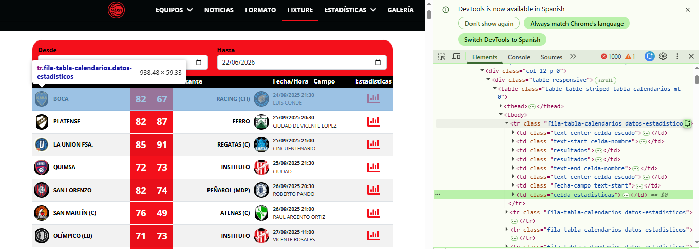
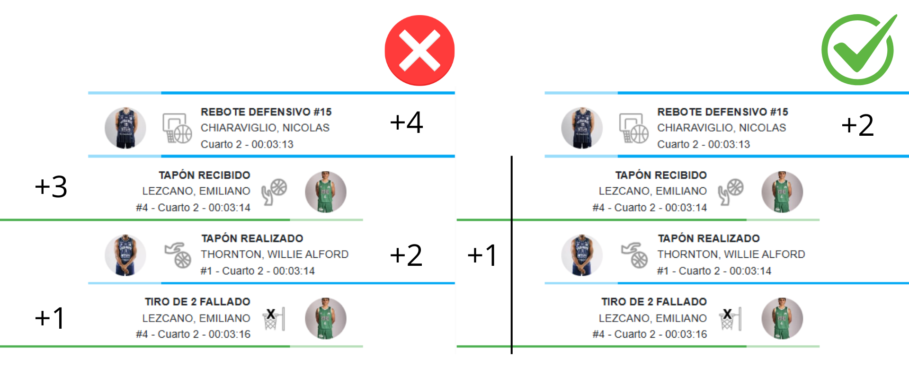

\newgeometry{left=2.5cm, right=2.5cm, top=2.5cm, bottom=2.5cm}
\begin{titlepage}
\centering

% --- Título del proyecto ---
{\Huge \textbf{Métrica RAPM: Evaluación del impacto ofensivo y defensivo de los jugadores de la Liga Nacional de Básquetbol en Argentina}\par}

\vspace{1.5cm}

% --- Subtítulo ---
{\LARGE \textbf{Tesina de grado}\par}

\vspace{2cm}

% --- Datos del autor y directores ---
{\Large Estudiante: Simón Pedro Gazze\par}
{\Large Director: Andrés Sosa\par}
{\Large Co-directora: Cristina Cuesta\par}

\vspace{2cm}

% --- Fecha ---
{\Large Fecha: 31 de agosto de 2026\par}

\vfill

% --- Logo centrado ---
\includegraphics[height=2.8cm]{Logo-unr.png}  % Cambiá por unr.png si corresponde

\end{titlepage}

\pagebreak

\restoregeometry

\newpage

\pagenumbering{gobble}

```{r, echo=FALSE}
knitr::opts_chunk$set(
  fig.pos = "H",
  echo = FALSE
)
```

```{r, echo=FALSE, message=FALSE}
library(knitr)
library(kableExtra)
library(dplyr)
library(gt)
library(htmltools)
library(scales)
library(stringr)
```

# Resumen {-}

El crecimiento de la analítica deportiva ha impulsado el desarrollo de métricas destinadas a evaluar con mayor precisión la contribución de los jugadores al rendimiento de sus equipos. Particularmente en el básquetbol, las estadísticas individuales derivadas del box score presentan limitaciones para capturar el impacto real de los jugadores sobre el resultado del juego. Una de las medidas desarrolladas con este propósito es el *plus-minus*, que registra la diferencia de puntos generada mientras un jugador permanece en cancha. Sin embargo, esta métrica presenta dificultades para aislar el efecto propio de cada jugador respecto del contexto en el que participa. En respuesta a esta problemática surge el *Regularized Adjusted Plus Minus* (RAPM), una medida basada en modelos estadísticos que estima el impacto ofensivo y defensivo de cada jugador controlando simultáneamente la presencia de compañeros y rivales en cancha.

El objetivo de este trabajo es estimar el impacto individual de los jugadores de la Liga Nacional de Básquetbol de Argentina durante la temporada 2024/2025 mediante modelos RAPM, construyendo rankings que permitan identificar y comparar sus contribuciones ofensivas y defensivas. Asimismo, se analizan distintas alternativas metodológicas para abordar problemas recurrentes en este tipo de modelos, particularmente la multicolinealidad entre jugadores y la presencia de coeficientes extremos asociados a jugadores con escasa participación en cancha.

<!-- Para esto, se construyó una base de datos *play-by-play* a partir de información obtenida mediante técnicas de *web scraping* sobre los partidos de la temporada regular. Posteriormente -->

Las acciones de juego registradas fueron agrupadas en posesiones, que constituyen la unidad de análisis utilizada para la estimación de las métricas propuestas. Inicialmente, se ajustaron modelos de regresión lineal múltiple, incorporando distintas técnicas de regularización. Posteriormente, se implementaron modelos de regresión logística multinomial que representan de manera más adecuada la naturaleza discreta de la variable respuesta. A partir de las probabilidades estimadas por estos modelos se construyeron métricas basadas en puntos esperados por posesión (EPTS). Finalmente, se propuso una ponderación a dicha métrica denominada wEPTS, que incorpora la participación de cada jugador relativa a las posesiones de su equipo con el objetivo de penalizar a los jugadores con poco tiempo de juego. Los resultados obtenidos muestran que esta métrica presentó un desempeño superior al de las alternativas propuestas, de acuerdo con los distintos criterios de validación utilizados.

Este estudio constituye la primera aplicación de métricas RAPM en la Liga Nacional de Básquetbol de Argentina y aporta una metodología reproducible para la evaluación objetiva del rendimiento individual de los jugadores, contribuyendo al desarrollo de herramientas de analítica deportiva en el contexto del básquetbol argentino.

**Palabras clave**: básquetbol, analítica en el deporte, Liga Nacional de Básquet, plus-minus, RAPM, regresión logística multinomial, regularización.

\newpage
\renewcommand{\contentsname}{Contenido}
\tableofcontents
\newpage
\pagenumbering{arabic}
\setcounter{page}{1}

# Introducción

### Sports Analytics {-}

*Sports Analytics* o analítica en el deporte es un término que refiere a la aplicación de métodos estadísticos para describir, explicar y/o predecir fenómenos vinculados al rendimiento deportivo, tanto a nivel individual como colectivo con el objetivo de facilitar la toma de decisiones de entrenadores o *staff* técnico antes, durante y después de los partidos.

A pesar de que las primeras aplicaciones al análisis de datos al deporte se remontan a mediados del siglo XX, el impulso más significativo ocurrió a partir del año 2000, en particular en el béisbol, con la popularización del enfoque conocido como *sabermetrics*[^1]. Desde entonces, la práctica se extendió a otros deportes como el básquetbol, el fútbol o el tenis; dando lugar a una nueva cultura de toma de decisiones basada en evidencia. Hoy en día, los equipos profesionales, las ligas y las federaciones emplean departamentos especializados en análisis de datos para optimizar estrategias de juego, evaluar el rendimiento de jugadores, prevenir lesiones y gestionar recursos económicos de manera más eficiente.

[^1]: Término utilizado para referirse al análisis estadístico del béisbol, basado en la recopilación y estudio sistemático de datos con el fin de comprender y cuantificar el desempeño de los jugadores y equipos. El nombre proviene de SABR (*Society for American Baseball Research*).

El básquetbol es uno de los deportes que más ha incorporado el análisis estadístico en su evolución reciente. Desde las primeras métricas derivadas del *box score* (resumen estructurado de los resultados de un partido), el desarrollo de bases de datos *play-by-play* (registro de cada una de las acciones del partido) a partir de la década del 2000 hasta la incorporación más reciente de tecnologías de *player tracking* (sistema que utiliza cámaras y software de visión artificial en los estadios para registrar los movimientos de jugadores y pelotas en tiempo real). A partir de esta información, se han desarrollado distintas herramientas estadísticas para poder estudiar la eficiencia de los jugadores, la eficiencia de los lanzamientos al aro, el desempeño de los equipos, la importancia en la creación de espacios, entre otras cosas.

### Analítica deportiva en el básquetbol argentino {-}

El creciente interés por la analítica deportiva que se ha evidenciado en los últimos años en distintos paises del mundo, ha empezado a captar la atención de las entidades deportivas en Argentina. En particular, durante 2025, la Confederación Argentina de Básquetbol (CABB) y la Asociación de Clubes (AdC) anunciaron la ampliación de su alianza con Catapult (empresa australiana de tecnología deportiva), integrando equipamiento de *wearables* (GPS) y software de videoanálisis para las 19 franquicias de la Liga Nacional, las 34 de la Liga Argentina y las selecciones nacionales en todas las ramas. Mientras que en el ámbito educativo, el Instituto CAB (creado en 2023) realizó un convenio con Sports Data Campus (España) para ofrecer, en agosto de este año, el primer curso de *Big Data aplicado al básquetbol* en Argentina, con el objetivo de que entrenadores y *staff* técnico colaboren en proyectos reales de la CABB, aportando soluciones basadas en datos sobre rendimiento, *scouting* y optimización de procesos[^2].

[^2]: Confederación Argentina de Básquetbol (2025). *La Confederación Argentina de Básquet y Sports Data Campus firman un acuerdo de colaboración*. [Link al artículo](https://www.argentina.basketball/ver/noticia/la-confederacion-argentina-de-basquet-y-sports-data-campus-firman-un-acuerdo-de-colaboracion).

Estas cuestiones previamente mencionadas dan indicio de que estamos ante un momento ideal para profundizar en el estudio y la aplicación del análisis de datos en el básquetbol. Se trata de un área que comienza a reconocerse como un componente fundamental tanto para mejorar el rendimiento deportivo de los equipos como para impulsar el desarrollo del negocio en torno al deporte. Sin embargo, el potencial de la analítica aplicada al básquetbol en Argentina aún pareciera encontrarse lejos de estar plenamente aprovechado.

En este marco, y con el fin de caracterizar el estado de situación del análisis de datos en el básquet argentino, se relevaron los proyectos e iniciativas actualmente activos en el país vinculados a la estadística y la tecnología aplicada al deporte.

-   *CHAS All Stats*, dirigido por Facundo Salas y Sebastián Fiol, ambos entrenadores de básquetbol Nivel 3 Eneba, especialistas en estadísticas avanzadas y analistas de datos en equipos profesionales. Ofrecen servicios de análisis táctico y brindan cursos de estadísticas avanzadas.

-   *Básquet Advance*, dirigido por el entrenador Cristian Sánchez, ofrece informes pre/post partido con estadísticas avanzadas y tendencias clave para entrenadores y scouts.

Ambos proyectos ofrecen herramientas muy importantes y de gran valor tanto para los equipos como para el desarrollo del análisis de datos en el deporte. Pero en ambos casos, los que llevan adelante estos proyectos son entrenadores de básquetbol, los cuales a pesar de que pueden contar con una sólida formación técnica, no son profesionales de ciencias estadística o matemática.

Por este motivo, resulta fundamental la incorporación de profesionales en carreras de ciencias exactas, que trabajen en conjunto con los entrenadores y cuerpos técnicos, para de esta manera poder ofrecer nuevos análisis más rigurosos y profundos, así como mejorar las herramientas actualmente disponibles. Esta correspondencia entre el conocimiento técnico-deportivo y el enfoque estadístico permitiría potenciar el desarrollo del básquet argentino y contribuir a elevar su nivel competitivo en un futuro.

### Medidas de desempeño para jugadores de básquetbol {-}

Desde la consolidación del *box-score* en el básquetbol profesional, durante la década de 1950, empezaron a calcularse las primeras medidas de desempeño para los jugadores, como pueden ser los puntos, rebotes, asistencias, etc. Durante mucho tiempo estas métricas constituyeron una de las formas más tradicionales de evaluar el rendimiento individual en el básquetbol. Su amplia disponibilidad y fácil interpretación las convirtieron en el principal insumo para comparar jugadores, otorgar premios o negociar contratos. Estas medidas suelen agruparse en un conjunto de estadísticas denominadas *bottom-up*, las cuales se calculan en función de las acciones individuales de los jugadores, es decir, si un jugador realiza una acción que se asocia con un resultado positivo para el equipo, la calificación de ese jugador aumenta, mientras que la calificación de los demás jugadores, que no participaron en la jugada, permanece sin cambios. Pero estas medidas presentan algunas limitaciones importantes, ya que, sólo capturan una parte de los eventos relevantes del partido (acciones como una defensa asfixiante, buenas rotaciones defensivas o pases rápidos para iniciar una posesión no están contempladas) y no necesariamente reflejan el impacto real de un jugador en las victorias de su equipo, que es lo que importa a fin de cuentas.

Por otra parte, las medidas *top-down* se basan en el rendimiento del equipo en su conjunto, y el crédito por dicho rendimiento se distribuye entre los jugadores que estuvieron involucrados en el partido, sin importar qué acciones puntuales hayan realizado.

Con la idea de que lo más importante en un partido es ganar, y entendiendo que las estadísticas tradicionales son solo una medida imperfecta de muchas de las contribuciones que realizan los jugadores a la victoria, en este trabajo se busca “pensar más allá del *box score*” y se centra en estadísticas *top-down*, más precisamente en la medida *plus-minus*. Esta estadística registra los cambios que se producen en el marcador durante los minutos en que el jugador de interés está en cancha, partiendo de la idea de que los equipos deberían rendir mejor (reflejado en un *plus-minus* más alto) cuando sus buenos jugadores están en cancha que cuando no lo están. Sin embargo esta métrica posee una deficiencia clave: **la calificación de cada jugador depende en gran medida de la calidad de sus compañeros en el campo**. Por ejemplo: un jugador de rol dentro de un gran equipo tendrá un mayor *plus-minus* que una superestrella en un equipo con mal desempeño.

### *Regularized Adjusted Plus Minus* (RAPM) {-}

La deficiencia anteriormente mencionada se ha intentado solucionar implementando modelos matemáticos que incorporen los efectos tanto de los compañeros presentes en cancha como de los rivales en ese momento, buscando aislar el efecto real de los jugadores en la cancha. El primero en realizar una publicación sobre el tema fue Dan Rosenbaum (2004), el cual planteó un modelo de regresión lineal múltiple en base a observaciones provenientes de partidos de las temporadas 2002-2003 y 2003-2004 de la *National Basketball Association* (NBA). Como unidad de análisis se utilizaron segmentos de partidos donde no ocurrían sustituciones, la variable respuesta fue la diferencia en el marcador entre el equipo local y el visitante en ese segmento; y como variables explicativas se postularon variables dicotómicas para cada uno de los jugadores que hayan jugado al menos un partido en esas temporadas. Finalmente las métricas de desempeño se correspondían con los coeficientes estimados que acompañaban a las "Dummies" de cada jugador, dichas estimaciones se realizaron mediante la técnica de Mínimos Cuadrados Ordinarios. Estas estadísticas se conocen como *Adjusted Plus Minus* (APM).

A pesar de que estas métricas presentaban una solución innovadora a la problemática inicial, Rosenbaum señaló que las estimaciones obtenidas no resultaron muy precisas. El modelo propuesto presentaba estimaciones con mucho error, debido a un claro problema de multicolinealidad ya que muchos de los jugadores compartían una gran cantidad de minutos juntos en cancha, y se necesitaba de una gran cantidad observaciones de varias temporadas para que el modelo pudiera separar el efecto propio de cada jugador.

Para solucionar esta problemática, se plantea la métrica RAPM introducida por Sill (2010) en la cual se aborda el problema de la multicolinealidad mediante estimaciones de los parámetros realizadas con métodos de regularización, particularmente utilizando la Regresión Ridge. Este método de regularización es el más abordado a lo largo de toda la literatura relevante sobre RAPM hasta la fecha.

Otro de los problemas recurrentes en estos modelos está relacionado con la inclusión de jugadores que participan muy pocos minutos en cancha (*LTPs - Low time Players*). Cuando un jugador juega muy poco, el modelo solo tiene unas pocas observaciones (segmentos) para evaluarlo, y si particularmente en esas observaciones el equipo tiene un muy buen desempeño (probablemente por casualidad); entonces el modelo no puede diferenciar si el efecto es propio del jugador y estima coeficientes extremos. Para solucionar estos casos se han contemplado las siguientes alternativas: 1) excluir a los jugadores con pocos minutos dentro de las temporadas (por ejemplo: Rosenbaum (2004) excluye a los jugadores con menos de 250 minutos, Ilardi (2007) excluye a lo jugadores con menos de 400 minutos, etc), 2) utilizar una gran cantidad de observaciones (Ilardi & Barzilai (2008) incorpora información de 5 temporadas), 3) plantear métodos de estimación de los parámetros que penalicen a este tipo de jugadores.

En los últimos años, muchos investigadores han publicado trabajos orientados a mejorar los resultados de las métricas RAPM. En este trabajo se toma como referencia central al artículo titulado **Lasso multinomial performance indicators for in‑play basketball data** (Damoulaki et al. , 2025), el cual presenta diferencias importantes respecto de los estudios previos. Dicho artículo utiliza posesiones (definidas, según Kubatko et al. (2007), como el periodo que comienza cuando un equipo obtiene el control de la pelota y termina cuando cede su control al rival) como unidad de análisis, puntos en esas posesiones como variable respuesta y emplea modelos logísticos multinomiales que representan de manera más adecuada la naturaleza de la respuesta.

<!-- Además de calcular estas métricas por primera vez para jugadores de Liga Nacional de Básquetbol de Argentina, se implementaran modificaciones con el objetivo de mejorar las estimaciones de nuestro modelo. Entre ellas, se propone asignar mayor peso a las observaciones que ocurren en momentos verdaderamente relevantes del partido, incorporar variables explicativas de interés y comparar diferentes métodos de estimación de los parámetros, entre otros ajustes. -->

\newpage

## Objetivos

### Objetivo general

El objetivo general de esta tesina es estimar el aporte individual de los jugadores de la Liga Nacional de Básquetbol de Argentina durante la temporada 2024/2025 mediante modelos RAPM, con el fin de construir un ranking que refleje su impacto en el desempeño de sus equipos.

### Objetivos específicos

1)  Generar una base de datos del tipo *play-by-play* para la temporada 2024/2025 de la Liga Nacional de Básquetbol de Argentina, mediante técnicas de *web scraping*.

2)  Diferenciar el aporte ofensivo y defensivo de cada uno de los jugadores de la liga, obteniendo finalmente rankings que identifiquen a los mejores jugadores en cada rubro.

3)  Desarrollar una metodología adecuada que permita solucionar el problema de los coeficientes extremos asociados a los jugadores con pocos minutos de juego (*LTPs*) durante la temporada.

4)  Comparar modelos en base a distintos criterios de evaluación, para poder determinar cuál de ellos proporciona mejores métricas, debiendo resumir de manera consistente y precisa el aporte ofensivo y defensivo de cada jugador en relación al desempeño de su equipo.

<!-- ----- Modificación del objetivo ------ -->

<!-- Recibí el siguiente comentario de parte de los jurados en la corrección del anteproyecto: -->

<!-- "Actualmente el objetivo enfatiza la construcción de un ranking. Te sugiero reformularlo poniendo mayor énfasis en la evaluación y comparación metodológica de los distintos enfoques de estimación (modelo lineal vs. multinomial, distintas penalizaciones, etc.). El ranking debería presentarse como un resultado del análisis, no como el eje central del trabajo." -->

<!-- A pesar de que mi idea era centrar la tesis en encontrar un ranking óptimo (objetivo general) y para esto comparar distintos modelos (objetivo específico 4), pienso que tiene razón de ser este comentario al ser una tesina de estadística más que una tesina vinculada al deporte. Mis objetivos modificados serían los siguientes, quedó atento a su opinión al respecto. -->

<!-- Objetivo general: -->

<!-- El objetivo general de esta tesina es evaluar y comparar diferentes enfoques de estimación de modelos RAPM para cuantificar el impacto individual de los jugadores de la Liga Nacional de Básquetbol de Argentina durante la temporada 2024/2025. -->

<!-- Objetivo específico 4: -->

<!-- Generar rankings definitivos de la Liga Nacional como el resultado final obtenido mediante el modelo óptimo, identificando a los mejores jugadores de cada rubro para la temporada en estudio. -->

## Organización de la tesina

El trabajo se organiza de la siguiente manera:

En el \hyperref[cap:datos]{Capítulo 2} se describe el proceso de generación y procesamiento de los datos. Se detalla la construcción de la base *play-by-play* mediante técnicas de *web scraping*, las etapas de limpieza y preprocesamiento de la información y la generación de la base *poss-by-poss* utilizada para el ajuste de los modelos estadísticos.

En el \hyperref[cap:metodologia]{Capítulo 3} se desarrolla la metodología estadística empleada en el trabajo. Se presentan los modelos propuestos, las métricas derivadas de los mismos, los principales problemas que suelen presentarse en este tipo de enfoques y las técnicas de regularización utilizadas para abordarlos. Finalmente, se describen los criterios adoptados para comparar el desempeño de los distintos modelos considerados.

En el \hyperref[cap:resultados]{Capítulo 4} se presentan los resultados obtenidos. Inicialmente, se realiza un análisis descriptivo de los datos y de distintas medidas basadas en *plus-minus*. Posteriormente, se analizan los rankings obtenidos mediante RAPM, EPTS y wEPTS y se comparan las distintas alternativas propuestas de acuerdo con los criterios de evaluación definidos previamente.

En el \hyperref[cap:conclusiones]{Capítulo 5} se presentan las principales conclusiones del trabajo, sintetizando los resultados más relevantes obtenidos a partir de la comparación de los distintos modelos.

Finalmente, en el \hyperref[cap:discusion]{Capítulo 6} se discuten los alcances y limitaciones del enfoque adoptado, y se plantean posibles líneas de investigación futura.

# Datos {#cap:datos}

Una parte central de esta tesina está dedicada a la construcción de una base de datos *play-by-play* correspondiente a la temporada 2024/2025 de la Liga Nacional de Básquetbol de Argentina (LNB). Este tipo de base registra de manera secuencial todas las acciones ocurridas dentro de un partido. Dado que no existe una fuente oficial que provea los datos en formato estructurado y descargable para su análisis estadístico, fue necesario diseñar y ejecutar un proceso de *web scraping* que permita recolectar, integrar y depurar la información de manera sistemática y reproducible. Los datos necesarios se extrajeron del [Sitio Oficial de la Liga Nacional de Básquet](https://www.laliganacional.com.ar/laliga/) , utilizando librerías de Python como `Selenium` y `BeautifulSoup`.

Posteriormente, se realizó un preprocesamiento orientado a transformar los eventos crudos en un *dataset* apto para cumplir los objetivos específicos de este trabajo. Como resultado, se obtuvo una base de datos ordenada cronológicamente en la cual cada fila corresponde a una posesión del partido, contabilizando los puntos anotados durante esa posesión y los jugadores que formaron parte de la misma, diferenciando sus roles ofensivos y defensivos. Debido a que bajo esta metodología se registran cada una de las posesiones del partido de manera secuencial, se denominó a esta estructura final como: base de datos *poss-by-poss*.

## Generación de la base de datos a partir de técnicas de Web Scraping

<!-- Una vez obtenido el listado completo de enlaces correspondientes a cada uno de los partidos en el período de estudio, se procedió a la extracción del registro de acciones del partido (play-by-play). Para esto, se accedió individualmente a la página de estadísticas de cada encuentro, particularmente a la pestaña denominada “en vivo”, donde se presenta el detalle secuencial de los eventos. -->

### Listado de links de los partidos

El primer paso consistió en la identificación y recopilación de los enlaces a las páginas webs que contienen las estadísticas individuales de todos los partidos incluidos en el período de estudio (378 partidos de temporada regular). Para ello, se accedió a la página de la Liga Nacional, [sección Fixture](https://www.laliganacional.com.ar/laliga/fixture), la cual presenta una tabla dinámica con los encuentros disputados y permite acceder a la información detallada de cada partido.

```{r, echo=FALSE, fig.cap="Fixture dentro de la página web de la LNB.", out.width="80%", fig.align="center"}
knitr::include_graphics("img/imagen links partidos.png")
```

En la Figura 1 se muestra la interfaz del sitio web, donde se visualiza el listado completo de partidos de la temporada para el rango de fechas seleccionadas. Dado que no pudo automatizarse la obtención de cada uno de estos links, se procedió a copiar manualmente el *DOM* (*Document Object Model*) de la página y a pegarlo en un archivo de texto.

```{r, echo=FALSE, fig.cap="Inspección de la página web.", out.width="100%", fig.align="center"}

```

A partir de dicho archivo de texto, se utilizó la librería `BeautifulSoup` de Python para recorrer la estructura del DOM, identificando previamente los elementos que contienen los enlaces de cada partido. En la Figura 2 se observa que esta información se encuentra dentro de las clases “fila-tabla-calendarios datos-estadisticos”, las cuales se recorren para obtener los respectivos enlaces a las páginas de estadísticas de cada partido, los nombres de los equipos participantes, la fecha y hora del encuentro y el resultado final, para cada uno de los 378 partidos disputados en la temporada regular. Obteniendo finalmente un diccionario que contenga toda esta información.

Dicho diccionario constituyó el insumo básico para el proceso posterior de scraping masivo, sobre el cual se iteró para obtener así la información correspondiente a cada una de las acciones registradas en cada partido. Esta estrategia permitió, además, asegurar la reproducibilidad del proceso, ya que el listado de partidos es eliminado de la página web una vez terminada la temporada, quedando fijado y documentado de manera explícita para su uso, en caso de ser requerido.

### Base de datos *play-by-play*

Una vez obtenido el listado completo de enlaces correspondientes a cada uno de los partidos en el período de estudio, se procedió a la extracción del registro de acciones del partido (*play-by-play*). Para esto, se accedió individualmente a la página de estadísticas de cada encuentro, particularmente a la pestaña denominada “En vivo”, donde se presenta el detalle secuencial de los eventos.

La Figura 3 muestra esta pestaña del sitio web, la cual contiene una tabla que se genera dinámicamente donde se registran, en orden cronológico, todas las acciones ocurridas durante el partido.

```{r, echo=FALSE, fig.cap="Pestaña en vivo dentro de la página web de estadísticas de un partido", out.width="70%", fig.align="center"}

```

En dicha tabla, cada acción del partido se encuentra representada como un elemento que incluye información textual sobre el tipo de acción (por ejemplo, lanzamiento convertido, falta, pérdida, etc), el jugador que realiza dicha acción, el cuarto de juego, el tiempo restante en el cuarto y, en caso de ser una acción donde se generan puntos, el marcador parcial en ese momento del partido. Esta información fue sistemáticamente extraída y almacenada en una estructura tabular, conservando el orden temporal de las acciones.

```{r, echo=FALSE, eval=FALSE}

datos_acciones <- data.frame(
  Cuarto = c("", 4, 4, 4, 4, 4, 4, 4, 4, 4),
  Tiempo = c("",
             "00:00:16",
             "00:00:16",
             "00:00:20",
             "00:00:21",
             "00:00:35",
             "00:00:35",
             "00:00:48",
             "00:01:16",
             "00:01:16"),
  Accion = c("FINAL DEL PERIODO",
             "ASISTENCIA",
             "CANASTA DE 2 PUNTOS",
             "REBOTE DEFENSIVO #44",
             "TIRO DE 2 FALLADO",
             "ASISTENCIA",
             "CANASTA DE 2 PUNTOS",
             "CANASTA DE 2 PUNTOS",
             "TIRO LIBRE ANOTADO",
             "TIRO LIBRE ANOTADO"),
  Jugador = c("",
              "LARRAZA, JUAN IGNACIO",
              "FRANCHELA, TOBIAS",
              "ALEXANDER, QUINTIN IMMANUEL",
              "AYALA, VALENTINO",
              "FRANCHELA, TOBIAS",
              "ALEXANDER, QUINTIN IMMANUEL",
              "WHITFIELD III, ROBERT JAMARCUS",
              "ALEXANDER, QUINTIN IMMANUEL",
              "ALEXANDER, QUINTIN IMMANUEL"),
  `Pts. Local` = c("Nan", "Nan", 109, "Nan", "Nan", "Nan", 109, 109, 107, 107),
  `Pts. Visit.` = c("Nan", "Nan", 70, "Nan", "Nan", "Nan", 68, 66, 66, 65)
)

datos_acciones %>%
  kable(
    format = "latex",
    booktabs = TRUE,
    linesep = "",
    caption = "últimas 10 observaciones de la base de datos play-by-play.",
    col.names = c("Cuarto", "Tiempo", "Acción", "Jugador", "Puntos local", "Puntos visitante")
  ) %>%
  kable_styling(
    latex_options = c("HOLD_position", "scale_down"),
    position = "center",
    font_size = 11
  )
```

Este procedimiento se aplicó de forma idéntica a todos los partidos de la temporada analizada, utilizando como insumo los enlaces previamente identificados. Finalmente, los registros de acciones obtenidos para cada encuentro fueron concatenados en una única base de datos *play-by-play*. Para conservar la correspondencia entre cada acción y su partido de origen, se incorporó un identificador construido a partir de los nombres de los equipos participantes y la fecha y hora del encuentro. También se añadieron las variables correspondientes al equipo local y visitante, obtenidas previamente a partir del fixture.

Es importante destacar que el *dataset* resultante constituye una secuencia detallada de eventos, pero en su forma original no incluye una identificación explícita del equipo asociado a cada acción, lo cual resulta indispensable a la hora de realizar los análisis posteriores.

### Tabla de jugadores-equipos

Para resolver este problema, se obtuvo dicha información a partir de los datos provenientes del *Box Score*, localizados en la pestaña "Estadísticas" de la página web del partido (Figura 4). Aquí se encuentra información referida a cada uno de los jugadores anotados en la planilla de ambos equipos.

```{r, echo=FALSE, fig.cap="Ejemplo del Box Score de un partido", out.width="70%", fig.align="center"}

```

En esta pestaña, la información se organiza en dos tablas con estadísticas individuales de los jugadores, una correspondiente al equipo local y otra al equipo visitante, las cuales aparecen en el mismo orden en que se muestran los nombres de los equipos en la interfaz del sitio web. A partir de esta estructura, se extrajo para cada jugador su nombre completo, el equipo al que pertenece y la cantidad de minutos disputados en dicho partido, generándose así una tabla de correspondencia jugador–equipo.

Esta tabla constituye un diccionario que permite asociar a cada jugador con su respectivo equipo y es utilizada posteriormente como insumo para realizar dicha correspondencia en cada acción de la base *play-by-play*.

<!-- A su vez, mediante la adición de la cantidad de minutos en el partido se realiza un filtrado de jugadores que hayan participado menos de cierto umbral requerido de tiempo durante la temporada, cuestión fundamental a tratar posteriormente en este trabajo. -->

## Preprocesamiento de los datos

### Integración del *box score* con el *play-by-play*

Una vez construida la tabla jugadores-equipos, se procedió a integrar dicha información con la base de datos *play-by-play*. Para ello, los nombres de los jugadores fueron previamente normalizados con el objetivo de reducir posibles inconsistencias de formato (espacios adicionales, diferencias menores de escritura), y luego se utilizó la correspondencia jugador–equipo para asignar a cada acción del *play-by-play* el equipo del jugador involucrado.

De este modo, cada acción queda asociada explícitamente a uno de los dos equipos del partido, aun cuando dicha información no se encuentre disponible de forma directa en el registro original del *play-by-play*. Este procedimiento permite identificar qué jugadores se encontraban en cancha para cada uno de los equipos, permitiendo construir los quintetos en cada momento del partido.

### Identificación de los quintetos en cancha al momento de la acción

A partir de la nueva tabla generada, se procedió a construir la presencia de los jugadores en cancha a lo largo del partido. Para ello, se identificaron las acciones asociadas a sustituciones, distinguiendo entre entradas (acción = ENTRA A PISTA) y salidas de jugadores (acción = ABANDONA LA PISTA), tal como se observa en la Figura 5.

```{r, echo=FALSE, fig.cap="Ejemplo de secuencia de acciones con sustitución", out.width="50%", fig.align="center"}
knitr::include_graphics("img/imagen sustitucion.png")
```

\newpage

El conjunto de jugadores en cancha se actualiza a medida que se recorren las acciones del partido, reiniciándose al comienzo de cada cuarto. De este modo, para cada instante del juego se obtiene el conjunto de jugadores activos en cancha.

Utilizando la tabla jugadores-equipos construida previamente, cada jugador en cancha fue asignado al equipo local o visitante, permitiendo reconstruir los quintetos de ambos equipos en cada acción del partido. Este paso resulta esencial para caracterizar el contexto en el que ocurre cada acción, ya que, al conocer el equipo al que pertenece el jugador que realiza la acción podemos inferir simultáneamente los jugadores ofensivos y defensivos presentes en cancha en cada momento.

Una vez reconstruidos los quintetos en cancha para cada acción, se realizaron controles de consistencia sobre su conformación, verificando que la cantidad de jugadores registrados para cada equipo fuera compatible con una situación regular de juego. Estos controles resultan especialmente relevantes debido a que la información del *play-by-play* es cargada manualmente por las mesas de control durante el desarrollo altamente dinámico de un partido de los partidos, por lo que pueden presentarse errores en la registración de eventos. El detalle de los controles realizados y de las inconsistencias detectadas y corregidas se presenta en el Anexo.

## Generación de la base de datos *poss-by-poss*

Como resultado del trabajo realizado en la Sección 2.1 y 2.2, se pudo obtener una base de datos unificada donde cada fila se corresponde con cada una de las jugadas o acciones que suceden dentro del partido, incluyendo información relevante para este trabajo como lo es el marcador del partido al momento de la acción, la composición de los quintetos en cancha y la condición de local o visitante de los equipos. Sin embargo, para poder aplicar los modelos estadísticos mencionados, resulta necesario agrupar estas acciones en **posesiones**, entendidas como el conjunto de acciones ocurridas antes de que cambie el control de la pelota.

Para llevar a cabo este proceso fue necesario definir una metodología adecuada que permitiera diferenciar qué acciones pertenecían a una misma posesión, y en qué momento comenzaba una distinta.

### Eliminación de acciones no relevantes para la posesión

Este procedimiento no pudo realizarse de manera directa, ya que, a pesar de contar con información secuencial sobre el equipo responsable de cada acción, no todo cambio en el equipo asociado a una acción implica necesariamente un cambio de posesión del balón. Existen situaciones en las que se registran acciones del equipo defensor dentro de una posesión del equipo atacante. A los cuales se ha decidido por llamar como "acciones intrusas". Un ejemplo de la contabilización correcta e incorrecta de las posesiones a partir de la secuencia de acciones se presenta en la Figura 6.

```{r, echo=FALSE, fig.cap="Comparación entre distintas formas de contabilizar las posesiones", out.width="70%", fig.align="center"}

```

Luego de hacer una revisión manual en un conjunto limitado de partidos, se llegó a la definición de que el conjunto de acciones presentes en el Cuadro 1 suelen ser siempre acciones intrusas o nunca resultan informativas para la delimitación de las posesiones. En consecuencia se decidió eliminar las filas en las que ocurren estas acciones en la base de datos. Estas acciones son:

```{r, echo=FALSE,message=FALSE}
# 1. Crear el dataframe con las acciones
acciones_eliminadas <- data.frame(
  Numero = 1:13,
  Accion = c(
    "ENTRA A PISTA",
    "INICIO DEL PERIODO",
    "FINAL DEL PERIODO",
    "ABANDONA LA PISTA",
    "TAPON REALIZADO",
    "TECNICA",
    "TECNICA BANQUILLO (C)",
    "TECNICA BANQUILLO (B)",
    "TECNICA DESCALIFICANTE",
    "TECNICA DESCALIFICANTE ACOMPAÑANTE NO PARTICIPA",
    "TECNICA-E (ALINEACIÓN ILEGAL)",
    "TIEMPO MUERTO SOLICITADO",
    "ANTIDEPORTIVA"
  )
)

# 2. Generar la tabla estilizada
acciones_eliminadas %>%
  kable(
    format = "latex",
    booktabs = TRUE,
    linesep = "",
    caption = "Acciones eliminadas por no ser informativas para la delimitación de las posesiones",
    col.names = c("N°", "Acción") # Encabezados claros
  ) %>%
  kable_styling(
    latex_options = c("HOLD_position"), 
    # Quitamos 'scale_down' porque esta tabla no es ancha y no lo necesita
    position = "center",
    font_size = 11
  ) %>%
  column_spec(1, width = "1.5cm", bold = TRUE) %>% # Columna de números centrada y negrita
  column_spec(2, width = "12cm") # Ancho fijo para que el texto ocupe bien la hoja

# acciones_eliminadas |>
#   knitr::kable(
#     format = "latex",
#     booktabs = TRUE,
#     caption = "Acciones eliminadas"
#   )
```

### Manejo de otro tipo de acciones particulares

1)  Tratamiento de la flecha de alternancia

En el básquetbol bajo reglamento FIBA, la flecha de alternancia determina la posesión del balón en los inicios de cuarto o en situaciones de salto entre dos. Cuando este evento aparece registrado en el *play-by-play*, el equipo que obtiene la posesión es el opuesto al que figura inicialmente asociado a la acción.

Para corregir este comportamiento, se implementó una regla que invierte el equipo asignado a la acción en presencia de una flecha de alternancia, garantizando la correcta identificación del equipo en control del balón.

2)  Eliminación de rebotes defensivos al final de cada cuarto

Se detectó que, en algunos casos, el *play-by-play* registra un rebote defensivo como última acción de un cuarto. Ya que esta situación sucede quedando unos pocos segundos para terminar el cuarto, no debe ser contabilizada como una posesión real, y para evitar dichas situaciones se eliminaron dichas acciones de la base de datos.

3)  Reglas específicas para el tratamiento de faltas ofensivas

Las faltas ofensivas representan un caso particular dentro del *play-by-play*, ya que no son diferenciadas de las faltas defensivas en la descripción de la acción, y tienen una diferencia fundamental a la hora de definir las posesiones. Por un lado, las faltas defensivas corresponden a una "acción intrusa" y deben ser eliminadas de la base, mientras que las faltas ofensivas siempre implican un cambio inmediato de posesión y, en ocasiones, pueden ser la única acción que realice un equipo dentro de una posesión, como se observa en la Figura 7. Por lo que en esos casos puntuales dicha acción debe conservarse.

En consecuencia, se desarrolló un conjunto de reglas basadas en el contexto de la acción previa para decidir si una falta debe ser conservada o eliminada del registro. Particularmente, se definió que: una falta debe conservarse si el equipo que la comete es distinto al equipo que realizó la acción inmediata anterior, siempre que dicha acción previa sea

1)  un lanzamiento fallido,
2)  una pérdida de balón,
3)  una anotación con una separación temporal suficiente[^3] que indique el transcurso de una nueva posesión.

[^3]: Si a una anotación le sigue una falta inmediata del rival, resulta ser la denominada "falta y conversión" la cual forma parte de la misma posesión.

Todas las faltas que no cumplían esta condición fueron eliminadas para evitar errores en el conteo de posesiones.

```{r, echo=FALSE, fig.cap="Ejemplo de falta ofensiva en una secuencia de acciones", out.width="70%", fig.align="center"}
knitr::include_graphics("img/falta ofensiva.png")
```

### Identificación de la finalización de las posesiones

Una vez realizadas estas tareas de preprocesamiento, se incorporó un identificador preliminar de posesión, basado en dos criterios fundamentales: el cambio de equipo en control del balón y el cambio de cuarto. De manera que cada vez que ocurría alguno de estos eventos, se identificaba el inicio de una nueva posesión. Esto se encuentra ejemplificado en el Cuadro 2.

```{r,echo=FALSE}

# 1. Tus datos (tal cual me los pasaste)
datos_secuencia <- data.frame(
  Cuarto = c(1, 1, 1, 1, 1, 1, 1),
  Tiempo = c("00:08:54", "00:09:12", "00:09:13", "00:09:18",  "00:09:32", "00:09:42", "00:09:43"),
  Accion = c("TIRO DE 3 FALLADO", "REBOTE DEFENSIVO #11", "TIRO DE 3 FALLADO", "FALTA RECIBIDA", "TRIPLE", "REBOTE DEFENSIVO #11", "TIRO DE 2 FALLADO"),
  Jugador = c("STENTA, NICOLAS", "VILDOZA, JOSE IGNACIO", "BUEMO, CARLOS EMANUEL", "BUENDIA, CARLOS MANUEL",  "PIÑERO, FACUNDO", "VILDOZA, JOSE IGNACIO", "OBERTO, JUAN CRUZ MATEO"),
  Equipo = c("BOCA", "BOCA", "ATENAS", "ATENAS",  "BOCA", "BOCA", "ATENAS"),
  Tipo = c("", "", "", "", "", "", ""),
  Posesion = c(4, 4, 3, 3, 2, 2, 1)
)

# 2. Generar la tabla limpia
datos_secuencia %>%
  kable(
    format = "latex",
    booktabs = TRUE,
    linesep = "",
    caption = "Ejemplo de secuencia de acciones diferenciando cada posesión",
    col.names = c("Cuarto", "Tiempo", "Acción", "Jugador", "Equipo", "...", "Posesión")
  ) %>%
  kable_styling(
    latex_options = c("HOLD_position", "scale_down"), 
    # 'striped': facilita seguir la fila con la vista
    # 'scale_down': asegura que entre en el ancho de la hoja
    position = "center",
    font_size = 11  )
```

Una vez identificadas las posesiones, se conservó para cada una de ellas la última acción registrada, correspondiente al cierre de la posesión, y se descartaron las acciones intermedias. De esta forma, la base pasó de contener una fila por acción a contener una fila por posesión.

### Cálculo y validación de los puntos por posesión

En primera instancia, para obtener la cantidad de puntos generados en cada posesión, se calculó la diferencia entre el puntaje acumulado del equipo atacante al final de la posesión y el puntaje acumulado registrado al cierre de la posesión inmediatamente anterior. De esta manera, cada posesión queda caracterizada por una variable discreta que representa su resultado ofensivo en términos de puntos anotados. El Cuadro 3 muestra el resultado de este procedimiento para las mismas posesiones presentadas previamente en el Cuadro 2, ahora reducidas a una fila por posesión e incorporando la cantidad de puntos anotados.

```{r, echo=FALSE}

# 1. Crear el conjunto de datos (Tabla 3)
datos_posesion <- data.frame(
  Cuarto = c(1, 1, 1, 1),
  Tiempo = c("00:08:54", "00:09:13", "00:09:32", "00:09:43"),
  Accion = c("TIRO DE 3 FALLADO", "TIRO DE 3 FALLADO", "TRIPLE", "TIRO DE 2 FALLADO"),
  Jugador = c("STENTA, NICOLAS", "BUEMO, CARLOS EMANUEL", "PIÑERO, FACUNDO", "OBERTO, JUAN CRUZ MATEO"),
  Equipo = c("BOCA", "ATENAS", "BOCA", "ATENAS"),
  Condicion = c("", "", "", ""),
  Posesion = c(4, 3, 2, 1),
  Puntos = c(0, 0, 3, 0)
)

# 2. Generar la tabla con el mismo estilo que la anterior
datos_posesion %>%
  kable(
    format = "latex",
    booktabs = TRUE, # Líneas académicas formales
    linesep = "",
    caption = "Ejemplo de estructura con una fila por posesión",
    col.names = c("Cuarto", "Tiempo", "Acción", "Jugador", "Equipo", "...", "Posesión", "Puntos")
  ) %>%
  kable_styling(
    latex_options = c("HOLD_position", "scale_down"),
    # 'striped': filas grises alternas (estilo cebra)
    # 'scale_down': ajusta automáticamente al ancho de la hoja A4
    position = "center",
    font_size = 11
  )
```

Sin embargo, durante el análisis descriptivo de esta variable, se detectaron valores incompatibles con la lógica del juego, observándose posesiones con puntos por posesión "negativos" como -4 y -2 puntos, así como también posesiones con resultados muy elevados (6,7 y 8 puntos). Estos últimos, a pesar de ser factibles, son muy poco comunes. Por este motivo se realizó una revisión manual de los partidos involucrados con el objetivo de identificar el origen del problema.

La inspección de los registros permitió comprobar que, en cinco partidos, el marcador acumulado informado en el código HTML presentaba errores de actualización. Como consecuencia, el cálculo inicial de los puntos anotados en cada posesión, basado en la diferencia entre los marcadores al inicio y al final de la posesión, producía valores incorrectos. En el Anexo se presenta en detalle uno de los casos detectados.

Para subsanar estos inconvenientes, se redefinió el procedimiento de cálculo de los puntos por posesión. En lugar de utilizar el marcador acumulado informado por el sitio web, se reconstruyó el marcador de manera independiente a partir de las acciones registradas en el *play-by-play*. Para ello se consideraron únicamente las tres acciones capaces de modificar el tanteador: TIRO LIBRE ANOTADO (+1 punto), CANASTA DE 2 PUNTOS (+2 puntos) y TRIPLE (+3 puntos). A partir de estas acciones se calcularon de forma acumulativa los puntos convertidos por cada equipo a lo largo de los partidos, obteniéndose marcadores reconstruidos que reemplazaron al obtenido originalmente mediante el proceso de *scraping*.

Como resultado de esta corrección, la variable puntos por posesión pasó a tomar únicamente valores comprendidos entre 0 y 7 puntos, eliminándose los valores imposibles detectados inicialmente.

Es importante destacar que, aún después de estas correcciones, algunas de las posesiones continuaron presentando puntos inusualmente altos, por lo que también se realizó una revisión del contexto de aquellas posesiones con resultados extremos. Mediante lo cual se identificaron inconsistencias en la secuencia cronológica de algunas acciones registradas en el *play-by-play*. En particular, se identificaron situaciones en las que dos acciones de anotación del mismo equipo aparecían de manera consecutiva, sin que existiera una acción intermedia del equipo rival que justificara la continuidad de la posesión. Estas inconsistencias pueden deberse a errores en la carga manual de la información realizada durante el partido y constituyen una limitación inherente a la calidad de los datos disponibles. Si bien estos casos fueron poco frecuentes, generan incertidumbre principalmente en las posesiones con cinco, seis o siete puntos, cuya ocurrencia es muy poco común en condiciones normales de juego. 

En este sentido, mientras que en la base de datos utilizada por Damoulaki et al. (2025) las posesiones con más de 3 puntos representan aproximadamente el 0,1 % del total, en la base construida para este trabajo dicha proporción asciende al 0,3 %, lo que podría ser consistente con la presencia de errores de carga no detectados en la totalidad de los partidos. Sin embargo, no puede descartarse que también responda a la idiosincrasia propia del juego en la Liga Nacional de Básquetbol de Argentina, en comparación con la NBA. Por los alcances de esta tesina, estas observaciones fueron conservadas en la base de datos.<!-- ; esta limitación se retoma en el capítulo de Discusión. -->

### Identificación de jugadores ofensivos y defensivos en cancha

Con el objetivo de poder distinguir la participación individual de los jugadores en cada posesión, se utilizó la información de los quintetos en cancha previamente reconstruidos durante el preprocesamiento. Para cada posesión se identificaron los cinco jugadores del equipo atacante y los cinco jugadores del equipo defensor.

A partir de esta información se construyó una representación matricial de jugadores por posesión, donde cada jugador de la temporada cuenta con dos variables indicadoras. Donde, la primer variable dummy asigna a cada jugador un 1 si el jugador forma parte del quinteto ofensivo y 0 en caso contrario; mientras que la segunda variable dummy asigna un -1 si el jugador forma parte del quinteto defensivo, y 0 en otro caso. Este esquema permite modelar de manera explícita la contribución ofensiva y defensiva de manera independiente para cada uno de los jugadores que han participado en al menos un partido dentro de la temporada en estudio.

## Base de datos final: *poss-by-poss*

A través de este proceso, se generó una base de datos que permite modelar la cantidad de puntos por posesión teniendo en cuenta los jugadores presentes en cancha, dicha base cuenta con la información correspondiente a 58.625 posesiones, asociadas a 378 partidos disputados en la temporada en estudio.

Las variables presentes son las siguientes:

`puntos` = Cantidad de puntos en la posesión.

`cuarto` = Cuarto en el que se desarrolló la posesión.

`tiempo` = Tiempo restante del cuarto en el momento que finaliza la acción.

`equipo` = Nombre del equipo que está atacando en la posesión.

`condicion` = Condición de localía del equipo que está atacando en la posesión.

Y se cuenta con variables indicadoras referentes a las presencias ofensivas y defensivas al momento de la posesión para cada uno de los jugadores que hayan completado al menos una posesión a lo largo de la temporada. Se encontraron 346 jugadores que cumplían esa condición en esta temporada, contabilizando de esta manera otras 692 (346 indicadoras ofensivas y 346 indicadoras defensivas) variables adicionales dentro del dataset.

<!-- En el presente estudio trabajaremos con la base de datos *play-by-play* correspondiente a la temporada 2024/2025 de la Liga Nacional de Básquetbol en Argentina. A la largo de dicha temporada, los 20 equipos participantes disputaron 38 partidos cada uno bajo el formato todos contra todos, por lo que obtendremos datos de 379[^4] partidos. A su vez, en cada uno de estos partidos se registraron aproximadamente 80 posesiones por equipo, obteniendo 160 posesiones totales. De manera que el dataset final contará con aproximadamente 60.000 observaciones (posesiones). -->

<!-- [^4]: Un (1) partido no se disputó por motivos climaticos, y se repartieron los puntos -->

# Metodología {#cap:metodologia}

<!-- En concordancia a los objetivos planteados en esta tesina de grado, se compararon resultados provistos por modelos con distintas características, con el fin de poder sintetizar la contribución ofensiva y defensiva de los jugadores de manera adecuada. Para identificar qué modelo es el que brinda mejores resultados, se definieron procedimientos adecuado para evaluarlos. Los distintos modelos utilizados, las formas de estimar los parámetros y los métodos de comparación de modelos se definen a continuación. -->

Con el fin de sintetizar adecuadamente la contribución ofensiva y defensiva de los jugadores, se compararon los resultados provistos por modelos con distintas características. Para identificar cuál de ellos brinda los mejores resultados, se definieron procedimientos adecuados para su evaluación y comparación. Los distintos modelos utilizados, las formas de estimación de sus parámetros y los métodos empleados para compararlos se presentan a continuación.

## Modelos propuestos

### Modelo de regresión lineal múltiple

Los modelos más utilizados en la literatura relevante sobre RAPMs son los **modelos de regresión lineal múltiple**, los cuales modelan el comportamiento de la variable respuesta *puntos en la posesión i* ($Y_i$) en función de P = 2K variables explicativas dicotómicas, correspondientes a las apariciones ofensivas y defensivas de K jugadores.

El componente aleatorio supone que las variables respuesta $Y_i$ tienen variancia constante $\sigma^2$. De esta manera tenemos que,

\begin{equation}
\begin{cases}
Y_i \sim N(\mu_i  , \sigma^2), \\
\mu_i = \beta_0 + \sum_{k=1}^{K} \beta^o_k x^o_{ik} + \sum_{k=1}^{K} \beta^d_k x^d_{ik},
\end{cases}
\end{equation}

para $i = 1,...,n$, donde, $n$: es el número total de posesiones disputadas, $K$ es el número total de jugadores en el análisis, $Y_i$ es la variable respuesta correspondiente al número de puntos realizados en la posesión $i$, $\mu_i$ es la cantidad esperada de puntos anotados en la posesión $i$, $x^o_{ik}$ es la indicadora ofensiva del jugador $k$ en la posesión $i$ ($1$ si el jugador $k$ estaba jugando en ataque en la posesión $i$, $0$ en otro caso), $x^d_{ik}$ es la indicadora defensiva del jugador $k$ en la posesión $i$ ($-1$ si el jugador $k$ estaba jugando en defensa en la posesión $i$, $0$ en otro caso), $\beta_0$ es el intercepto del modelo, $\beta^o_k$ es el coeficiente ofensivo del jugador $k$ (ORAPM), $\beta^d_k$ es el coeficiente defensivo del jugador $k$ (DRAPM).

<!-- Como $\hat{\beta}_k$ es una combinación lineal de $Y_i$ , entonces la distribución de estos estimadores es conocida. Tenemos que: -->

<!-- $$\hat{\beta}_k \sim N(\beta_k, var[\hat{\beta_k}])$$ -->

Este modelo es de sencilla aplicación y ha sido ampliamente utilizado por distintos analistas que trabajan con este tipo de métricas. Sin embargo, presenta como desventaja que la variable respuesta utilizada en este trabajo es discreta y toma un conjunto reducido de valores enteros (entre 0 y 7 puntos), mientras que el modelo de regresión múltiple supone una distribución normal para dicha respuesta. Por este motivo, esta distribución no resulta del todo adecuada para representar la naturaleza de la variable de interés.

<!-- Sin embargo, se cuenta con que la variable respuesta en este caso es discreta, tomando valores enteros acotados entre 0 y 7, presentando como desventaja que el supuesto de normalidad del modelo de regresión lineal múltiple podría no resultar apropiado para representar adecuadamente la naturaleza de la variable de interés. -->


#### Interpretación de los coeficientes

Las medidas de eficiencia ofensiva (ORAPM) y defensiva (DRAPM) están representadas por los coeficientes asociados a las variables indicadoras ofensivas y defensivas de cada jugador, denotados por $\beta_k^o$ y $\beta_k^d$, respectivamente. Estos coeficientes cuantifican el aporte marginal esperado de cada jugador sobre la cantidad de puntos anotados por posesión.

Un mayor valor en el coeficiente ORAPM está asociado a una mayor cantidad de puntos anotados esperados por posesión. Por otra parte, debido a que las variables defensivas fueron codificadas con valores 0 y -1, un valor mayor del DRAPM está asociado a una menor cantidad esperada de puntos recibidos. Por lo tanto, en ambos casos, valores mayores representan una contribución más favorable al rendimiento del equipo.

En este modelo, la comparación entre dos jugadores resulta muy útil e intuitiva. En particular, la diferencia entre dos coeficientes representa el cambio esperado en la cantidad de puntos anotados por posesión cuando un jugador reemplaza a otro, manteniendo constantes todos los demás jugadores presentes en cancha. Esta interpretación puede ilustrarse mediante el siguiente ejemplo.

Si denotamos a los dos quintetos que están disputando la posesión como el quinteto ofensivo A ($a_1$, $a_2$, $a_3$, $a_4$, $a_5$) y el quinteto defensivo B ($b_1$, $b_2$, $b_3$, $b_4$, $b_5$), la cantidad esperada de puntos anotados por el equipo atacante viene dada por

$$
\begin{aligned}
\mu_1 =\;&
\beta_0
+\beta_{a_1}^{o}
+\beta_{a_2}^{o}
+\beta_{a_3}^{o}
+\beta_{a_4}^{o}
+\beta_{a_5}^{o}
-\beta_{b_1}^{d}
-\beta_{b_2}^{d}
-\beta_{b_3}^{d}
-\beta_{b_4}^{d}
-\beta_{b_5}^{d}.
\end{aligned}
$$

Si se asume que el jugador $a_6$ reemplaza al jugador $a_1$, manteniéndose sin modificaciones los restantes nueve jugadores. En ese caso, la cantidad esperada de puntos se modifica a:

$$
\begin{aligned}
\mu_2 =\;&
\beta_0
+\beta_{a_6}^{o}
+\beta_{a_2}^{o}
+\beta_{a_3}^{o}
+\beta_{a_4}^{o}
+\beta_{a_5}^{o}
-\beta_{b_1}^{d}
-\beta_{b_2}^{d}
-\beta_{b_3}^{d}
-\beta_{b_4}^{d}
-\beta_{b_5}^{d}.
\end{aligned}
$$

Entonces $\mu_2-\mu_1= \beta_{a_6}^{o}-\beta_{a_1}^{o}$ representa la diferencia de puntos esperados anotados por el equipo A cuando el jugador $a_6$ reemplaza al jugador $a_1$, y todos los demás jugadores se mantienen constantes. De esta manera, si $\beta_{a_6}^{o} > \beta_{a_1}^{o}$ se espera que el equipo atacante anote una mayor cantidad de puntos por posesión con el jugador $a_6$ en cancha, por lo que su contribución ofensiva resulta mayor.

De manera análoga, para la interpretación de los coeficientes defensivos, si el jugador $b_6$ reemplaza al jugador $b_1$ la cantidad esperada de puntos anotados por el equipo atacante es

$$
\begin{aligned}
\mu_3 =\;&
\beta_0
+\beta_{a_1}^{o}
+\beta_{a_2}^{o}
+\beta_{a_3}^{o}
+\beta_{a_4}^{o}
+\beta_{a_5}^{o}
-\beta_{b_6}^{d}
-\beta_{b_2}^{d}
-\beta_{b_3}^{d}
-\beta_{b_4}^{d}
-\beta_{b_5}^{d}.
\end{aligned}
$$

entonces $\mu_3-\mu_1= -\beta_{b_6}^{d}+\beta_{b_1}^{d}$ representa la diferencia de puntos esperados recibidos por el equipo B cuando el jugador $b_6$ reemplaza al jugador $b_1$, y todos los demás jugadores se mantienen constantes. De esta manera, si $\beta_{b_6}^{d}$ es mayor a $\beta_{b_1}^{d}$, la cantidad esperada de puntos recibidos será menor y la contribución defensiva del jugador $b_6$ será mayor que la del jugador $b_1$.

### Modelo logístico multinomial

Si bien el modelo de regresión lineal permite obtener una interpretación directa de los efectos ofensivos y defensivos de los jugadores, como se mencionó anteriormente, la variable respuesta considerada en este trabajo es discreta. En este sentido, resulta de interés considerar una especificación alternativa que contemple esta característica, por lo que se implementan modelos de **regresión logística multinomial**.

Recordando que $Y_i$ es igual a la cantidad de puntos en la posesión $i$, la nueva variable respuesta resulta

\begin{equation}
Y^M_i =
\begin{cases}
Y_i, & \text{para } Y_i \in \{0, 1, 2\} \\
3, & \text{para } Y_i \geq 3.
\end{cases}
\end{equation}

Para representar formalmente la respuesta multinomial, se define el vector de variables indicadoras

$$\boldsymbol{Y}_i = (Y_{i0}, Y_{i1}, Y_{i2}, Y_{i3}),$$

donde $Y_{ic} = 1$ si $Y^M_i = c$ y $Y_{ic} = 0$ en otro caso. Por lo tanto,

$$\boldsymbol{Y}_i \sim Multinomial(1, \boldsymbol{\pi}_i),$$

con $\boldsymbol{\pi_i} = (\pi_{i0},\pi_{i1},\pi_{i2},\pi_{i3})$ y $\sum_{c=0}^3 \pi_{ic}=1$.

Resultando $\pi_{i0},\pi_{i1},\pi_{i2}$ y $\pi_{i3}$ las probabilidades respectivas de no anotar, de anotar 1 punto, de anotar 2 puntos y de anotar 3 puntos o más en la posesión $i$.

Luego construimos el modelo logístico multinomial con categoría de referencia, eligiendo como categoría de referencia a $0$ puntos anotados:

\begin{equation}
log(\frac{\pi_{ic}}{\pi_{i0}})=\beta_{0c} + \sum_{k=1}^{K} \beta^o_{kc} x^o_{ik} + \sum_{k=1}^{K} \beta^d_{kc} x^d_{ik}\quad \text{con } c \in \{1,2, 3\}.
\end{equation}

Este modelo describe el efecto de los jugadores en cada uno de los tres logits correspondientes a las categorías diferentes de cero, permitiendo calcular el aporte ofensivo y defensivo de cada jugador para cada tipo de anotación.

Las probabilidades multinomiales vienen dadas por las siguientes ecuaciones

\begin{equation}
\pi_{ic}=\frac{exp(\boldsymbol{x}_i^T\boldsymbol{\beta}_c)}{1+\sum_{h=1}^3exp(\boldsymbol{x}_i^T\boldsymbol{\beta}_h)}, \hspace{1cm} c \in \{1,2, 3\},
\end{equation}

con $\boldsymbol{\beta}_0 = \boldsymbol{0}$.

#### Interpretación de los coeficientes

Para cada jugador $k$, un mayor valor en alguno de los coeficientes ofensivos ($\beta_{k1}^o$,$\beta_{k2}^o$,$\beta_{k3}^o$) se encuentra asociado a un mayor valor en la razón de *odds* de anotar 1, 2 o 3 puntos o más, respecto de no anotar. Mientras que, a valores más grandes en los coeficientes defensivos ($\beta_{k1}^d$,$\beta_{k2}^d$,$\beta_{k3}^d$), menor será cada una de las respectivas razones de *odds* correspondientes.

De igual manera, como el objetivo de esta tesina está centrado en obtener una medida única que resuma la contribución de un jugador en el desempeño ofensivo y defensivo de su equipo, estos coeficientes no se interpretan de manera individual, sino que sirven como base para la construcción de una métrica unificada.

## EPTS y wEPTS

El modelo logístico multinomial proporciona, para cada jugador, tres coeficientes ofensivos y tres defensivos, correspondientes a su contribución sobre las razones de odds de anotar uno, dos y tres puntos o más, respectivamente, en comparación con no anotar. Si bien estos coeficientes permiten analizar por separado el efecto de cada jugador sobre los distintos tipos de anotación, el objetivo de esta tesina es obtener una medida única que resuma su contribución al desempeño ofensivo y defensivo de su equipo. Con este propósito, a partir de las probabilidades estimadas por el modelo, se construyen las métricas EPTS y wEPTS.

### *Expected points* (EPTS)

<!-- En el modelo expuesto en la Sección 3.1.2, los coeficientes {$\beta_1^o$,$\beta_2^o$,$\beta_3^o$} y {$\beta_1^d$,$\beta_2^d$,$\beta_3^d$} representan las contribuciones de cada jugador en los distintos tipos de anotación. Aunque puede resultar interesante y permita realizar diversos tipos de análisis, el objetivo final de este estudio es obtener una métrica que unifique la contribución ofensiva y defensiva en una única medida general. -->

A diferencia del modelo de regresión lineal múltiple, el cambio en la cantidad esperada de puntos al sustituir un jugador por otro no sólo está determinado por los coeficientes de ambos jugadores, sino también por los coeficientes de sus cuatro compañeros y de los cinco jugadores rivales. Por lo tanto, siguiendo la estrategia propuesta por Damoulaki et al. (2025), se evalúa a cada jugador bajo un escenario simplificado. En este escenario, el único jugador con coeficiente distinto de cero es el jugador de interés, mientras que todos los demás jugadores presentes en cancha pertenecen al grupo de referencia, es decir, poseen coeficientes iguales a cero. De este modo, la cantidad esperada de puntos por posesión refleja exclusivamente la contribución ofensiva o defensiva del jugador evaluado.

La contribución ofensiva se obtiene calculando la cantidad de puntos esperada por posesión que anota el equipo de dicho jugador cuando él está incluido ofensivamente, bajo el escenario simplificado. De manera similar, la contribución defensiva de un jugador se obtiene mediante la cantidad esperada de puntos concedidos por posesión por el equipo de dicho jugador cuando él está en el quinteto y todos los demás jugadores en cancha pertenecen al grupo de referencia. A esta nueva métrica se la denomina *Expected Points* (EPTS).

\begin{equation}
EPTS_k^r= E(Y_i \mid X_{ik}^r \ne 0,\, \boldsymbol{X}_{{i\setminus{k}}}^r = \boldsymbol{0},\, \boldsymbol{X}_i^{\overline{r}} = \boldsymbol{0}), \quad r \in \{o, d\}.
\end{equation}

Estas dos medidas, $EPTS^o$ y $EPTS^d$, son funciones de los coeficientes ofensivos y defensivos del modelo multinomial ajustado. Se obtienen mediante

\begin{equation}
EPTS_k^r= \pi^r_{k1}+2\pi_{k2}^r+3,0304\pi_{k3}^r, \quad r \in \{o,d\},
\end{equation}

donde $\pi_{kc}^o$ son las probabilidades estimadas mediante un modelo de regresión logística multinomial de anotar uno, dos o tres puntos o más, respectivamente, por posesión del equipo del jugador $k$, cuando este se encuentra incluido en la alineación y tanto sus compañeros como los jugadores del equipo rival pertenecen al grupo de referencia, es decir, presentan coeficientes iguales a cero. De manera similar, $\pi_{kc}^d$ son las probabilidades de que el equipo oponente al del jugador $k$ anoten uno, dos o tres puntos o más, respectivamente, por posesión, cuando dicho jugador está incluido en la alineación y el resto de los jugadores pertenecen al grupo de referencia. Estas probabilidades vienen dadas por:

$$\pi_{kc}^r=\frac{exp(\mu_{kc}^r)}{1+exp(\mu_{k1}^r)+exp(\mu_{k2}^r)+exp(\mu_{k3}^r)} \quad \text{con } \mu_{kc}^o=\beta_{0c}+\beta_{kc}^o \quad \text{y } \mu_{kc}^d=\beta_{0c}-\beta_{kc}^d.$$ 

Vale destacar que, el valor de la categoría "3 puntos o más" corresponde al promedio empírico de puntos en esta categoría superior a partir de la distribución observada:

$$\frac{3(8134)+4(143)+5(45)+6(6)+7(1)}{8134+143+45+6+1}=3,0304.$$

Finalmente se obtiene una medida de desempeño ofensivo y defensivo para cada jugador, donde un mayor valor de $EPTS^o$ indica una mayor cantidad esperada de puntos anotados por posesión cuando el jugador participa ofensivamente, mientras que un menor valor de $EPTS^d$ representa una menor cantidad esperada de puntos concedidos por posesión cuando el jugador integra el equipo defensor.

### *Weighted expected points* (wEPTS)

Una versión ponderada de los EPTS se obtiene teniendo en cuenta la participación del jugador a lo largo de la temporada. Para ello, se realiza una ponderación según la proporción de posesiones de su equipo en las que el jugador de interés estuvo en cancha. De esta manera, el EPTS ponderado (wEPTS) se define como:

\begin{equation}
\begin{aligned}
wEPTS_k^{r} &= E(Y_i \mid \boldsymbol{X}_{i\setminus{k}}^{r} = \boldsymbol{0},\, \boldsymbol{X}_i^{\,\bar{r}} = \boldsymbol{0},\, T_i^{r} = t_k) \\[6pt]
&= P(X_{ik}^{r} \ne 0 \mid T_i^{r} = t_k) \, E(Y_i \mid X_{ik}^{r} \ne 0,\boldsymbol{X}_{i\setminus{k}}^{r} = \boldsymbol{0},\, \boldsymbol{X}_i^{\,\bar{r}} = \boldsymbol{0}) \\[6pt]
&\quad + P(X_{ik}^{r} = 0 \mid T_i^{r} = t_k) \, E(Y_i \mid X_{ik}^{r} = 0,\boldsymbol{X}_{i\setminus{k}}^{r} = \boldsymbol{0},\, \boldsymbol{X}_i^{\,\bar{r}} = \boldsymbol{0}) \\[6pt]
&= W_k^{r} \, EPTS_k^{r} + (1 - W_k^{r}) \, EPTS_0,
\end{aligned}
\end{equation}

donde $r \in \{o, d\}$.

$EPTS_0$ representa la cantidad esperada de puntos por posesión bajo el escenario en el que todos los jugadores presentes en cancha pertenecen al grupo de referencia. Dado que en este escenario todos los coeficientes ofensivos y defensivos asociados a los jugadores son iguales a cero, este valor depende únicamente de los interceptos del modelo y es el mismo tanto para la evaluación ofensiva como defensiva. De esta manera,

\begin{equation}
EPTS_0 =
\frac{
exp(\beta_{01})
+ 2exp(\beta_{02})
+ 3{,}0304exp(\beta_{03})
}{
1
+ exp(\beta_{01})
+ exp(\beta_{02})
+ exp(\beta_{03})
}.
\end{equation}

Por su parte, el peso $W_k^{r}$ se estima como:

\begin{equation}
\hat{W}_k^{r} =
\frac{n_k^{r}}{n_{t_k}^{r}}
=
\frac{\sum_{i=1}^{n} \mathcal{I}(X_{ik}^{r} \ne 0)}
     {\sum_{i=1}^{n} \mathcal{I}(T_i^{r} = t_k)},
\end{equation}

donde $\mathcal{I}(A)$ es una variable indicadora que vale 1 en caso de que A sea verdadero y 0 en caso contrario, $T_i^r$ es el equipo en ataque ($r=o$) o en defensa ($r=d$) en la posesión i, $t_k$ es el equipo del jugador $k$, $n_k^r$ es el número de posesiones en las que el jugador $k$ participó en el quinteto en ataque o defensa en la temporada y $n_{t_k}^r$ es el número de posesiones en las que el equipo del jugador $k$ estuvo en ataque o defensa en la temporada.

## Estimación de los RAPMs

### Método de mínimos cuadrados

En el modelo de regresión lineal múltiple, los parámetros se estiman mediante el método de mínimos cuadrados, siendo la función a minimizar:

\begin{equation}
S = \sum_{i=1}^n (y_i-\mu_i)^2.
\end{equation}

Los estimadores de $\beta_l$ se definen como aquellos que minimizan la suma de cuadrados $S$, y se denotan como $\hat{\beta}_0, \ldots, \hat{\beta}_P$. Obteniendo de esta manera los siguientes coeficientes estimados:

\begin{equation}
\hat{\beta_l} = \frac{\sum_{i=1}^n x_{il}^*y_{i}}{\sum_{i=1}^n (x_{il}^*)^2},
\end{equation}

para $l= 0,...,P$, donde $x_{il}^*$ son los valores de la $l$-ésima variable explicativa $x_l$ después de haber sido ajustada por todas las demás variables explicativas $x_0,...,x_P$ excepto $x_l$. La variable explicativa ajustada $x_{l}^*$ es aquella parte de $x_l$ que no puede ser explicada mediante una regresión sobre las otras variables explicativas (Dunn y Smyth, 2018).

### Método de máxima verosimilitud

En el modelo logístico multinomial, los parámetros asociados a las distintas categorías de respuesta se estiman conjuntamente a partir de las tres ecuaciones logit. En general, las estimaciones de máxima verosimilitud se obtienen maximizando la log-verosimilitud multinomial,

\begin{equation}
L_m(\boldsymbol{\beta},\boldsymbol{y})=\sum_{i=1}^n\sum_{c=0}^3y_{ic}log(\pi_{ic}),
\end{equation}

o equivalentemente minimizando la log-verosimilitud negativa ($-L_m(\boldsymbol{\beta},\boldsymbol{y})$).

A diferencia del modelo lineal estimado mediante mínimos cuadrados ordinarios, la estimación de los coeficientes del modelo logístico multinomial no posee una solución cerrada, por lo que debe recurrirse a algoritmos iterativos para obtener los resultados. En este trabajo, dichos modelos se ajustaron mediante la librería `glmnet` del software estadístico R, la cual utiliza algoritmos de descenso cíclico por coordenadas para minimizar la función objetivo penalizada.

## Multicolinealidad

En los modelos de regresión múltiple, la multicolinealidad hace referencia a la existencia de dependencias lineales o casi lineales entre las columnas de la matriz de diseño. Cuando estas dependencias son exactas, la matriz $X'X$ resulta singular y los parámetros no pueden estimarse mediante mínimos cuadrados ordinarios. Cuando las dependencias son aproximadas, las estimaciones pueden calcularse, pero presentan variancia grande, dando lugar a coeficientes muy sensibles a cambios relativamente pequeños en los datos.

En los modelos RAPM la multicolinealidad aparece de manera natural debido a la estructura propia del juego. <!--Cada jugador es representado mediante una variable indicadora que toma el valor 1 cuando participa ofensivamente en una posesión, -1 cuando participa defensivamente y 0 en caso contrario. Por este motivo, a -->Esto se debe a que, al tener muchos jugadores que comparten una gran proporción de sus minutos en cancha con los mismos compañeros, existe una fuerte dependencia entre las columnas correspondientes a la matriz de diseño, como puede identificarse en el Cuadro 4. Como resultado, el modelo dispone de poca información para distinguir cuál de los jugadores es realmente responsable del rendimiento observado durante esas posesiones.

Este problema resulta especialmente relevante en la Liga Nacional de Básquetbol de Argentina, donde la cantidad de observaciones disponibles es considerablemente menor que en competencias como la NBA, donde la cantidad de partidos disputados por cada equipo (82 partidos en la NBA contra 38 en la LNB) y la duración de cada cuarto (12 minutos en la NBA contra 10 minutos en la LNB) es mayor.

```{r, warning=FALSE}
tabla_top10 = readRDS("tabla_top10.RDS")

tabla_top10 = tabla_top10 %>% mutate(JugadorA = str_replace(JugadorA, "(, .).*$", "\\1."),
                                      JugadorB = str_replace(JugadorB, "(, .).*$", "\\1."))

tabla_multicol <- tabla_top10 %>%
  mutate(
    `Posesiones juntos` = scales::comma(posesiones_juntos, big.mark = "."),
    `% de A con B` = sprintf("%.1f", pct_A_con_B),
    `% de B con A` = sprintf("%.1f", pct_B_con_A),
    `Correlación ofensiva` = sprintf("%.3f", correlacion)
  ) %>%
  dplyr::select(
    `Jugador A` = JugadorA,
    `Jugador B` = JugadorB,
    `Posesiones juntos`,
    `% de A con B`,
    `% de B con A`,
    `Correlación ofensiva`
  )

tabla_multicol %>%
  kable(
    format = "latex",
    booktabs = TRUE,
    linesep = "",
    caption = "Pares de jugadores que compartieron la mayor proporción de posesiones durante la temporada regular.",
    align = c("l","l","r","r","r","r")
  ) %>%
  kable_styling(
    latex_options = c("HOLD_position","scale_down"),
    position = "center",
    font_size = 11
  )
```

Para abordar este problema, distintos autores recurrieron a estimaciones basadas en métodos de regularización mediante los cuales se introduce deliberadamente un pequeño sesgo en las estimaciones con el objetivo de reducir su varianza. Este compromiso entre sesgo y varianza suele traducirse en una disminución del error de predicción y en estimaciones considerablemente más estables. Por otra parte, diversos autores destacaron las ventajas de disponer de una mayor cantidad de datos, incorporando en muchos casos información de varias temporadas. Sin embargo, esta estrategia no pudo implementarse en el presente trabajo, ya que, una vez finalizada cada temporada de la Liga Nacional de Básquetbol de Argentina, los enlaces a los partidos dejan de estar disponibles, imposibilitando el acceso a la información histórica necesaria para reconstruir las bases de datos.

## Tratamiento de los jugadores con poco tiempo de juego (*Low time players - LTP*)

En el presente trabajo se identificaron 346 jugadores que participaron en al menos una posesión a lo largo de la temporada, lo que representa un promedio de 17,3 jugadores utilizados por equipo. En la Figura 8 se observa que la distribución de posesiones presenta una marcada asimetría, con jugadores que participaron en apenas una o dos posesiones, mientras que otros, titulares indiscutibles, participaron en más de 4000 posesiones.

```{r, fig.cap="Distribución de posesiones disputadas por jugador", out.width="80%", fig.align="center"}
knitr::include_graphics("img/distribucion_posesiones.pdf")
```

Las estimaciones de los coeficientes de jugadores que juegan muy poco, y por lo tanto, cuentan con muy pocas observaciones en la base, se ven fuertemente afectadas y presentan coeficientes extremos. Para intentar solucionar esta problemática, dentro de la literatura relevante sobre RAPM, se han definido distintos criterios de exclusión de jugadores en base a la cantidad de minutos que disputaron en las temporadas analizadas.

Rosenbaum (2004) propone excluir a los jugadores con menos de 250 minutos disputados, mientras que Ilardi (2007) e Ilardi y Barzilai (2008) utilizan un umbral de 400 minutos. Sill (2010) evalúa distintos puntos de corte, comprendidos entre 800 y 1200 minutos, seleccionando el más adecuado mediante validación cruzada. En un enfoque diferente, Gong y Chen (2024) no eliminan a estos jugadores, sino que agrupan a aquellos con menos de 10 minutos por partido en una categoría específica, representando al 20% del total de jugadores, y les asignan un prior particular dentro de su modelo bayesiano. Mientras que en el artículo de referencia de este trabajo, Damoulaki et al. (2025) excluye a los jugadores con menos de 200 minutos, lo que representa el 32% de los jugadores de su base de datos.

Considerando los antecedentes presentados y dado que la posesión constituye la unidad de análisis utilizada en los modelos RAPM desarrollados en este trabajo, se decidió definir el criterio de exclusión en función de la cantidad de posesiones disputadas por cada jugador, en lugar de los minutos jugados. En particular, se excluyeron aquellos jugadores que participaron en menos de 500 posesiones durante la temporada, lo que representa 117 jugadores (33,8 % del total).

Cabe destacar que la exclusión de jugadores con poco tiempo de juego no elimina completamente este problema de sobreestimación de coeficientes, ya que continúan existiendo diferencias importantes en la cantidad de observaciones disponibles para cada jugador. Por este motivo, además del criterio de exclusión adoptado, en los modelos propuestos se emplean métodos de regularización, los cuales penalizan la magnitud de los coeficientes estimados cuando la información disponible resulta insuficiente.

## Métodos de regularización

El modelo planteado presenta variables predictoras altamente correlacionadas debido a que muchos de los jugadores comparten gran parte del tiempo en cancha, por lo que el ajuste con mínimos cuadrados ordinarios o mediante máxima verosimilitud se torna inestable. Con el objetivo de abordar este problema, se realizaron estimaciones mediante métodos de regularización (o *shrinkage*), los cuales incorporan un término de penalización a la función de pérdida para de esta manera controlar la magnitud de los coeficientes estimados. Esta técnica provoca que las estimaciones sean sesgadas, pero a cambio de una reducción en la variancia (James, G., Witten, D., Hastie, T., & Tibshirani, R. (2021)).

En el caso de los modelos logísticos multinomiales, cada variable explicativa posee un coeficiente asociado a cada una de las tres ecuaciones logit. En su implementación mediante la librería `glmnet` se utilizó una penalización agrupada, de modo que los tres coeficientes correspondientes a una misma variable explicativa se consideran como un único grupo. Esta característica resulta relevante para las penalizaciones que incorporan un componente $L_1$, ya que las variables explicativas permanecen activas o se anulan simultáneamente en las tres categorías de respuesta.

### Regresión Ridge o Regularización $L_2$

El método más utilizado en la bibliografía relevante sobre RAPM es la regresión Ridge. Esta técnica, propuesta originalmente por Hoerl y Kennard (1970), incorpora una penalización cuadrática ($L_2$) sobre los coeficientes del modelo.

Para el modelo de regresión lineal múltiple los coeficientes estimados $\hat{\boldsymbol{\beta}}$ se obtienen minimizando la función de pérdida ($S$) modificada de la siguiente manera:

\begin{equation}
S^*= \sum_{i=1}^n (y_i-\mu_i)^2 + \lambda \sum_{l=1}^P \beta_l^2=S+\lambda \sum_{l=1}^P \beta_l^2
\end{equation}

Al igual que en mínimos cuadrados ordinarios, la regresión Ridge busca coeficientes estimados que ajusten bien a los datos, minimizando la suma de cuadrados del error. Por otro lado, el segundo término, $\lambda \sum_{l=1}^P \beta_l^2$ es menor cuando $\beta_1,...,\beta_P$ son más cercanos a cero. De esta manera este término penalizador tiene el efecto de contraer los coeficientes estimados hacia cero.

El *trade-off* entre estos dos criterios es controlado por el hiperparámetro $\lambda \geq 0$, el cual controla el efecto relativo de estos dos términos en los coeficientes de regresión estimados. La estimación será igual a la de mínimos cuadrados cuando $\lambda$ = 0 (no hay penalización) y a medida que $\lambda$ aumenta, la penalización se vuelve más dominante y los coeficientes tienden a 0.

<!-- La importancia de este método para abordar la multicolinealidad radica en la relación generada entre el sesgo y la variancia del estimador. A medida que se incrementa $\lambda$, la flexibilidad del modelo decrece, decreciendo también la variancia de los estimadores, a cambio de introducir sesgo en dichas estimaciones. -->

<!-- $$\boldsymbol{\beta}^R = (X'X + \lambda I)^{-1}(X'X) \boldsymbol{\beta}^{MCO}$$, -->

<!-- de aquí se desprende que: -->

<!-- $$Var(\boldsymbol{\beta}^R) = \sigma^2 (X'X + \lambda I)^{-1} X'X (X'X + \lambda I)^{-1} = \sigma^2 \sum_{l=1}^P \frac{e_j}{(e_j + \lambda)^2}$$ -->
<!-- y -->
<!-- $$Sesgo(\boldsymbol{\beta}^R) = -\lambda (X'X + \lambda I)^{-1} \boldsymbol{\beta}^{MCO}$$, -->

<!-- donde $e_1$, ..., $e_P$ son los eingenvalores de $X'X$. Queda en evidencia que, al aumentar $\lambda$, aumenta el sesgo y disminuye la variancia. -->

Por otro lado, en el caso del modelo logístico multinomial, el parámetro de penalización se agrega a la función de log-verosimilitud, de manera tal que la función a minimizar resulta:

\begin{equation}
L^*_m(\boldsymbol{\beta},\boldsymbol{y})= -\sum_{i=1}^n\sum_{c=0}^3y_{ic}log(\pi_{ic}) + \lambda \sum_{l=1}^P\sum_{c=1}^3 \beta_{lc}^2= - L_m(\boldsymbol{\beta},\boldsymbol{y}) + \lambda \sum_{l=1}^P\sum_{c=1}^3 \beta_{lc}^2,
\end{equation}

en ambos casos el valor del $\lambda$ se selecciona mediante validación cruzada. Cabe destacar que, a diferencia de lo que ocurre con la penalización L1 (Sección 3.6.2), la agrupación de los tres coeficientes de un mismo jugador no introduce ninguna diferencia en la penalización Ridge.

Una característica de la penalización $L_2$ es que, en general, no produce coeficientes exactamente iguales a cero para valores finitos de $\lambda$. Esto se debe a que el término de penalización asociado a cada coeficiente $(\beta_l^2)$ es suave y diferenciable en cero, por lo que no existe un cambio abrupto en el criterio de optimización cuando un coeficiente alcanza dicho valor. En consecuencia, Ridge reduce la magnitud de los efectos estimados pero conserva habitualmente a todos los predictores dentro del modelo.

### Lasso o Regularización $L_1$

La técnica Lasso, propuesta por Tibshirani (1996), constituye una alternativa a Ridge que, además de contraer la magnitud de los coeficientes, puede llevar algunos de ellos exactamente a cero. De esta manera, el método realiza simultáneamente regularización y selección de variables. La intención de aplicar esta técnica está basada en su posible utilidad para abordar el problema de los coeficientes extremos que presentan los jugadores que juegan pocos minutos. A diferencia de la penalización cuadrática utilizada por Ridge, Lasso incorpora una penalización $L_1$, basada en la suma de los valores absolutos de los coeficientes. Para el modelo de regresión lineal múltiple la función de pérdida resulta:

\begin{equation}
S^*= \sum_{i=1}^n (y_i-\mu_i)^2 + \lambda \sum_{l=1}^P |\beta_l|=S+\lambda \sum_{l=1}^P |\beta_l|.
\end{equation}

En esta técnica se presenta la función $(|\beta_l|)$ , la cual no es diferenciable en cero y presenta un punto anguloso en dicho valor. Esta característica permite que, para determinados valores de $\lambda$, el mínimo de la función objetivo se alcance exactamente en $\beta_l=0$. En su interpretación geométrica, la restricción $L_1$ presenta vértices sobre los ejes correspondientes a coeficientes nulos, mientras que la restricción $L_2$ de Ridge posee una superficie suave. Como consecuencia, Lasso no solo contrae los coeficientes, sino que puede anular completamente algunos de ellos. En este caso valores grandes de $\lambda$ incrementan la penalización, llevando a que un mayor número de coeficientes se reduzcan exactamente a cero.

Por otro lado, considerando la penalización agrupada mencionada al inicio de esta sección, en el modelo logístico multinomial la penalización L1 no se aplica a cada coeficiente individualmente, sino a la norma L2 del vector formado por los tres coeficientes asociados a cada jugador. Esta variante se conoce en la literatura como *group lasso* (Yuan & Lin, 2006), y resulta en:

\begin{equation}
L^*_m(\boldsymbol{\beta},\boldsymbol{y})= - \sum_{i=1}^n \sum_{c=0}^3 y_{ic} log(\pi_{ic}) + \lambda \sum_{l=1}^P \sqrt{\beta_{l1}^2+\beta_{l2}^2+\beta_{l3}^2}= - L_m(\boldsymbol{\beta},\boldsymbol{y}) + \lambda \sum_{l=1}^P \sqrt{\beta_{l1}^2+\beta_{l2}^2+\beta_{l3}^2}.
\end{equation}

En este caso, al tratarse de una penalización agrupada, la anulación ocurre a nivel de grupo, donde los tres coeficientes asociados a un mismo predictor ($\beta_{l1},\beta_{l2},\beta_{l3}$) se anulan de manera conjunta, o ninguno de ellos lo hace.

### Elastic Net

Lasso presenta una limitación relevante cuando existen grupos de predictores fuertemente correlacionados. En estas situaciones puede seleccionar uno de ellos y contraer los restantes a cero, aun cuando varios contengan información similar sobre la variable respuesta. Como consecuencia, pequeñas modificaciones en los datos pueden cambiar cuál de las variables correlacionadas se contrae a cero.

Elastic Net, propuesto por Zou y Hastie (2005), combina las penalizaciones $L_1$ y $L_2$ con el objetivo de reunir las principales propiedades de ambos métodos. La componente $L_1$ permite anular algunos coeficientes y, por lo tanto, realizar selección de variables. La componente $L_2$, en cambio, favorece que predictores altamente correlacionados reciban coeficientes similares, evitando que el modelo seleccione arbitrariamente uno de ellos y elimine al resto.

Esta característica resulta particularmente apropiada para los modelos RAPM, donde es habitual encontrar jugadores que comparten una proporción elevada de sus posesiones. Frente a este escenario, Elastic Net permite evitar en cierta medida la selección arbitraria de uno solo de los jugadores realizada por Lasso, sin renunciar completamente a la capacidad de producir coeficientes nulos. Para el modelo de regresión lineal múltiple la función de pérdida viene dada por:

\begin{equation}
S^*= \sum_{i=1}^n (y_i-\mu_i)^2 + \lambda [\alpha\sum_{l=1}^P|\beta_l|+\frac{(1-\alpha)}{2}\sum_{l=1}^P \beta_l^2]=S+\lambda[\alpha\sum_{l=1}^P |\beta_l|+\frac{(1-\alpha)}{2}\sum_{l=1}^P \beta_l^2],
\end{equation}

mientras que para el modelo logístico multinomial resulta:

\begin{equation}
\begin{split}
L^*_m(\boldsymbol{\beta},\boldsymbol{y}) &= -\sum_{i=1}^n\sum_{c=0}^3y_{ic}log(\pi_{ic}) + \lambda \left[ \alpha\sum_{l=1}^P\sqrt{\beta_{l1}^2+\beta_{l2}^2+\beta_{l3}^2}+\frac{(1-\alpha)}{2}\sum_{l=1}^P\sum_{c=1}^3 \beta_{lc}^2 \right] \\
&= - L_m(\boldsymbol{\beta},\boldsymbol{y}) + \lambda \left[ \alpha\sum_{l=1}^P\sqrt{\beta_{l1}^2+\beta_{l2}^2+\beta_{l3}^2}+\frac{(1-\alpha)}{2}\sum_{l=1}^P\sum_{c=1}^3 \beta_{lc}^2 \right],
\end{split}
\end{equation}

donde, $\lambda$ controla la intensidad de la regularización, mientras que $\alpha \in [0,1]$ determina cuánto peso se asigna a cada penalización. Para $\alpha=0$ se obtiene Ridge y para $\alpha=1$ se obtiene Lasso. Los valores intermedios permiten distintos compromisos entre contracción y selección de variables.

## Selección de hiperparámetros óptimos

Los modelos que incorporan técnicas de regularización (Ridge, Lasso y Elastic Net) requieren la selección de uno o más hiperparámetros que controlan la intensidad de la penalización. En particular, Ridge y Lasso dependen únicamente del parámetro de regularización $\lambda$, mientras que Elastic Net incorpora además el parámetro $\alpha$, que determina la combinación entre las penalizaciones $L_1$ y $L_2$.

La selección de estos hiperparámetros se realizó mediante una búsqueda exhaustiva (*Grid Search*) sobre un conjunto predefinido de valores candidatos. Para cada combinación de hiperparámetros se ajustó el modelo utilizando validación cruzada de 10 particiones (*10-Fold Cross-Validation*), seleccionándose aquella que minimizó el error cuadrático medio en la regresión lineal múltiple y la *deviance* en la regresión logística multinomial, calculados como el promedio de dichas métricas sobre los conjuntos de validación.

La *deviance* es una medida de discrepancia basada en la log-verosimilitud, que compara el ajuste del modelo estimado con el de un modelo saturado. Valores menores indican una menor discrepancia respecto de los resultados observados y, por lo tanto, un mejor ajuste.

Es importante resaltar que se decidió asignar **partidos completos** dentro de cada partición. De este modo, las posesiones de un mismo encuentro no quedan repartidas entre entrenamiento y validación. Las particiones generadas se replicaron exactamente para la selección de hiperparámetros en cada uno de los modelos.

## Comparación de modelos

Una vez obtenidos los rankings de jugadores a través de las distintas técnicas mencionadas, resulta sumamente importante establecer criterios que permitan compararlos y, de esta manera, poder identificar cuál es el que ofrece mejores resultados.

En primera instancia, se evalúa la bondad de ajuste de los distintos modelos mediante medidas de error y procedimientos de validación basados en simulación. De manera complementaria, se realizan comparaciones a través de estrategias propuestas en artículos relevantes dentro de la literatura de RAPM, buscando evaluar la **consistencia** y la **validez** de los rankings generados.

Particularmente, en el ámbito del fútbol, Lars Magnus Hvattum, quien ha desarrollado una extensa línea de investigación sobre métricas *plus-minus* para la evaluación de jugadores, plantea distintas propuestas metodológicas para la comparación de modelos, las cuales no parecen haber sido implementadas en básquetbol hasta la fecha. En el artículo *Modelling the financial contribution of soccer players to their clubs* (Sæbø & Hvattum, 2019) y en videos de su canal de , [Football Player Ratings](https://www.youtube.com/@footballplayerratings), se definen dos criterios para medir los distintos sistemas de rankings. Esta metodología es se replica para medir la consistencia de los modelos realizados, mientras que, para evaluar su validez, se recurre a criterios de validación externa, tomando como referencia la propuesta de Damoulaki et al. (2025) pero adaptándola a la información disponible en la Liga Nacional de Básquet Argentina.

### Bondad de ajuste

#### Raíz del error cuadrático medio (RMSE)

Con el objetivo de evaluar el desempeño predictivo, se compararon los distintos modelos utilizando como criterio principal a la raíz del error cuadrático medio (\textit{Root Mean Squared Error}, RMSE). Aunque los modelos normal y multinomial presentan distintas especificaciones para la variable respuesta, ambos permiten obtener, para cada posesión, una predicción puntual expresada en la escala original de puntos, lo que permite compararlos mediante una misma medida de error.

El RMSE se define como

\begin{equation}
RMSE=
\sqrt{
\frac{1}{n}
\sum_{i=1}^{n}
(y_i-\hat y_i)^2
},
\end{equation}

donde $y_i$ representa la cantidad de puntos observada en la posesión $i$ y $\hat y_i$ el valor predicho por el modelo.

En el enfoque clásico basado en regresión normal, la cantidad de puntos por posesión se modela directamente mediante una distribución normal y la predicción viene dada por

$$\hat{y}_i = \hat{\mu}_i$$.

En cambio, el modelo logístico multinomial considera a los puntos por posesión como variable categórica, permitiendo estimar las probabilidades $\hat{\pi}_{ic}$ para cada categoría de anotación. Para obtener una predicción puntual en la escala original de puntos, se utiliza una ponderación análoga a la definida en la Sección 3.2.1 para la construcción del EPTS, pero calculando las probabilidades sobre el conjunto de jugadores presentes en la posesión $i$:

$$
\hat{y}_i = 
0\hat{\pi}_{i0}
+1\hat{\pi}_{i1}
+2\hat{\pi}_{i2}
+3,0304\hat{\pi}_{i3}.
$$

De esta manera, las predicciones obtenidas mediante ambos enfoques pueden compararse directamente a través del RMSE.
<!-- De esta forma, tanto el modelo normal como el multinomial producen una predicción continua del número esperado de puntos por posesión, permitiendo comparar ambos enfoques mediante el RMSE. -->

#### Simulación del modelo multinomial

Se realizó una validación adicional basada en simulaciones del modelo multinomial. El objetivo de este procedimiento es verificar si el modelo reproduce adecuadamente la distribución empírica de puntos por posesión.

Para cada posesión $i$, el modelo estima un vector de probabilidades:

$$
\boldsymbol{\pi}_i = (\pi_{i0},\pi_{i1},\pi_{i2},\pi_{i3}),
$$

que representa las probabilidades de anotar $0$, $1$, $2$ o $3$ o más puntos, respectivamente.

Posteriormente, para cada posesión se genera aleatoriamente un resultado según dichas probabilidades. Por ejemplo, si para una posesión determinada el modelo estima:

$$
\boldsymbol{\hat{\pi}}_i = (0.58,0.03,0.27,0.12),
$$

entonces el valor simulado para dicha posesión será:

$$
Y_i^{sim}=
\begin{cases}
0 & \text{con probabilidad } 0,58, \\
1 & \text{con probabilidad } 0,03, \\
2 & \text{con probabilidad } 0,27, \\
3^+ & \text{con probabilidad } 0,12.
\end{cases}
$$

Este procedimiento se repite para todas las posesiones del conjunto de datos, obteniendo así un conjunto completo de posesiones simuladas. Luego, el proceso completo se replica múltiples veces (en este caso, 1000 simulaciones independientes).

El objetivo de esta metodología es evaluar si el modelo multinomial es capaz de reproducir adecuadamente la distribución observada de puntos por posesión. Para ello, se comparan las frecuencias relativas simuladas y observadas de cada categoría de anotación.

### Evaluación de la consistencia de los resultados

Siguiendo el criterio de consistencia presentado por Hvattum (Football Player Ratings, 2023), un buen modelo producirá resultados similares independientemente de qué partidos hayan sido incluidos en el *dataset*. Bajo este enfoque, si un mismo sistema de rankings brinda estimaciones de RAPMs similares al ser aplicado a distintas muestras (de tamaños similares), entonces dicho modelo será consistente.

Para evaluar esto, se divide el conjunto de datos completo en dos particiones con cantidades similares de posesiones. Luego, se calculan las métricas de los jugadores para cada partición y se estima la correlación de Pearson entre ambos conjuntos de coeficientes. Cuanto mayor sea este coeficiente, mayor será la consistencia del modelo.

\begin{figure}[H]
\centering
\includegraphics[width=0.8\textwidth]{img/consistencia-hvattum.PNG}
\caption{Procedimiento para evaluar la consistencia de los modelos RAPM.\\
Fuente: Hvattum (2023), \textit{How to evaluate football player ratings?} [Video]. YouTube.}
\end{figure}

<!-- ### Validez -->

<!-- Hvattum define que un modelo es válido si el conjunto de estimaciones que se obtienen para los jugadores puede representar correctamente el aporte que estos realizan a sus equipos, en términos de obtener victorias. Para poder identificar esto realiza el supuesto de que los ratings de los jugadores tienen una conexión directa con el desempeño de sus equipos, es decir, que los equipos que tengan un rating promedio más alto deberían tener una mayor probabilidad de ganar los partidos. Esta forma de evaluar los modelos ya había sido propuesta por uno de los artículos fundacionales de está temática (Ilardi & Barzilai, 2008), pero no ha sido explorada en profundidad en artículos relacionados al básquetbol. -->

<!-- La idea general se basa en plantear un modeo de regresión logística binario, donde cada observación corresponde a un partido completo, la variable respuesta es el resultado del encuentro (1 si el equipo local gana, 0 si pierde) y como única variable explicativa tendremos la diferencia entre los promedios de los ratings RAPM de los jugadores de ambos equipos (es decir, la diferencia entre los ratings promedios del local y visitante). -->

<!-- Para ello, se estiman los valores de RAPM utilizando los datos de, por ejemplo, la primera mitad de la temporada. Posteriormente, se ajusta el modelo logístico con un conjunto de partidos posteriores y, finalmente, se evalúa la capacidad predictiva del modelo sobre los partidos restantes, empleando métricas de desempeño como el AUC, Accuracy, etc. -->

<!-- ![Procedimiento para evaluar la validez de los modelos RAPM.\ -->

<!-- Fuente: Hvattum (2023), *How to evaluate football player ratings?* [Video]. YouTube.](img/Diseño%20sin%20título%20(1).png){width="80%"} -->

### Criterios de validación externa

Con el objetivo de evaluar la validez de los rankings obtenidos mediante los distintos modelos, se evaluaron distintos criterios externos basados en la propuesta de Damoulaki et al. (2025), adaptados a la información disponible para la Liga Nacional de Básquetbol. Estos criterios no intervienen directamente en la estimación de los coeficientes de los modelos y permiten contrastar los rankings obtenidos con reconocimientos individuales, niveles de participación y estadísticas tradicionales de los jugadores, por lo que permiten evaluar la capacidad de las métricas para identificar a jugadores reconocidos por su buen desempeño.

El conjunto de criterios elegidos fue el siguiente:

-   *Criterio de jugadores galardonados*: A lo largo de la temporada la LNB premia a los integrantes del quinteto ideal de la semana (durante las 28 semanas de temporada regular), así como también a los mejores quintetos de las distintas instancias de post-temporada. Por otro lado, al finalizar la temporada regular, se otorgan los principales premios individuales de desempeño (Jugador Más Valioso, Mejor Jugador Nacional, Mejor Jugador Extranjero, Mejor Defensor, Jugador Revelación, Sexto Hombre y Jugador de Mayor Progresión), donde para cada uno de estos premios se selecciona previamente una terna de tres jugadores. Dentro de esta ceremonia se premia también al quinteto ideal de toda la temporada. En total, se identificaron 81 jugadores que recibieron al menos un galardón o que integraron alguna terna durante la temporada en  estudio. 

  Como medida de validación, se consideró para cada modelo a los 50 primeros jugadores del ranking ofensivo y los 50 primeros del defensivo de manera conjunta, y se identificó cuántos de los 81 jugadores galardonados aparecían en al menos uno de estos rankings.<!--Adicionalmente, se analizaron mediante distintas visualizaciones las posiciones alcanzadas por los jugadores más distinguidos de la temporada. -->

-   *Criterio de jugadores con poco tiempo de juego*: Se identificaron los 50 jugadores con menor cantidad de minutos disputados entre los jugadores incluidos en los modelos y se calculó la proporción de ellos que aparecían entre los 50 mejores jugadores según cada ranking ofensivo y defensivo. Dado que la escasa participación suele generar estimaciones inestables, se espera que un modelo con mejor desempeño ubique a una menor cantidad de estos jugadores en las primeras posiciones de los rankings.

-   *Criterio de jugadores titulares*: Se definieron como titulares a los seis jugadores con mayor cantidad de minutos disputados de cada equipo. Para cada modelo se calculó la proporción de las 100 posiciones correspondientes al top 50 ofensivo y al top 50 defensivo que estaban ocupadas por jugadores pertenecientes a este grupo. Una mayor proporción indica una mayor presencia de jugadores con alto volumen de juego entre los mejor valorados. También se calculó, de manera complementaria, la proporción de las 100 posiciones correspondientes a los últimos 50 puestos de cada ranking que estaban ocupadas por jugadores titulares, con el objetivo de evaluar su presencia entre los jugadores a los que los modelos asignan las valoraciones más bajas.

-   *Criterio del box score*: Se identificaron los 50 mejores jugadores según distintas estadísticas tradicionales del *box score*. Para la evaluación ofensiva se consideraron los puntos, las asistencias y los rebotes ofensivos, mientras que para la evaluación defensiva se utilizaron los rebotes defensivos, los recuperos y las tapas. Posteriormente, se calculó la proporción de coincidencias entre estos grupos de jugadores y el top 50 de los rankings ofensivos y defensivos, respectivamente.

# Resultados {#cap:resultados}

## Análisis descriptivo

La temporada 2024/2025 de la Liga Nacional de Básquet contó con 20 equipos participantes, los cuales disputaron 38 partidos cada uno a lo largo de dicho año de competencia, a excepción de Zarate Basket (36 partidos), Instituto (37 partidos) y Riachuelo (37 partidos) que disputaron una menor cantidad debido a la suspensión de 2 partidos. Del total de partidos analizados en este período, se identificaron 58625 posesiones finalizadas, obteniendo un promedio de aproximadamente 155 posesiones por partido.

### Puntos por posesión

Cada una de las posesiones analizadas presentó cierta cantidad de puntos al finalizar, dando como resultado un rango de variación de 0 a 7 puntos. Siendo los casos de 5,6 y 7 puntos, situaciones extremadamente atípicas (0,089% de los casos). El resultado más frecuente al finalizar una posesión fue la ausencia de puntos, obteniendose en 31241 posesiones, lo cual representa un 53,2% del total de posesiones. Esto se resume en el Cuadro 5.

```{r, fig.cap="Distribución de puntos por posesión", out.width="80%", fig.align="center"}
t1 = readRDS("puntos_por_pos.rds")

t1 %>%
  mutate(`%` = gsub("\\.", ",", `%`)) %>%
  kable(
    format = "latex",
    booktabs = TRUE,
    linesep = "",
    caption = "Distribución de puntos por posesión"
  ) %>%
  kable_styling(
    latex_options = c("HOLD_position"),
    position = "center",
    font_size = 11
  )
```

### Rendimiento de los equipos

Antes de analizar las métricas individuales, resulta conveniente presentar el desempeño general de los equipos durante la fase regular de la temporada 2024/2025. El Cuadro 6 muestra la tabla de posiciones final de la Liga Nacional, la cual servirá como referencia para interpretar los resultados obtenidos por las distintas métricas evaluadas en el trabajo.

```{r, fig.cap="Tabla de posiciones LNB - Temporada 24/25", out.width="80%", fig.align="center"}

df <- data.frame(
  Equipo = c("Boca Juniors","Oberá","Instituto","Quimsa","Obras",
             "Riachuelo","Regatas","Ferro","Gimnasia","San Martín",
             "Unión","Atenas","Peñarol","Olímpico","San Lorenzo",
             "Platense","Independiente","La Unión","Zárate","Argentino"),
  
  Pts = c(67,64,64,63,62,60,58,58,58,57,57,57,55,55,55,53,52,51,48,44),
  PJ  = c(38,38,38,38,38,37,38,38,38,38,38,38,38,38,38,38,38,38,37,38),
  PG  = c(29,26,26,25,24,22,20,20,20,19,19,19,18,17,17,15,14,13,10,6),
  PP  = c(9,12,12,13,14,15,18,18,18,19,19,19,20,21,21,23,24,25,27,32),
  PF  = c(3097,3140,3073,3320,3134,3032,3018,3108,3141,2824,3116,2997,3085,3067,2945,3018,3237,3199,2723,2724),
  PC  = c(2884,2960,2790,2973,3028,2894,3015,3131,2985,2779,3237,3058,2990,3168,3034,3125,3348,3286,3097,3216),
  Dif = c(213,180,283,347,106,138,3,-23,156,45,-121,-61,95,-101,-89,-107,-111,-87,-374,-492)
)

tabla <- df %>%
  arrange(desc(Pts)) %>%
  mutate(pos = paste0(row_number(), "°."))

kable(
  tabla,
  format = "latex",
  booktabs = TRUE,
  linesep = "",
  caption = "Tabla de posiciones de la Liga Nacional 2024/2025",
  col.names = c(
    "Equipo",
    "Pts",
    "PJ",
    "PG",
    "PP",
    "PF",
    "PC",
    "+/-",
    ""
  ),
  align = c("c","l","c","c","c","c","c","c","c")
) %>%
  kable_styling(
    latex_options = c("HOLD_position","scale_down"),
    position = "center",
    font_size = 11
  ) %>%
  row_spec(1:4, background = "#D8F3DC") %>%
  row_spec(5:12, background = "#FFF3BF") %>%
  row_spec(13:18, background = "#F7F7F7") %>%
  row_spec(19:20, background = "#F8D7DA") %>%
  column_spec(3, bold = TRUE)
```

### Análisis de *plus-minus*

Como primera aproximación a la evaluación del rendimiento individual, se analizó la métrica *plus-minus* (+/-), la cual brinda un indicio de cuán eficiente fue el jugador en el tiempo que permaneció en cancha, calculando la diferencia de puntos realizados por el equipo propio en comparación con los puntos del rival dentro de ese intervalo de tiempo.

El Cuadro 7 deja en evidencia que los jugadores con mayor +/- pertenecen, en su mayoría, a los equipos que mejores resultados obtuvieron durante la temporada regular. Donde nueve de los once jugadores mejor ubicados integraron alguno de los cuatro primeros equipos de la clasificación (Boca Juniors, Oberá Tenis Club, Instituto y Quimsa). Las únicas excepciones fueron Marcos Chacón Tirado y Diego Rafael Figueredo, quienes registraron valores elevados de *plus-minus* a pesar de formar parte de equipos ubicados en la mitad de la tabla de posiciones.

```{r, fig.cap="Mejores plus-minus de la temporada", out.width="80%", fig.align="center"}
paleta_sem = readRDS("paleta_sem.rds")

mej_pm <- readRDS("mej_pm.rds")

mej_pm %>%
  mutate(
    `+/-` = cell_spec(
      `+/-`,
      format = "latex",
      bold = TRUE,
      background = paleta_sem(`+/-`)
    )
  ) %>%
  kable(
    format = "latex",
    escape = FALSE,
    booktabs = TRUE,
    linesep = "",
    caption = "Jugadores con mayor plus-minus"
  ) %>%
  kable_styling(
    latex_options = "HOLD_position",
    position = "center",
    font_size = 9
  )
```

En el extremo opuesto, el Cuadro 8 deja en evidencia un patrón aún más marcado. Durante la temporada, Zárate Basket y Argentino de Junín presentaron un rendimiento considerablemente inferior al resto de los equipos, situación que se tradujo en diferencias de puntos ampliamente negativas. Como consecuencia, los diez jugadores con menor +/- de la competencia pertenecieron exclusivamente a esos equipos.

```{r, fig.cap="Peores plus-minus de la temporada", out.width="80%", fig.align="center"}
peor_pm <- readRDS("peor_pm.rds")

peor_pm %>%
  mutate(
    `+/-` = cell_spec(
      `+/-`,
      format = "latex",
      bold = TRUE,
      background = paleta_sem(`+/-`)
    )
  ) %>%
  kable(
    format = "latex",
    escape = FALSE,
    booktabs = TRUE,
    linesep = "",
    caption = "Jugadores con menor plus-minus"
  ) %>%
  kable_styling(
    latex_options = "HOLD_position",
    position = "center",
    font_size = 9
  )
```

Estos resultados muestran que los rendimientos propios de cada uno de los equipos dictan, en gran medida, quiénes lideran o cierran los rankings de *plus-minus*, reafirmando la dificultad que presenta esta medida tradicional para aislar el verdadero impacto individual del jugador respecto del contexto en el que participa.

### Análisis del *plus-minus* por cada 100 posesiones

Además de estar influenciado por el desempeño del equipo al que pertenece el jugador, el *plus-minus* es una medida acumulativa a lo largo de la temporada , por lo que su valor depende tanto del diferencial de puntos registrado mientras el jugador se encuentra en cancha como de la cantidad de posesiones en las que participa. <!-- Por ejemplo, dos jugadores con desempeños similares pertenecientes a un equipo con muy buen desempeño en general, pueden diferir en esta métrica en caso de que uno de ellos dispute una mayor cantidad de partidos o permanezca más tiempo en cancha. --> En este sentido, en grandes equipos que generalmente registran diferenciales positivos en el marcador, un jugador con mayor participación puede acumular un *plus-minus* superior al de otro jugador con menos minutos, sin que esta diferencia refleje necesariamente una mayor contribución individual. Con el propósito de reducir inicialmente la influencia de este volumen de participación, se calculó el *plus-minus* por cada 100 posesiones:

$$PM^{100}_k = \frac{PM_k \cdot 100}{N_k}$$ donde $PM_k$ representa el *plus-minus* acumulado del jugador k y $N_k$ la cantidad de posesiones en las que participó.

```{r, fig.cap="Ranking de plus-minus ponderado por cantidad de posesiones", out.width="80%", fig.align="center"}
knitr::include_graphics("img/pm_por_posesiones.pdf")
```

Al observar los resultados, los valores más extremos de la distribución se concentran entre los jugadores con menor participación. En particular, los 15 valores más altos y los 39 más bajos corresponden a jugadores que participaron en menos de 500 posesiones durante la temporada. Esta concentración en ambos extremos sugiere que, cuando se presentan pocas observaciones, la métrica resulta especialmente sensible a unas pocas acciones favorables o desfavorables y, por lo tanto, presenta una mayor variabilidad.

Para abordar este problema, manteniendo consistencia con el criterio adoptado posteriormente para el tratamiento de los jugadores con poca participación, se restringió el análisis a quienes disputaron al menos 500 posesiones en la temporada.

En el cuadro 9 se presentan los diez valores más altos y los diez más bajos del plus-minus por cada 100 posesiones bajo esta condición.

```{r, fig.cap="Jugadores con mayor plus-minus por cada 100 posesiones", out.width="80%", fig.align="center"}
mej_pm_aj1 <- readRDS("mej_pm_aj1.rds")
paleta_sem1 <- readRDS("paleta_sem1.rds")


# 1. Aplicamos el mutate usando el nombre original de la columna antes de renombrarla
mej_pm_aj1 <- mej_pm_aj1 %>%
  mutate(
    pm_ajust_pos = cell_spec(
      round(pm_ajust_pos, 4),
      format = "latex",
      bold = TRUE,
      background = paleta_sem1(pm_ajust_pos)
    )
  )

names(mej_pm_aj1)[names(mej_pm_aj1) == "pm_ajust_pos"] <- "$PM^{100}$"

mej_pm_aj1 %>%
  kable(
    format = "latex",
    escape = FALSE,    #para que reconozca los $ y comandos de LaTeX
    booktabs = TRUE,
    linesep = "",
    caption = "Jugadores con mayor plus-minus por cada 100 posesiones"
  ) %>%
  kable_styling(
    latex_options = "HOLD_position",
    position = "center",
    font_size = 9
  )
```

Luego de aplicar esta restricción, dos jugadores de Gimnasia de Comodoro se ubican entre los diez valores más altos. Evidenciando un impacto positivo de estos jugadores en el tiempo que estuvieron en cancha, destacando en un equipo de mitad de tabla.

```{r, fig.cap="Jugadores con peor plus-minus por cada 100 posesiones", out.width="80%", fig.align="center"}
peor_pm_aj1 <- readRDS("peor_pm_aj1.rds")


# 1. Aplicamos el mutate usando el nombre original de la columna antes de renombrarla
peor_pm_aj1 <- peor_pm_aj1 %>%
  mutate(
    pm_ajust_pos = cell_spec(
      round(pm_ajust_pos, 4),
      format = "latex",
      bold = TRUE,
      background = paleta_sem1(pm_ajust_pos)
    )
  )

names(peor_pm_aj1)[names(peor_pm_aj1) == "pm_ajust_pos"] <- "$PM^{100}$"

peor_pm_aj1 %>%
  kable(
    format = "latex",
    escape = FALSE,    #para que reconozca los $ y comandos de LaTeX
    booktabs = TRUE,
    linesep = "",
    caption = "Jugadores con menor plus-minus por cada 100 posesiones"
  ) %>%
  kable_styling(
    latex_options = "HOLD_position",
    position = "center",
    font_size = 9
  )
```

Mientras que en la parte inferior (Cuadro 10) la composición del ranking deja de concentrarse exclusivamente en jugadores de Argentino de Junín y Zárate Basket, e incorpora también jugadores de La Unión de Formosa, Ferro y Olímpico.

De igual manera, esta normalización de la métrica tradicional no elimina todas limitaciones del *plus-minus*, dado que la métrica continúa sin considerar la calidad de los compañeros y rivales con los que cada jugador compartió cancha.

### Análisis del *plus-minus* estandarizado por equipo

Como se mencionó en la Sección 4.1.4, el cálculo de +/- por posesión resulta muy informativo, pero lo es más si se piensa dentro del contexto del equipo. Tal como se evidencia en la Figura 11, los valores presentados en dicha métrica dependen fuertemente del desempeño de cada equipo, donde equipos clasificados a *playoffs* presentan jugadores con valoración generalmente positiva y equipos ubicados en las últimas posiciones de la tabla presentan, en su mayoría, una valoración negativa.

```{r, echo=FALSE, fig.cap="plus-minus cada 100 posesiones por equipo", out.width="85%", fig.align="center"}
knitr::include_graphics("img/distribucion_pm100_por_equipo.pdf")
```

Pensando en mitigar el efecto, tanto positivo como negativo, que genera pertenecer a cierto equipo, se evalúa el +/- por 100 posesiones en relación a los valores de dicha métrica presentados por los propios compañeros del equipo. De esta forma, se busca identificar a aquellos jugadores que, aun perteneciendo a un equipo con una diferencia de anotación desfavorable, presentan un desempeño relativo superior al de sus compañeros.

Para ello se utilizó una estandarización robusta, basada en la mediana y la desviación absoluta mediana (*median absolute deviation*, MAD), en lugar de la media y la desviación estándar. Para un jugador $k$ perteneciente al equipo $e$, se definió:

$$PM^{est}_k = \frac{PM^{100}_k - \widetilde{PM^{100}}_e}{MAD_e(PM^{100})}$$ Valores positivos indican que el jugador registró un +/- por 100 posesiones superior a la mediana de sus compañeros, mientras que los valores negativos señalan un desempeño inferior en términos relativos dentro de su equipo.

```{r, fig.cap="Jugadores con mayor plus-minus estandarizado", out.width="80%", fig.align="center"}
mej_pm_aj2 <- readRDS("mej_pm_aj2.rds")
paleta_sem2 <- readRDS("paleta_sem2.rds")


# 1. Aplicamos el mutate usando el nombre original de la columna antes de renombrarla
mej_pm_aj2 <- mej_pm_aj2 %>%
  mutate(
    `+/- estandarizado` = cell_spec(
      round(`+/- estandarizado`, 4),
      format = "latex",
      bold = TRUE,
      background = paleta_sem1(`+/- estandarizado`)
    )
  )

names(mej_pm_aj2)[names(mej_pm_aj2) == "`+/- estandarizado`"] <- "$PM^{est}$"

mej_pm_aj2 %>%
  kable(
    format = "latex",
    escape = FALSE,    #para que reconozca los $ y comandos de LaTeX
    booktabs = TRUE,
    linesep = "",
    caption = "Jugadores con mayor plus-minus estandarizado"
  ) %>%
  kable_styling(
    latex_options = "HOLD_position",
    position = "center",
    font_size = 9
  )
```

En el cuadro 11 se observa que los tres primeros puestos corresponden a jugadores que no disputaron la temporada completa con sus respectivos equipos. Nakye Sanders y Vicente Garello se incorporaron como refuerzos a Atenas y San Martín, respectivamente, mientras que Leonardo Mainoldi dejó Olímpico luego de los primeros siete encuentros.

En los tres casos, su participación coincide con períodos de mejores resultados para sus equipos. Atenas registró un récord de 9 victorias y 9 derrotas con Sanders, frente a 9-11 en los partidos que disputó sin él, aunque no pareciera ser una diferencia tan relevante, la diferencia en el +/- acumulado del equipo fue de -62 puntos en los partidos que no disputó Sanders, mientras que aumentó a +2 puntos en los partidos que sí disputó. Por su parte, San Martín obtuvo un récord de 4-10 antes de la llegada de Garello y de 15-9 desde su incorporación. Finalmente, Olímpico inició la temporada con un registro de 5-2 mientras contó con Mainoldi, pero acumuló 12 triunfos y 19 derrotas tras su partida. Si bien estas diferencias no permiten atribuir causalmente los cambios en el rendimiento colectivo a un único jugador, aportan contexto coherente con las elevadas valoraciones relativas que presentan dentro de sus planteles.

Entre los puestos superiores también aparece Santiago Capelli, a pesar de registrar un +/- negativo en términos absolutos. Su caso ilustra el propósito de la estandarización: aunque integró Argentino de Junín, el equipo con peor desempeño de la temporada, su diferencial fue considerablemente más favorable que el de sus compañeros.

```{r, fig.cap="Jugadores con peor plus-minus estandarizado", out.width="80%", fig.align="center"}

peor_pm_aj2 <- readRDS("peor_pm_aj2.rds")


# 1. Aplicamos el mutate usando el nombre original de la columna antes de renombrarla
peor_pm_aj2 <- peor_pm_aj2 %>%
  mutate(
    `+/- estandarizado` = cell_spec(
      round(`+/- estandarizado`, 4),
      format = "latex",
      bold = TRUE,
      background = paleta_sem1(`+/- estandarizado`)
    )
  )

names(peor_pm_aj2)[names(peor_pm_aj2) == "`+/- estandarizado`"] <- "$PM^{est}$"

peor_pm_aj2 %>%
  kable(
    format = "latex",
    escape = FALSE,    #para que reconozca los $ y comandos de LaTeX
    booktabs = TRUE,
    linesep = "",
    caption = "Jugadores con peor plus-minus estandarizado"
  ) %>%
  kable_styling(
    latex_options = "HOLD_position",
    position = "center",
    font_size = 9
  )
```

En el Cuadro 12 se observa que, de manera similar al caso de Capelli, entre los puestos inferiores del ranking aparece Nicolas Romano, presentando un +/- positivo en términos absolutos. Dicho jugador integró al equipo con mayor +/- a lo largo de la temporada, pero presentó un desempeño muy por debajo al de de sus compañeros.

Esta medida complementa el análisis del +/- por 100 posesiones al identificar la posición relativa de cada jugador dentro de su plantel. Sin embargo, los valores deben interpretarse principalmente como una medida del desempeño de cada jugador respecto al de sus compañeros, y no como una medida directa de rendimiento individual aislada del contexto del equipo.

## Métricas basadas en modelos estadísticos

Las métricas descriptivas analizadas en la sección anterior permiten cuantificar el rendimiento observado de los equipos durante las posesiones en las que participa cada jugador, pero no aislar su contribución individual del contexto en el que se produce. Para abordar esta limitación, a continuación se presentan los resultados obtenidos mediante los modelos estadísticos desarrollados en el Capítulo 3: RAPM, EPTS y wEPTS.

### RAPM

Como primera medida estándar a evaluar, se estimó el RAPM mediante un modelo de regresión lineal múltiple normal presentado en la Sección 3.1.1. Se consideraron $K$ = 229 jugadores (66,1% del total) que superaron el criterio mínimo de participación, por lo que se incluyeron 458 indicadores de presencia, 229 ofensivos y 229 defensivos. Los coeficientes se estimaron mediante Ridge, Lasso y Elastic Net para reducir la inestabilidad generada por la multicolinealidad y la escasa cantidad de observaciones de algunos jugadores.

Los hiperparámetros de cada técnica de regularización se seleccionaron mediante el procedimiento de validación cruzada descrito en la Sección 3.7. Los valores seleccionados y los correspondientes errores cuadráticos medios de validación cruzada se presentan en el Cuadro 13.

```{r}
tabla_penalizacion <- data.frame(
  Penalizacion = c("Ridge", "Lasso", "Elastic Net"),
  alpha = c("0", "1", "0,005"),
  lambda = c("0,06258", "0,00085", "0,04261"),
  CME_CV = c("1,405088", "1,405401", "1,405031"),
  Coeficientes = c("458", "98", "331")
)

tabla_penalizacion %>%
  kbl(
    format = "latex",
    booktabs = TRUE,
    linesep = "",
    escape = FALSE,
    caption = "Técnicas de regularización y valores de hiperparámetros.",
    col.names = c(
      "Penalización",
      "$\\alpha$",
      "$\\lambda$",
      "CME CV",
      "Coeficientes activos"
    ),
    align = c("l", "c", "c", "c", "c")
  ) %>%
  kable_styling(
    latex_options = "hold_position",
    position = "center",
    font_size = 11
  ) %>%
  column_spec(1, width = "3.6cm") %>%
  column_spec(2, width = "1.6cm") %>%
  column_spec(3, width = "2.2cm") %>%
  column_spec(4, width = "2.5cm") %>%
  column_spec(5, width = "4.3cm")
```

Las distintas regularizaciones presentaron medidas de error muy similares, siendo Elastic Net la mejor entre las tres alternativas. También se observan valores absolutos bajos para los coeficientes de penalización, lo cual no debe confundirse con una baja penalización, ya que para el caso de LASSO se redujo el 78,60% de los coeficientes a 0. Mientras que en el caso de Elastic Net donde se presentó una penalización aparentemente dominada por $L_2$ ($\alpha$ = 0,005), también se anularon un 27,72% de los coeficientes.

Al analizar estos resultados a nivel de jugador, de los 229 jugadores que ingresaron en el modelo, 144 presentaron ambos coeficientes iguales a cero en el modelo LASSO, mientras que solo 22 cumplieron esa condición con Elastic Net. En estos casos, la anulación de un coeficiente no implica necesariamente que un jugador carezca de impacto, sino que, a partir de la información aportada por el resto de los predictores, su efecto ofensivo o defensivo no resultó suficientemente distinguible. Esta anulación puede estar asociada tanto con la cantidad de posesiones disputadas como con la elevada correlación existente entre jugadores que comparten frecuentemente sus minutos en cancha.

Por otro lado, el modelo Ridge no reduce los coeficientes exactamente hasta 0, pero sí los contrae hacia ese valor: 51 coeficientes presentaron una magnitud inferior a 0,001 puntos por posesión, equivalente a un efecto inferior a 0,1 puntos cada 100 posesiones.

```{r, echo=FALSE, fig.cap="Distribución de los coeficientes RAPM activos según regularización", out.width="90%", fig.align="center"}
knitr::include_graphics("img/dist_betas_normal.pdf")
```

La Figura 12 presenta la distribución de los coeficientes activos luego de la regularización. Ridge conservó la totalidad de los parámetros, pero también concentró una proporción alta de ellos alrededor de cero. En cambio, LASSO conservó un conjunto reducido de efectos, aunque generalmente de mayor magnitud. Elastic Net presentó un comportamiento intermedio, al anular el 27,7 % de los predictores y mantener una distribución más próxima a la obtenida mediante Ridge.

Una limitación de estos modelos es que suponen una distribución normal para los puntos anotados por posesión, pese a que la respuesta observada es discreta y presenta una elevada concentración en cero. Por este motivo, a continuación se analizan los resultados obtenidos mediante el modelo de regresión logística multinomial y las métricas EPTS derivadas de sus probabilidades estimadas.

### EPTS

Se ajustaron los modelos de regresión logística multinomial presentados en la Sección 3.1.2 para estimar la probabilidad de cada tipo de anotación, mediante las distintas técnicas de regularización consideradas para la estimación de sus coeficientes. La elección de los hiperparámetros se realizó a través del procedimiento de validación cruzada, utilizando la *deviance* como medida de error a minimizar. Los resultados de este proceso se presentan en el Cuadro 14.


```{r}
tabla_penalizacion <- data.frame(
  Penalizacion = c("Ridge", "Lasso", "Elastic Net"),
  alpha = c("0", "1", "0,005"),
  lambda = c("0,00946", "0,00039", "0,00562"),
  Deviance_CV = c("2,195519", "2,196606", "2,195772"),
  Predictores = c("458", "199", "457")
)

tabla_penalizacion %>%
  kbl(
    format = "latex",
    booktabs = TRUE,
    linesep = "",
    escape = FALSE,
    caption = "Técnicas de regularización y valores de hiperparámetros.",
    col.names = c(
      "Penalización",
      "$\\alpha$",
      "$\\lambda$",
      "\\textit{Deviance} CV",
      "Predictores activos"
    ),
    align = c("l", "c", "c", "c", "c")
  ) %>%
  kable_styling(
    latex_options = "hold_position",
    position = "center",
    font_size = 11
  ) %>%
  column_spec(1, width = "3.6cm") %>%
  column_spec(2, width = "1.6cm") %>%
  column_spec(3, width = "2.2cm") %>%
  column_spec(4, width = "2.5cm") %>%
  column_spec(5, width = "4.3cm")
```

Al igual que en los modelos normales (Sección 4.2.1), las tres técnicas de regularización presentaron valores de *deviance* de validación cruzada muy similares entre sí, por lo que estas diferencias no permiten concluir que una penalización sea claramente superior a las demás en términos de bondad de ajuste. A pesar de que las diferencias fueron mínimas, en la grilla evaluada se observó un incremento en la *deviance* a medida que aumentó el valor de $\alpha$, obteniéndose el menor valor para Ridge ($\alpha=0$). Para Elastic Net, se conservó la configuración con menor deviance entre aquellas con $\alpha>0$, correspondiente a $\alpha$=0,005, con el objetivo de comparar el comportamiento de las tres técnicas de regularización.

Al analizar la reducción de coeficientes de los distintos modelos, se observa que el modelo Elastic Net seleccionado solo anuló un predictor defensivo, debido al reducido peso asignado a la componente $L_1$. Mientras que el modelo LASSO redujo 259 coeficientes a cero, de los cuales se desprende que 82 jugadores presentan los dos coeficientes nulos, 49 solo anulan el coeficiente ofensivo y 46 solo el defensivo.

A partir de los coeficientes estimados se calcularon los EPTS ofensivos y defensivos según la definición presentada en la Sección 3.2.1. La Figura 13 muestra la distribución de estas métricas para las tres técnicas de regularización.

```{r, echo=FALSE, fig.cap="Distribución de EPTS ofensivos y defensivos según regularización", out.width="90%", fig.align="center"}
knitr::include_graphics("img/dist_betas_multi.pdf")
```

Al analizar las métricas ofensivas y defensivas generadas por cada modelo, se puede identificar una similitud muy marcada entre los resultados provistos por Ridge y Elastic Net. Para evaluar específicamente la concordancia entre sus rankings, se calculó el coeficiente de correlación de Spearman, obteniéndose valores de 0,9988 para el componente ofensivo y 0,9987 para el defensivo. Estos resultados indican que ambos modelos producen ordenamientos prácticamente idénticos, lo que resulta coherente con el bajo valor de $\alpha$ seleccionado para Elastic Net ($\alpha$ = 0,005). Mientras que para LASSO se observa que, al igual que en los modelos normales, la distribución de las métricas es más dispersa, con colas más pronunciadas.

### wEPTS

Una vez obtenidos los EPTS, se calculó su versión ponderada según la proporción de posesiones de su equipo en las que participó cada jugador. Esta ponderación contrae los EPTS hacia el valor correspondiente al grupo de referencia ($EPTS_0$), siendo la contracción proporcionalmente mayor cuanto menor es la participación del jugador. Si un jugador participara en todas las posesiones de su equipo, su wEPTS coincidiría con el EPTS.

Para evidenciar el efecto de la ponderación, se compararon las distribuciones de EPTS y wEPTS obtenidas mediante Ridge. En cada componente se resaltan los cinco jugadores que presentaron la mayor variación absoluta entre ambas métricas, los segmentos unen el EPTS original de cada jugador con su correspondiente wEPTS, mientras que la línea vertical punteada representa el valor $EPTS_0$ del grupo de referencia.

```{r, echo=FALSE, fig.cap="Distribuciones de EPTS y wEPTS: componente ofensivo", out.width="100%", fig.align="center"}
knitr::include_graphics("img/grafico_ofensivo_wepts.pdf")
```

A través de la Figura 14 se observa que las mayores reducciones absolutas no se concentran necesariamente entre quienes presentan muy baja participación durante la temporada. Cuatro de los cinco jugadores mejor ubicados en el ranking ofensivo de EPTS se encontraron entre los más afectados por la ponderación, a pesar de haber participado aproximadamente en el 40%–45% de las posesiones de sus equipos. Como consecuencia, registraron caídas relevantes en el ranking:

-   `MORRISON, DOMINIQUE MONTEL` pasó del 1.º puesto en el ranking de EPTS al 3.º en el de wEPTS.

-   `CHACON TIRADO, MARCOS` pasó del 3.º puesto al 15.º, recibiendo la mayor penalización entre las métricas ofensivas (una diferencia de -0,02118 puntos esperados).

-   `DATO, MARTINIANO` pasó del 4.º puesto al 9.º en el ranking wEPTS.

-   `THOMAS III, CHARLES PRICE` pasó del 5.º puesto al 12.º.

Por otra parte, al analizar las métricas defensivas presentadas en la Figura 15 también se observa un comportamiento similar al mencionado.

```{r, echo=FALSE, fig.cap="Comparación de distribuciones: EPTS vs wEPTS", out.width="100%", fig.align="center"}
knitr::include_graphics("img/grafico_defensivo_wepts.pdf")
```

Donde destaca `SANDERS, NAKIE GERALD`, quien presentó la mayor variación absoluta entre EPTS y wEPTS entre todos los jugadores, con una diferencia de 0,02215 puntos esperados por posesión. Como consecuencia, pasó del 9.º al 39.º puesto del ranking defensivo. Entre los cinco jugadores con mayor penalización en la métrica defensiva vuelve a aparecer `CHACON TIRADO, MARCOS`, quien pasó del 7.º al 13.º puesto. Sumado a que presentó la mayor penalización en el componente ofensivo, este resultado lo identifica como uno de los jugadores cuya valoración se ve más afectada por la incorporación de la ponderación.

Estos resultados muestran que los mayores cambios absolutos no corresponden necesariamente a los jugadores con menor participación. Aunque una menor participación implica una mayor contracción proporcional hacia $EPTS_0$, la magnitud absoluta del cambio también depende de la distancia entre el EPTS original del jugador y dicho valor de referencia. En consecuencia, jugadores que originalmente presentaban valores muy elevados de EPTS pueden verse muy pejudicados, modificando de manera sustancial las posiciones superiores del ranking.

<!-- Vemos que los jugadores más afectados en términos absolutos son los que están en las primeras posiciones de los rankingg, esto se debe a que... Este resultado se explica porque la magnitud absoluta del ajuste depende conjuntamente de la participación y de la distancia entre el EPTS original y el valor de referencia. Por definición: -->

<!-- $$wEPTS_k-EPTS_0=W_k(EPTS_k-EPTS_0)$$ -->

<!-- Por lo tanto, luego de aplicar la ponderación, el jugador conserva una proporción de $W_k$ de su distancia original respecto de $EPTS_0$. De esta manera, quienes tienen menor participación siempre van a presentar una contracción proporcional mayor. Sin embargo, el cambio absoluto es: -->

<!-- $$|wEPTS_k-EPTS_k|=(1-W_k)|EPTS_k-EPTS_0|$$ -->

<!-- Por eso, un jugador con una participación intermedia (como la gran mayoría de casos que se vieron anteriormente) puede ser uno de los más afectados en términos absolutos si su EPTS original está muy alejado de $EPTS_0$. -->

## Comparación de modelos

### Bondad de ajuste

La capacidad predictiva de estos modelos se comparó, al igual que en el artículo de referencia, mediante el RMSE. Las predicciones utilizadas para calcular esta medida fueron generadas a partir de un nuevo ajuste de los modelos, para lo cual se dividió la base de datos en diez particiones, se entrenó el modelo con nueve de ellas y se predijeron las posesiones pertenecientes a la partición restante. Este procedimiento se repitió dejando sucesivamente cada una de las particiones fuera del entrenamiento, de manera de obtener predicciones *out-of-fold* para todas las posesiones de la base de datos. Luego, a partir de estas predicciones se calculó el RMSE de cada modelo.

```{r}
resultados_rmse <- tibble(
  Modelo = c(
    "Normal Ridge",
    "Normal LASSO",
    "Normal Elastic Net",
    "Multinomial Ridge",
    "Multinomial LASSO",
    "Multinomial Elastic Net"
  ),
  RMSE = c(
    1.185367,
    1.185494,
    1.185344,
    1.185414,
    1.185505,
    1.185378
  )
)

resultados_rmse %>%
  kable(
    format = "latex",
    booktabs = TRUE,
    linesep = "",
    caption = "RMSE out-of-fold para cada modelo"
  ) %>%
  kable_styling(
    latex_options = c("HOLD_position", "scale_down"), 
    # 'striped': facilita seguir la fila con la vista
    # 'scale_down': asegura que entre en el ancho de la hoja
    position = "center",
    font_size = 11
  )
```

En base al Cuadro 15 se puede notar que ninguna combinación de distribución y regularización pareciera producir una mejora predictiva importante sobre las demás. Siendo la mejor métrica obtenida por el modelo de regresión múltiple penalizada con Elastic Net, con un RMSE igual a 1,185344; sin embargo, la diferencia respecto del modelo multinomial LASSO, que presentó el valor más elevado, fue de apenas 0,000161.

Dado que el RMSE evalúa únicamente la precisión del valor esperado de puntos, se complementó este análisis mediante el otro procedimiento propuesto por Damoulaki et al. (2025), comparando la distribución empírica de los puntos por posesión con la obtenida a partir de simulaciones del modelo multinomial.

```{r, fig.cap="Simulación de distribución empírica", out.width="90%", fig.align="center"}
knitr::include_graphics("img/simulacion_proporcion_empirica.pdf")
```

Para cada categoría de anotación se representó la distribución de las proporciones obtenidas en 1.000 simulaciones. En la Figura 16 se observa que las distribuciones se concentraron alrededor del valor empírico y fueron prácticamente iguales entre las tres técnicas de regularización, lo que indica que los modelos multinomiales reproducen de manera adecuada, y similar entre sí, la distribución marginal observada de los puntos por posesión.

<!-- ### Comparación con medidas descriptivas -->

<!-- Como paso previo a la evaluación formal de la consistencia y validez de los modelos generados, se realiza una comparación de los rankings basados en modelos estadísticos con las medidas *Top Down* presentadas en la etapa descriptiva. Todas estas métricas buscan evidenciar el aporte de los jugadores en el desempeño de sus equipos, por lo que se espera cierto grado de similitud en los rankings. -->

<!-- Debido a que los modelos separan el efecto ofensivo y defensivo de cada jugador se reconstruyeron las medidas descriptivas presentadas anteriormente, utilizando los puntos realizados mientras el jugador estuvo en ataque y los puntos concedidos mientras estuvo en defensa como métricas equivalentes al +/-. A partir de la misma se obtuvo la métrica por 100 posesiones y la versión estandarizada. -->

### Consistencia

Los resultados provistos en la Sección 4.3.1 mostraron que las distintas combinaciones de distribución y técnica de regularización presentaron una capacidad predictiva prácticamente equivalente. Sin embargo, una bondad de ajuste similar no implica necesariamente que los rankings estimados sean igualmente confiables. Un modelo puede reproducir adecuadamente los resultados observados y, al mismo tiempo, generar métricas muy sensibles a los partidos incluidos en el conjunto de datos.

Siguiendo el enfoque comentado en el apartado metodológico (Sección 3.8.2), se evaluó entonces la consistencia de los modelos, entendida como su capacidad para producir valoraciones similares al ser ajustados sobre muestras diferentes. Para ello, los partidos fueron distribuidos aleatoriamente en dos particiones con cantidades similares de posesiones, manteniendo todas las posesiones de un mismo encuentro dentro de una única partición. Posteriormente, cada modelo fue reajustado de manera independiente y se calculó la correlación de Pearson entre los rankings obtenidos para los jugadores presentes en ambas muestras.

El análisis se realizó separadamente para las contribuciones ofensivas y defensivas. Como referencia adicional, las correlaciones observadas se compararon con rankings generados aleatoriamente para evidenciar mejoras sobre un escenario base.

```{r, fig.cap="Análisis de consistencia de los rankings", out.width="90%", fig.align="center"}
knitr::include_graphics("img/consistencia_modelos.pdf")
```

Las correlaciones de Pearson obtenidas entre los rankings estimados en ambas particiones fueron positivas en todas las combinaciones analizadas, aunque de magnitud baja a moderada, con valores comprendidos entre 0,116 y 0,345. Si bien estos resultados evidencian cierta sensibilidad de las valoraciones a los partidos utilizados para su estimación, deben interpretarse considerando que cada modelo fue ajustado utilizando aproximadamente la mitad de una temporada de la Liga Nacional de Básquetbol. Esto implica una cantidad relativamente baja de partidos y, en consecuencia, de posesiones disponibles para estimar la contribución de cada jugador, lo que podría dificultar la obtención de valoraciones estables entre ambas muestras. Bajo estas condiciones, el hecho de que la mayoría supere lo esperable bajo rankings aleatorios ya constituye un resultado alentador.

En términos generales, las contribuciones defensivas mostraron una mayor consistencia que las ofensivas. Los valores más elevados correspondieron al wEPTS defensivo estimado mediante Elastic Net y Ridge, con correlaciones de 0,345 y 0,337, respectivamente. A su vez, Elastic Net presentó la mayor correlación en cinco de las seis combinaciones de métricas ofensivas y defensivas consideradas, aunque con resultados muy próximos a los obtenidos mediante Ridge. En contraste, LASSO registró sistemáticamente las correlaciones más bajas y, en algunos casos, estas no lograron superar los valores esperables bajo rankings generados aleatoriamente.

A pesar de la magnitud baja a moderada de las correlaciones, 16 de las 18 combinaciones analizadas presentaron valores superiores al percentil 97,5 de la distribución de las 5.000 correlaciones obtenidas mediante rankings aleatorios. Por lo tanto, aunque los resultados ponen de manifiesto cierta variabilidad en las estimaciones al modificar los partidos utilizados para ajustar los modelos, la gran mayoría de los rankings mostró un grado de consistencia superior al esperable por azar. Entre las alternativas evaluadas, los rankings de wEPTS obtenidos mediante Ridge y Elastic Net fueron los que presentaron los mayores niveles de consistencia.

### Validación externa

Las evaluaciones realizadas en las Secciones 4.3.1 y 4.3.2 permitieron analizar la capacidad de ajuste de los modelos y la estabilidad de las valoraciones obtenidas ante cambios en la muestra utilizada. Sin embargo, resulta importante complementar estos criterios con validaciones externas que permitan determinar en qué medida los rankings representan adecuadamente el rendimiento de los jugadores, o la percepción del rendimiento que los especialistas tienen sobre los mismos. Por este motivo, la evaluación se complementó mediante los criterios de validación externa definidos en la Sección 3.8.3.

Estos criterios comparan a los rankings obtenidos con distintas referencias vinculadas al desempeño de los jugadores, como los reconocimientos recibidos durante la temporada, su nivel de participación y las estadísticas tradicionales del box score. Si bien estas referencias no constituyen una medida definitiva del verdadero aporte individual, permiten evaluar la concordancia de las distintas métricas con otras referencias vinculadas al rendimiento de los jugadores.

```{r}
tabla_criterios <- readRDS(
  "tabla_validacion_modelos.rds"
)

# Función para colocar en negrita el mejor valor
marcar_mejor <- function(x, sentido = c("max", "min")) {
  
  sentido <- match.arg(sentido)
  
  mejor <- if (sentido == "min") {
    min(x, na.rm = TRUE)
  } else {
    max(x, na.rm = TRUE)
  }
  
  texto <- sprintf("%.1f", x)
  
  ifelse(
    dplyr::near(x, mejor),
    kableExtra::cell_spec(
      texto,
      format = "latex",
      bold = TRUE
    ),
    texto
  )
}

tabla_criterios_formato <- tabla_criterios %>%
  mutate(
    # Criterio 1: mayor porcentaje
    galardones_fmt = marcar_mejor(
      galardones,
      sentido = "max"
    ),
    
    # Criterio 2: menor porcentaje
    pocos_minutos_fmt = marcar_mejor(
      pocos_minutos,
      sentido = "min"
    ),
    
    # Criterio 3a: mayor porcentaje
    titulares_top_fmt = marcar_mejor(
      titulares_top,
      sentido = "max"
    ),
    
    # Criterio 3b: mayor porcentaje
    titulares_bottom_fmt = marcar_mejor(
      titulares_bottom,
      sentido = "max"
    )
  ) %>%
  transmute(
    Modelo,
    `Criterio 1 (\\%)` = galardones_fmt,
    `Criterio 2 (\\%)` = pocos_minutos_fmt,
    `Criterio 3a (\\%)` = titulares_top_fmt,
    `Criterio 3b (\\%)` = titulares_bottom_fmt
  )


tabla_criterios_formato %>%
  kable(
    format = "latex",
    escape = FALSE,
    booktabs = TRUE,
    linesep = "",
    align = c("l", "c", "c", "c", "c"),
    caption = paste(
      "Comparación de rankings según criterios de validación externa"
    )
  )  %>%
  kable_styling(
    latex_options = c(
      "HOLD_position",
      "scale_down"
    ),
    position = "center",
    font_size = 11
  ) %>%
  footnote(
    general = paste(
      "Para el criterio de galardonados (1), la proporción corresponde al número de jugadores reconocidos identificados entre los top 50 ofensivo y defensivo, sobre un total de 81 jugadores galardonados. Para los criterios de poco tiempo de juego y titulares (2 y 3), las proporciones se calculan sobre 100 posiciones de ranking: 50 ofensivas y 50 defensivas."
    ),
    general_title = "",
    footnote_as_chunk = TRUE,
    threeparttable = TRUE
  )
```

Los resultados del Cuadro 16 muestran un patrón favorable para las métricas derivadas del modelo logístico multinomial. En todos los criterios, los valores más favorables fueron alcanzados por EPTS o wEPTS. En particular, EPTS y wEPTS estimados mediante LASSO identificaron al 54,3 % de los 81 jugadores galardonados, mientras que los wEPTS estimados mediante Ridge y Elastic Net presentaron la menor presencia de jugadores con poco tiempo de juego entre las posiciones superiores, con apenas 2 de las 100 posiciones consideradas. A su vez, wEPTS estimado con Ridge registró la mayor presencia de titulares en estas posiciones, alcanzando 78 de las 100.

Las diferencias favorables observadas en los criterios vinculados con la participación para las métricas de wEPTS resultan esperables, dado que esta métrica incorpora explícitamente la proporción de posesiones disputadas por cada jugador. Por lo tanto, estos resultados muestran que la ponderación cumple efectivamente con el objetivo de reducir la presencia de jugadores con escasa participación en los extremos superiores del ranking.

```{r}
tabla_boxscore <- readRDS(
  "tabla_validacion_boxscore.rds"
)

marcar_maximo <- function(x) {
  
  maximo <- max(x, na.rm = TRUE)
  texto <- sprintf("%.1f", x)
  
  ifelse(
    dplyr::near(x, maximo),
    kableExtra::cell_spec(
      texto,
      format = "latex",
      bold = TRUE
    ),
    texto
  )
}

tabla_boxscore_formato <- tabla_boxscore %>%
  mutate(
    across(
      PTS:BLK,
      marcar_maximo
    )
  ) %>%
  rename(
    `PTS (\\%)` = PTS,
    `AST (\\%)` = AST,
    `OREB (\\%)` = OREB,
    `DREB (\\%)` = DREB,
    `STL (\\%)` = STL,
    `BLK (\\%)` = BLK
  )
tabla_boxscore_formato %>%
  kable(
    format = "latex",
    escape = FALSE,
    booktabs = TRUE,
    linesep = "",
    align = c("l", "c", "c", "c", "c", "c", "c"),
    caption = paste(
      "Comparación de los rankings según estadísticas",
      "tradicionales del box score"
    )
  ) %>%
  add_header_above(
    c(
      " " = 1,
      "Estadísticas ofensivas" = 3,
      "Estadísticas defensivas" = 3
    )
  ) %>%
  kable_styling(
    latex_options = c(
      "HOLD_position",
      "scale_down"
    ),
    position = "center",
    font_size = 11
  ) %>%
  footnote(
    general = paste(
      "Cada celda indica el porcentaje de jugadores del top 50 del ranking estimado que también pertenece al top 50 de la correspondiente estadística del box score. Para PTS, AST y OREB se consideran los rankings ofensivos, mientras que para DREB, STL y BLK se consideran los defensivos."
    ),
    general_title = "",
    footnote_as_chunk = TRUE,
    threeparttable = TRUE
  )
```

El patrón observado en el Cuadro 16 se mantiene al comparar los rankings con las estadísticas tradicionales del box score. En las seis variables consideradas, el mayor porcentaje de coincidencia fue alcanzado por al menos una de las métricas derivadas del modelo logístico multinomial. Por otra parte, al analizar las distintas técnicas de regularización implementadas, se encontraron mejores resultados en los wEPTS estimados mediante Ridge y Elastic Net. Particularmente al centrarse en las medidas ofensivas, donde presentaron los mayores niveles de concordancia en puntos, asistencias y rebotes ofensivos.

En las estadísticas defensivas las diferencias entre métricas fueron menos marcadas y no se identificó una única combinación dominante. No obstante, los máximos observados en rebotes defensivos, recuperos y tapas también incluyeron en todos los casos a alguna variante de EPTS o wEPTS. 

En términos generales, la coincidencia promedio fue mayor para las estadísticas ofensivas (36,1 %) que para las defensivas (28,4 %). Este patrón coincide con lo señalado por Damoulaki et al. (2025), donde se sostiene que el rendimiento ofensivo puede asociarse más con la habilidad individual de los jugadores, mientras que el éxito defensivo depende en mayor medida de la coordinación y cooperación colectiva. Sin embargo, se considera que el planteo realizado por Damoulaki resulta parcial o incompleto, debido a que la menor coincidencia observada no debe atribuirse exclusivamente a una limitación de los modelos, sino a una limitación propia de las medidas tradicionales defensivas como los rebotes defensivos, los recuperos y las tapas las cuales no cuantifican de manera adecuada el aporte defensivo del jugador y no capturan aspectos importantes como el posicionamiento, las rotaciones o la intensidad.

Como análisis complementario, se compararon los rankings estimados con las medidas descriptivas basadas en *plus-minus* presentadas en las Secciones 4.1.4 y 4.1.5. A diferencia de los criterios anteriores, esta comparación no constituye una validación externa en sentido estricto, dado que ambas medidas se construyen a partir del rendimiento del equipo en términos de puntos anotados y recibidos durante las posesiones. El objetivo de la comparación es evaluar en qué medida los modelos reproducen los ordenamientos que se obtendrían mediante medidas más simples que buscan explicar el mismo fenómeno.

```{r}
# ── Tabla para la tesina: concordancia con métricas descriptivas ──────────────
tabla_concordancia_descriptiva <- readRDS(
  "tabla_concordancia_descriptiva.rds"
)

marcar_maximo <- function(x) {
  
  maximo <- max(x, na.rm = TRUE)
  texto  <- sprintf("%.0f", x)
  
  ifelse(
    dplyr::near(x, maximo),
    kableExtra::cell_spec(
      texto,
      format = "latex",
      bold = TRUE
    ),
    texto
  )
}


tabla_concordancia_formato <- tabla_concordancia_descriptiva %>%
  dplyr::transmute(
    Modelo,
    realiz_por_pos = marcar_maximo(realizados_100),
    realiz_est     = marcar_maximo(realizados_est),
    recib_por_pos  = marcar_maximo(recibidos_100),
    recib_est      = marcar_maximo(recibidos_est)
  )

colnames(tabla_concordancia_formato) <- c(
  "Modelo",
  "Por posesión (\\%)",
  "Estandarizados (\\%)",
  "Por posesión (\\%)",
  "Estandarizados (\\%)"
)


tabla_concordancia_formato %>%
  kableExtra::kable(
    format = "latex",
    escape = FALSE,
    booktabs = TRUE,
    linesep = "",
    align = c("l", "c", "c", "c", "c"),
    caption = paste(
      "Concordancia entre los rankings estimados",
      "y las medidas descriptivas basadas en plus-minus"
    )
  ) %>%
  kableExtra::add_header_above(
    c(
      " " = 1,
      "Puntos realizados" = 2,
      "Puntos recibidos" = 2
    ),
    escape = FALSE
  ) %>%
  kableExtra::kable_styling(
    latex_options = c(
      "HOLD_position",
      "scale_down"
    ),
    position = "center",
    font_size = 11
  ) %>%
  kableExtra::footnote(
    general = paste(
      "Cada celda indica el porcentaje de jugadores del top 50",
      "del ranking estimado que también pertenece al top 50 de la",
      "correspondiente medida descriptiva."
    ),
    general_title = "",
    footnote_as_chunk = TRUE,
    threeparttable = TRUE
  )
```

A diferencia de lo observado en los criterios de validación externa, los rankings RAPM derivados del modelo normal mostraron una mayor concordancia con las medidas descriptivas basadas en plus-minus, particularmente con aquellas calculadas por posesión. A su vez, los modelos estimados mediante Ridge y Elastic Net presentaron mayores porcentajes de coincidencia que los obtenidos mediante LASSO.

Esta mayor concordancia de los RAPM con estas métricas podría estar relacionada con una mayor proximidad entre sus formas de construcción. Tanto el *plus-minus* como el RAPM obtenido mediante el modelo normal se encuentran expresados en términos de los puntos anotados o recibidos durante las posesiones. Las métricas basadas en el modelo multinomial, en cambio, obtienen los puntos esperados a partir de las probabilidades estimadas para cada tipo de anotación.

# Conclusiones {#cap:conclusiones}

El presente trabajo permitió desarrollar una metodología para la construcción de rankings de desempeño ofensivo y defensivo de los jugadores que participaron de la temporada 2024/2025 de la Liga Nacional de Básquetbol, mediante modelos lineales generalizados en los que se utilizó la posesión como unidad de análisis.

La comparación de los modelos mostró, en primer lugar, que las diferencias en la capacidad predictiva fueron prácticamente inexistentes. Los valores de RMSE obtenidos mediante predicciones *out-of-fold* se ubicaron entre 1,185344 y 1,185505, por lo que ninguna combinación de modelo y técnica de regularización presentó una ventaja relevante bajo este criterio. Sin embargo, puede destacarse que, a pesar de que las diferencias fueron mínimas, LASSO registró el mayor error tanto en el modelo normal como en el multinomial. Por otro lado, el análisis de consistencia permitió identificar diferencias más claras entre las técnicas de regularización. Los rankings estimados mediante Ridge y Elastic Net presentaron, en términos generales, una mayor estabilidad ante cambios en los partidos utilizados para ajustar los modelos, mientras que LASSO registró sistemáticamente los menores niveles de correlación entre particiones.

Las diferencias entre los enfoques resultaron más visibles al incorporar criterios de validación externa. En términos generales, los rankings derivados del modelo multinomial, mediante EPTS y especialmente wEPTS, presentaron una mayor concordancia con los criterios externos considerados que los RAPM obtenidos a partir del modelo normal, lo que aporta evidencia favorable para la utilización de estas nuevas métricas en la evaluación del desempeño de los jugadores. Dentro de estas, los rankings wEPTS estimados mediante Ridge y Elastic Net mostraron los resultados más favorables entre todas las alternativas, destacando particularmente en los criterios vinculados con la participación de los jugadores y con las estadísticas ofensivas del *box score*. Por otra parte, la concordancia de los rankings generados con las estadísticas tradicionales resultó mayor para el componente ofensivo que para el defensivo. Como se menciona en la Sección 4.3.3, esta diferencia podría estar vinculada a que las medidas defensivas tradicionales utilizadas en la comparación no necesariamente representan de manera adecuada la contribución defensiva del jugador.

En términos generales, puede evidenciarse un resultado menos favorable de LASSO, el cual difiere del obtenido por Damoulaki et al. (2025), quienes encontraron mejores resultados mediante esta técnica y propusieron finalmente al wEPTS construido a partir de esta penalización como la alternativa preferida. Una posible explicación se encuentra en las diferencias entre las bases analizadas: la menor cantidad de información disponible en este trabajo, junto con la elevada correlación existente entre las variables indicadoras de jugadores que comparten gran parte de sus minutos, podría incrementar la inestabilidad asociada a la selección realizada por LASSO.

Otro análisis de interés surge de la comparación entre EPTS y wEPTS, donde la variación en los puestos altos del ranking de estas medidas deja entrever una diferencia muy interesante en su interpretación. El EPTS describe principalmente el rendimiento esperado del jugador durante las posesiones en las que participa, sin incorporar directamente cuánto intervino a lo largo de la temporada. El wEPTS, en cambio, penaliza esta valoración en función de su participación durante la temporada, pudiendo interpretarse como una medida de contribución total del rendimiento de los jugadores sobre toda la temporada.

En este sentido, EPTS y wEPTS pueden entenderse como medidas que responden a distintos objetivos y que, por lo tanto, pueden ser utilizadas de manera complementaria. Mientras que el EPTS puede resultar útil cuando el interés se encuentra en evaluar el rendimiento del jugador durante los minutos que disputó y ser utilizado, por ejemplo, para el *scouting* de los equipos, el wEPTS puede utilizarse para evaluar qué jugador fue el que más aportó a lo largo de la temporada en su conjunto y ser utilizado para la elección de premios.

Como conclusión general, si bien los resultados no permiten establecer una superioridad absoluta de un modelo bajo todos los criterios, los resultados obtenidos llevan a priorizar las métricas EPTS y wEPTS estimadas mediante Ridge o Elastic Net. Ambas técnicas produjeron ordenamientos prácticamente idénticos (las correlaciones de Spearman entre sus rankings superaron 0,998 tanto en ataque como en defensa) y fueron las que mostraron los resultados más favorables en gran parte de los criterios considerados. Dado que el valor de $\alpha$ seleccionado para Elastic Net fue de apenas 0,005, su comportamiento resultó muy próximo al de Ridge. En consecuencia, más que identificar una diferencia sustantiva entre ambas técnicas, los resultados respaldan la utilización de cualquiera de ellas frente a LASSO para los datos disponibles en esta aplicación.

# Discusión {#cap:discusion}

No existe un “Santo Grial” entre las métricas de evaluación de jugadores, difícilmente una única medida permita representar a todos los aspectos del juego de manera conjunta y definir, de manera definitiva, que un jugador es mejor que otro. Bajo esta perspectiva, los rankings obtenidos en este trabajo no pretenden proporcionar una valoración definitiva del rendimiento de los jugadores, sino constituir una fuente adicional de información que complemente las estadísticas tradicionales y sea de utilidad para los cuerpos técnicos.

En este marco, resulta importante considerar tanto las fortalezas de la metodología desarrollada como las limitaciones que pueden haber condicionado los resultados obtenidos.

## Fortalezas del trabajo

Más allá de los rankings, una de las principales fortalezas del trabajo se encuentra en la construcción de los datos necesarios para realizar este tipo de análisis. Debido a que la información del *play-by-play* y del *box score* de la Liga Nacional no se encontraban disponibles como bases estructuradas y descargables para su análisis, fue necesario desarrollar procedimientos para su extracción, procesamiento y depuración. A partir de estas fuentes se construyó, además, la base *poss-by-poss* utilizada para la estimación de los modelos, que resume las posesiones disputadas e identifica los jugadores presentes en ataque y defensa. La disponibilidad pública tanto de estas bases como de los procedimientos utilizados para generarlas permite que los resultados puedan ser reproducidos en futuras temporadas.

Otra fortaleza del trabajo reside en la incorporación de Elastic Net dentro de la comparación de técnicas de regularización, una alternativa poco explorada en la literatura de métricas RAPM aplicada al básquetbol. Su inclusión permitió ampliar el análisis más allá de Ridge y LASSO y evaluar el comportamiento de una penalización que combina características de ambas.

También se considera una fortaleza la utilización de distintos criterios para evaluar los rankings obtenidos. La capacidad predictiva fue complementada con un análisis de consistencia frente a modificaciones en los partidos utilizados para estimar las métricas y con criterios de validación externa basados en información independiente de los modelos. Esta combinación resulta especialmente relevante dado que una buena capacidad de ajuste o predicción no garantiza que las valoraciones individuales obtenidas sean estables o representen adecuadamente el desempeño de los jugadores. Evaluar distintos criterios toma importancia, ya que, como señala Hvattum (2019), no existe un criterio universalmente aceptado para determinar la calidad de las distintas métricas RAPM.

Por último, se considera como aporte de valor el haber realizado una primera aplicación sistemática de este tipo de modelos en la Liga Nacional de Básquetbol de Argentina. En un contexto donde la disponibilidad pública de datos y de métricas avanzadas es considerablemente menor que en competencias como la NBA, la adaptación de estas metodologías al básquetbol argentino permite establecer una base sobre la cual puedan desarrollarse análisis posteriores y nuevas aplicaciones orientadas al estudio del rendimiento individual.

## Debilidades del trabajo

La principal limitación del estudio se encuentra asociada a la calidad de los datos disponibles. El *play-by-play* utilizado fue construido a partir de registros que presentaban errores e inconsistencias. Si bien durante el procesamiento se implementaron numerosos controles y correcciones con el objetivo de reducir estos problemas, no puede garantizarse la detección de la totalidad de los errores. En consecuencia, la base de datos utilizada puede contener una incorrecta cantidad de posesiones registradas o errores en la cantidad de puntos realizados en las mismas, introduciendo ruido adicional en la información utilizada para estimar los modelos.

Una segunda limitación está relacionada con la propia construcción de la base a nivel de posesión. El registro original se encuentra estructurado como una sucesión de acciones y no identifica explícitamente el inicio y el final de cada posesión, por lo que fue necesario definir un conjunto de reglas que permitiera realizar esta transformación. Las decisiones adoptadas fueron seleccionadas luego de evaluar distintas alternativas y buscando minimizar las inconsistencias detectadas, pero no necesariamente constituyen una identificación perfecta de todas las posesiones. Esto podría explicar por qué en buena parte de la literatura tradicional de RAPM se utiliza como unidad de análisis a los segmentos sin sustituciones, lo cual puede obtenerse de manera mucho más directa.

Una última limitación importante corresponde a la cantidad de información disponible en la base de datos utilizada. El análisis se realizó utilizando únicamente una temporada de la Liga Nacional, con una cantidad de posesiones considerablemente inferior a la disponible en estudios realizados sobre la NBA. Artículos sobre esta área de estudio enfatizan en la importancia de la adhesión de varias temporadas.

## Propuestas de extensión del trabajo

Los resultados obtenidos en este trabajo constituyen una primera aproximación a la construcción de métricas RAPM ajustadas para la Liga Nacional de Básquetbol de Argentina y sientan un precedente para un amplio conjunto de posibles investigaciones futuras. A continuación, se proponen algunas extensiones que podrían contribuir a mejorar la metodología desarrollada:

- Los modelos utilizados estiman efectos individuales de los jugadores. Sin embargo, el rendimiento de un jugador puede depender de los compañeros con los que comparte cancha. La incorporación de efectos de interacción entre jugadores permitiría representar posibles sinergias entre jugadores, tal como se propone en Grassetti et al. (2021).

<!-- - La incorporación de otros indicadores defensivos que representen de mejor manera el aporte de los jugadores permitiría evaluar de mejor manera la validez externa de los rankings defensivos. -->

- Los modelos RAPM utilizados en este trabajo consideran cada posesión como una observación independiente. Sin embargo, las posesiones pertenecientes a un mismo partido podrían presentar dependencia asociada a factores como el ritmo de juego, los ajustes tácticos, la fatiga o el contexto competitivo. Una posible extensión consistiría en desarrollar modelos que incorporen explícitamente esta correlación intrapartido.

<!-- [INTERPRETACIÓN Y COMPARACIÓN DE MODELOS DE REGRESIÓN LOGÍSTICA PARA EL ESTUDIO DE LA DESOCUPACIÓN](https://rephip.unr.edu.ar/server/api/core/bitstreams/a4c018fe-9f41-44ee-8d53-d554e3473bb0/content) (regresión logística con correlación, aplicación de modelos gee) -->

- Podría considerarse la incorporación de otras covariables en el modelo que ayuden a mejorar la predicción del resultado final de cada posesión. Como podría ser la condición de localía del equipo que ataca, el tiempo restante en el cuarto, la diferencia en el marcador o la importancia del momento del partido.

- El punto de corte utilizado para identificar a los LTPs responde a una decisión metodológica, pero no deja de ser algo un poco arbitrario. Podría analizarse escenarios con distintos puntos de corte y evaluar los resultados de cada modelo.

- Podría evaluarse la utilización de ponderaciones diferentes en cada posesión según la relevancia del momento del partido, asignando mayor peso a situaciones decisivas (*clutch time*) y menor peso a posesiones disputadas cuando el resultado se encuentra prácticamente definido (*garbage time*), siguiendo una estrategia similar a la utilizada por Rosenbaum (2004).

- La incorporación de información correspondiente a nuevas temporadas permitiría aumentar la cantidad de observaciones disponibles y podría contribuir a obtener estimaciones más estables. Para conservar una mayor representatividad del rendimiento reciente, podría asignarse un peso mayor a las temporadas más actuales, siguiendo estrategias utilizadas previamente en la literatura.

<!-- # Aplicación -->

<!-- ## Generación y preprocesamiento de la base de datos -->

<!-- Una parte central de esta tesina estará dedicada a la construcción de una base de datos *play-by-play* correspondiente a la temporada 2024/2025 de la Liga Nacional de Básquetbol de Argentina. Este tipo de base registra todas las acciones ocurridas dentro de un partido. Dado que no existe una fuente oficial que provea los datos en formato estructurado y descargable para su análisis estadístico, fue necesario diseñar y ejecutar un proceso de *web scraping* que permitiera recolectar, integrar y depurar la información de manera sistemática y reproducible. Los datos necesarios se extraerán del [Sitio Oficial de la Liga Nacional de Básquet](#0) , utilizando librerías de Python como `Selenium` y `BeautifulSoup`. -->

<!-- Posteriormente, se realizó un preprocesamiento que permite obtener el dataset con la estructura necesaria para poder aplicar los modelos mencionados anteriormente. Resultando una tabla ordenada cronologicamente en la cual cada fila refiere a una posesión del partido, contabilizando los puntos que ocurrieron durante esa posesión y los jugadores que formaron parte de la misma, tanto ofensivamente como defensivamente. Al registrar cada una de las posesiones del partido de manera secuencial, la llamaremos base de datos *poss-by-poss.* -->

<!-- ### Generación de los datos a partir de técnicas de Web Scraping -->

<!-- #### Listado de links de los partidos -->

<!-- El primer paso consistió en la identificación y recopilación de los enlaces individuales de todos los partidos incluidos en el período de estudio (378 partidos de temporada regular). Para ello, se accedió a la página de la Liga Nacional, [sección Fixture](https://www.laliganacional.com.ar/laliga/fixture), la cual presenta una tabla dinámica con los encuentros disputados. -->

<!-- ---------------agregar imagen del fixture———- -->

<!-- A partir de este procesamiento se identificaron todas las etiquetas HTML que contenían enlaces a las estadísticas detalladas de cada partido, reconociendo un patrón común en las URLs asociadas a los encuentros individuales: "estadisticascabb.gesdeportiva.es/partido/". Estos enlaces fueron almacenados en una estructura de datos, evitando duplicaciones, y posteriormente volcados a un archivo de texto (.txt). Dicho archivo constituyó el insumo básico para el proceso posterior de scraping masivo, sobre los cuales se iterará para obtener así la información correspondiente a cada una de las acciones de cada partido. -->

<!-- Esta estrategia permitió, además, asegurar la reproducibilidad del proceso, ya que el listado de partidos es eliminado de la página web una vez terminada la temporada, quedando fijado y documentado de manera explícita para su uso, en caso de ser requerido. -->

<!-- #### Base de datos *play-by-play* -->

<!-- Una vez obtenidos los links correspondientes a cada uno de los partidos, se procedió a la extracción del registro de acciones del partido (*play-by-play*). Para ello, se accedió a la pestaña "en vivo" del encuentro, la cual contiene la tabla que cuenta con la información requerida. -->

<!-- --------agregar imagen de la tabla play by play—— -->

<!-- En dicha tabla, cada acción del partido se encuentra representada como un elemento ordenado de manera cronológica que incluye información textual sobre el tipo de acción (por ejemplo, lanzamiento convertido, falta, pérdida), el jugador que realiza dicha acción, el cuarto de juego, el tiempo restante en el cuarto y , en caso de ser una acción donde se generan puntos, el marcador parcial en ese momento del partido. Esta información fue sistemáticamente extraída y almacenada en una estructura tabular, conservando el orden temporal de las acciones. -->

<!-- El *play-by-play* resultante constituye una secuencia detallada de eventos, pero en su forma original no incluye una identificación explícita del equipo asociado a cada acción, lo cual resulta indispensable a la hora de poder identificar a todos los jugadores presentes, tanto de manera ofensiva como defensiva, en cada una de las acciones del partido. -->

<!-- #### Tabla de jugadores-equipos -->

<!-- Para resolver este problema, se obtendrá dicha información a partir de los datos provenientes del *Box Score*, los cuales se encuentran en la pestaña "Estadísticas" de la página web del partido. Aquí encontraremos información referida a cada uno de los jugadores anotados en la plantilla de ambos equipos. -->

<!-- ------imagen del box score ----------- -->

<!-- En esta pestaña, la información se organiza en dos tablas con estadísticas individuales de los jugadores, una correspondiente al equipo local y otra al equipo visitante, las cuales aparecen en el mismo orden en que se muestran los nombres de los equipos en la interfaz del sitio web. A partir de esta estructura, se extrajo para cada jugador su nombre completo y el equipo al que pertenece, generándose así una tabla de correspondencia jugador–equipo. -->

<!-- Esta tabla constituye un diccionario que permite asociar a cada jugador con su respectivo equipo, y es utilizada posteriormente como insumo para identificar el equipo que realiza cada acción en la base *play-by-play*. -->

<!-- ### Preprocesamiento de los datos -->

<!-- #### Integración del box score con el play-by-play -->

<!-- Una vez construida la tabla jugadores-equipos, se procedió a integrar dicha información con la base de datos play-by-play. Para ello, los nombres de los jugadores fueron previamente normalizados con el objetivo de reducir posibles inconsistencias de formato (espacios adicionales, diferencias menores de escritura), y luego se utilizó la correspondencia jugador–equipo para asignar a cada acción del play-by-play el equipo del jugador involucrado. -->

<!-- De este modo, cada acción queda asociada explícitamente a uno de los dos equipos del partido, aun cuando dicha información no se encuentre disponible de forma directa en el registro original del play-by-play. Este procedimiento permite identificar que jugadores estarán en cancha para cada uno de los equipos, permitiendo construir los quintetos en cada momento del partido. -->

<!-- #### Identificación de los quintetos en cancha al momento de la acción -->

<!-- A partir de la nueva tabla generada, se procedió a construir la presencia de los jugadores en cancha a lo largo del partido. Para ello, se identificaron las acciones asociadas a sustituciones, distinguiendo entre entradas (acción = ENTRA A PISTA) y salidas de jugadores (acción = ABANDONA LA PISTA). -->

<!-- -------ejemplo de un inicio de partido----------- -->

<!-- El conjunto de jugadores en cancha se actualiza a medida que se recorren las acciones del partido, reiniciándose al comienzo de cada cuarto. De este modo, para cada instante del juego se obtiene el conjunto de jugadores activos en cancha. -->

<!-- Una vez identificado el conjunto de jugadores presentes en cancha en cada momento, se procedió a clasificar dichos jugadores según el equipo al que pertenecen. Utilizando la tabla jugadores-equipos construida previamente, cada jugador en cancha fue asignado al equipo local o visitante, permitiendo reconstruir los quintetos de ambos equipos en cada acción del partido. Este paso resulta esencial para caracterizar el contexto en el que ocurre cada acción, ya que al conocer el equipo al que pertenece el jugador que realiza la acción podemos inferir simultáneamente los jugadores ofensivos y defensivos presentes en cancha en cada momento. -->

<!-- Una vez reconstruidos los quintetos en cancha para cada acción, se incorporó un control de consistencia basado en la cantidad total de jugadores activos. Dado que una situación de juego regular involucra diez jugadores (cinco por equipo), se podrán identificar aquellas acciones en las que la cantidad total de jugadores en cancha fuera superior o inferior a dicho umbral. -->

<!-- ### Generación de la base de datos *poss-by-poss* -->

<!-- Como resultado de las etapas anteriores, pudimos obtener una base de datos unificada donde cada fila se corresponde con cada una de las jugadas o acciones que suceden dentro del partido, incluyendo información relevante para este trabajo como lo es el marcador del partido al momento de la acción, la composición de los quintetos en cancha y la condición de local o visitante. Sin embargo, para poder aplicar los modelos estadísticos mencionados en esta tesina de grado, resulta necesario agrupar estas acciones en **posesiones**, entendidas como el conjunto de acciones ocurridas antes de que cambie el control de la pelota. -->

<!-- Para llevar a cabo este proceso fue necesario definir una metodología adecuada que permita diferenciar qué acciones pertenecían a una misma posesión, y en que momento comenzaba una distinta. -->

<!-- #### Eliminación de acciones no relevantes para la posesión -->

<!-- Este procedimiento no pudo realizarse de manera directa, ya que, a pesar de contar con la información secuencial sobre el que equipo realizaba cada acción, no todo cambio en el equipo asociado a una acción implica necesariamente un cambio de posesión del balón. Existen situaciones en las que se registran acciones del equipo defensor dentro de una posesión del equipo atacante. A los cuales se ha decidido por llamar como "acciones intrusas". -->

<!-- -------- ejemplo de acciones intrusas en un partido ----------- puede ser algo que si contaramos la accion intrusa serian 3 posesiones y una X, y otro caso en que si la eliminamos se contaria una sola posesion y agregamos una tilde -->

<!-- Luego de hacer una revisión manual en un conjunto limitado de partidos, se llegó a la definición de que el siguiente conjunto de acciones suelen ser siempre acciones intrusas o nunca resultan informativas para la delimitación de las posesiones. En consecuencia se ha decidido eliminar las filas en las que ocurren estas acciones en la base de datos. -->

<!-- Estas acciones son: -->

<!-- "ENTRA A PISTA", "INICIO DEL PERIODO", "FINAL DEL PERIODO", "ABANDONA LA PISTA", "TAPON REALIZADO", "TECNICA", "TECNICA BANQUILLO (C)", "TECNICA BANQUILLO (B)", "TECNICA DESCALIFICANTE", "TECNICA DESCALIFICANTE ACOMPAÑANTE NO PARTICIPA", "TECNICA-E (ALINEACIÓN ILEGAL)", "TIEMPO MUERTO SOLICITADO", "ANTIDEPORTIVA" (poner como tabla) -->

<!-- #### Manejo de otro tipo de acciones particulares -->

<!-- 1)  Tratamiento de la flecha de alternancia -->

<!-- En el básquetbol bajo reglamento FIBA, la flecha de alternancia determina la posesión del balón en los inicios de cuarto o en situaciones de salto entre dos. Cuando este evento aparece registrado en el play-by-play, el equipo que obtiene la posesión es el opuesto al que figura inicialmente asociado a la acción. -->

<!-- Para corregir este comportamiento, se implementó una regla que invierte el equipo asignado a la acción en presencia de una flecha de alternancia, garantizando la correcta identificación del equipo en control del balón. -->

<!-- 2)  Eliminación de rebotes defensivos al final de cada cuarto -->

<!-- Se detectó que, en algunos casos, el play-by-play registra un rebote defensivo como última acción de un cuarto. Ya que esta situación sucede quedando unos pocos segundos para terminar el cuarto, no debe ser contabilizada como una posesión real, y para evitar dichas situaciones se eliminó dichas acciones de la base de datos. -->

<!-- 3)  Reglas específicas para el tratamiento de faltas ofensivas -->

<!-- Las faltas ofensivas representan un caso particular dentro del play-by-play, ya que no son diferenciadas de las faltas defensivas en la descripción de la acción, y tienen una diferencia fundamental a la hora de definir las posesiones, ya que las faltas defensivas corresponden a una "acción intrusa" y deben ser eliminadas de la base, mientras que las faltas ofensivas siempre implican un cambio inmediato de posesión y pueden ser la única acción que realice un equipo dentro de una posesión, por lo que en esos casos deben conservarse. En consecuencia, se desarrolló un conjunto de reglas basadas en el contexto de la acción previa para decidir si una falta debe ser conservada o eliminada del registro. -->

<!-- En particular, se definió que las faltas ofensivas a conservar son las que que ocurren luego de lanzamientos, pérdidas o acciones de anotación con una separación temporal suficiente, e identificando que el equipo que comete la falta es distinto del equipo que ejecutó la acción previa. Todas las faltas restantes fueron eliminadas para evitar duplicaciones o interrupciones artificiales en la secuencia de juego. -->

<!-- -----ejemplo de falta ofensiva------- -->

<!-- #### Identificación de la finalización de las posesiones -->

<!-- Una vez realizada está tarea de preprocesamiento anteriormente mencionada, se incorporó un identificador preliminar de posesión, basado en dos criterios fundamentales: el cambio de equipo en control del balón y el cambio de cuarto. De manera que cada vez que ocurre alguno de estos eventos, se identifica como el inicio una nueva posesión. -->

<!-- -----ejemplo------ -->

<!-- De este modo, se seleccionaron las filas correspondientes a los eventos finales de cada posesión, descartando las acciones intermedias que no determinan su conclusión. -->

<!-- #### Cálculo de puntos por posesión -->

<!-- Para obtener la cantidad de puntos obtenidos en cada posesión, se calculó la diferencia entre el puntaje acumulado del equipo atacante al final de la posesión y el puntaje acumulado registrado al cierre de la posesión inmediatamente anterior. De esta manera, cada posesión queda caracterizada por una variable discreta que representa su resultado ofensivo en términos de puntos anotados. -->

<!-- #### Identificación de jugadores ofensivos y defensivos en cancha -->

<!-- Con el objetivo de poder distinguir la participación individual de los jugadores en cada posesión, se utilizó la información de los quintetos en cancha previamente reconstruidos durante el preprocesamiento. Para cada posesión se identificaron los cinco jugadores del equipo atacante y los cinco jugadores del equipo defensor. -->

<!-- A partir de esta información se construyó una representación matricial de jugadores por posesión, donde cada jugador de la temporada cuenta con dos variables indicadora. En la cual, la primer variable Dummy asigna a cada jugador un 1 si el jugador forma parte del quinteto ofensivo y 0 en caso contratrio; mientras que la segunda variable Dummy asigna un -1 si el jugador forma parte del quinteto defensivo, y 0 en otro caso. Este esquema permite modelar de manera explícita la contribución ofensiva y defensiva de manera independiente/separada para cada uno de los jugadores que han participado en al menos un partido dentro de la temporada en estudio. -->

<!-- ### Base de datos final: *poss-by-poss* -->

<!-- A través de este proceso, se generó una base de datos que permitirá modelar la cantidad de puntos por posesión teniendo en cuenta los jugadores presentes en cancha, dicha base cuenta con la información correspondiente a 58.625 posesiones, asociadas a 378 partidos disputados en la temporada en estudio. -->

<!-- Las variables presentes son las siguientes: -->

<!-- `puntos_pos` = Cantidad de puntos en la posesión. -->

<!-- `cuarto` = Cuarto en el que se desarrollo la posesión. -->

<!-- `tiempo` = Tiempo restante del cuarto en el momento que finaliza la acción. -->

<!-- `equipo_accion` = Nombre del equipo que está atacando en la posesión. -->

<!-- `localia_accion` = Condición de localia del equipo que está atacando en la posesión. -->

<!-- Y se cuenta con variables indicadoras referentes a las presencias ofensivas y defensivas al momento de la posesión para cada uno de los jugadores que hayan completado al menos una posesión a lo largo de la temporada, contabilizando de esta manera otras 700 (350 indicadoras ofensivas y 350 indicadoras defensivas) variables dentro del dataset. -->

<!-- podria en la parte de la generación del box score comentar que tambien se utilizará para poder filtrar a los jugadores que hayan participado menos de cierto umbral de minutos durante la temporada. -->

<!-- agregar tambien que los datos en el play by play son cargados por una mesa de control y que posiblemente contengan errores los cuales van a intentar de ser minimizados al maximo -->

<!-- falta lo de MERCHANT que es un error propio de la carga de datos, quizas depende de como tome las posesiones con 7 puntos por ejemplo puedo ponerlos todos juntos en un nuevo apartado -->

<!-- ## Estimación de los RAPMs -->

<!-- En esta segunda etapa, se utilizará la base de datos ya preprocesada para obtener los ratings ofensivos y defensivos de cada uno de los jugadores que hayan jugado al menos 1 partido a lo largo de la temporada analizada, estos ratings se corresponderan con las estimaciones de los parámetros de los modelos planteados. -->

<!-- Tanto el modelo de regresión lineal múltiple como el modelo logístico multinomial, seran ajustado utilizando la libreria `glmnet` del software estadístico R. Esta librería permite la estimación de parámetros mediante técnicas de regularización como Ridge, Lasso y Elastic Net, lo que resulta particularmente útil para manejar colinealidad entre variables y para la selección automática de predictores (James et al., 2021). -->

<!-- Por otro lado, en caso de presentarse limitaciones computacionales que dificulten el ajuste de los modelos sobre la totalidad de los datos, se considerará la implementación de los mismos en Apache Spark a través de la librería `sparklyr`, lo que permitirá distribuir el procesamiento y manejar grandes volúmenes de información de manera eficiente. -->

<!-- ## Comparación de los distintos enfoques -->

<!-- En esta última etapa, se procederá a la evaluación y comparación de los modelos ajustados, siguiendo la metodología propuesta por Hvattum pero aplicada al básquetbol. Cada uno de los distintos modelos será evaluado en función de la consistencia que presenten y la validez de los mismos. Los resultados se presentarán mediante gráficos comparativos que faciliten la visualización de las diferencias entre enfoques y estará acompañado de un análisis personal basado en la experiencia propia sobre los jugadores de la liga, permitiendo contextualizar los resultados y destacar aspectos relevantes que puedan no ser capturados únicamente por los modelos estadísticos. -->

<!-- # Cuestiones a tener en cuenta -->

```{=html}
<!-- Para comentarios finales = No olvidar el error producido por las posesiones que arrancan en un quinteto y terminan con otro. Comentar que se decidio tomar a los jugadores que finalizan la posesión ya que este momento es el que define si se anotan puntos o no
-->
```

\newpage

# Bibliografía

Agresti, A. (2013). *Categorical Data Analysis* (3rd ed.). Wiley Series in Probability and Statistics. Wiley, New York.

Damoulaki, A., Ntzoufras, I. & Pelechrinis, K. (2025). *Lasso multinomial performance indicators for in-play basketball data.* Comput Stat 40, 2157–2181.

Dunn, P. K., & Smyth, G. K. (2018). *Generalized linear models with examples in R. Springer.*

Football Player Ratings. (2023). *How to evaluate football player ratings?* [Video]. YouTube. https://www.youtube.com/watch?v=I22mtwJf-Gw

Gong, H., & Chen, S. (2024). *Estimating positional plus-minus in the NBA.* Journal of Quantitative Analysis in Sports.

Hoerl, A. E., & Kennard, R. W. (1970). *Ridge regression: Biased estimation for nonorthogonal problems*. Technometrics, 12(1), 55–67.

Hvattum, L. M. (2019). *A comprehensive review of plus–minus ratings for evaluating individual players in team sports.* International Journal of Computer Science in Sport, 18, 1–23.

Ilardi, S. (2007). *Adjusted Plus-Minus: An idea whose time has come.* Blog: 82games. <http://www.82games.com/ilardi1.htm>

Ilardi, S., & Barzilai, A. (2008). *Adjusted Plus-Minus ratings: New and improved for 2007–2008.* Blog: 82games. <http://www.82games.com/ilardi2.htm>

James, G., Witten, D., Hastie, T., & Tibshirani, R. (2021). *An Introduction to Statistical Learning with Applications in R* (ISLR2).

Kubatko, J., Oliver, D., Pelton, K., & Rosenbaum, D. (2007). *A starting point for analyzing basketball statistics.* Journal of Quantitative Analysis in Sports, 3, Article 1.

Rosenbaum, D. (2004). *Measuring how NBA players help their teams win.* Blog: 82games. <http://www.82games.com/comm30.htm>

Sæbø, O., & Hvattum, L. (2019). *Modelling the financial contribution of soccer players to their clubs.* Journal of Sports Analytics, 5, 23–34.

Sill, J. (2010). *Improved NBA adjusted +/– using regularization and out-of-sample testing.* Proceedings of the 2010 MIT Sloan Sports Analytics Conference.

Tibshirani, R. (1996). *Regression shrinkage and selection via the lasso.* Journal of the Royal Statistical Society: Series B (Methodological), 58(1), 267–288.

Yuan, M., & Lin, Y. (2006). *Model selection and estimation in regression with grouped variables.* Journal of the Royal Statistical Society: Series B, 68(1), 49–67.

Zou, H., & Hastie, T. (2005). *Regularization and Variable Selection via the Elastic Net.* Journal of the Royal Statistical Society: Series B, 67(2), 301–320.

# Anexo

## Controles de consistencia y corrección de errores en la base de datos

Durante el proceso de generación y preprocesamiento de la base de datos se implementaron distintos controles de consistencia con el objetivo de detectar posibles errores en la información obtenida mediante *web scraping*. Debido a que los registros del *play-by-play* son cargados manualmente por las mesas de control durante el desarrollo de los partidos, la fuente original puede presentar inconsistencias que requieren ser identificadas y, cuando resulte posible, corregidas antes de su utilización.

Para detectar posibles errores en la conformación de los quintetos en cancha, se construyó una variable que contabiliza la cantidad de jugadores presentes en cada quinteto para cada una de las acciones del partido. Dicha variable debería contabilizar un valor menor o igual a cinco para ambos equipos en todas las acciones registradas.

De esta manera se detectó un caso puntual en el partido de ZARATE BASKET vs ATENAS (C), donde el quinteto local registraba seis jugadores en cancha. Esta inconsistencia se observó desde el inicio del segundo cuarto, con 10:00 minutos restantes, hasta el minuto 4:42 del mismo período.

Para subsanar este inconveniente, se realizó una revisión manual del *play-by-play* original disponible en la página web y se pudo identificar que al comienzo del segundo cuarto se había registrado incorrectamente el ingreso de seis jugadores en lugar de cinco, lo cual constituye un error atribuible a la mesa de control. Una vez identificada esta problemática, se revisó el contexto de las siguientes jugadas y pudo determinarse que el jugador MERCHANT, EDGAR HENRY no se encontraba realmente en cancha durante ese tramo del partido.

En consecuencia, se procedió a corregir el error eliminando al jugador mencionado de la variable correspondiente al quinteto local en las acciones afectadas, así como ajustando el conteo de jugadores en cancha. De esta manera, se restauró la consistencia lógica de los quintetos y se garantizó la validez de la información utilizada en las etapas posteriores del análisis.

## Detección de errores en el marcador parcial: caso *QUIMSA vs BOCA (019/10/2024 11:30)*

Al revisar uno de los partidos con presencia de puntos incompatibles, se detectó que en el minuto 02:27 del tercer cuarto, el marcador parcial reflejaba correctamente el resultado del partido (64 - 42 a favor de QUIMSA). Sin embargo, la acción de anotación siguiente, el TIRO LIBRE ANOTADO del jugador de BOCA, PIÑERO, FACUNDO, en el minuto 02:21 del tercer cuarto, registraba un marcador parcial erróneo, de 67 - 43. Se observa entonces que el marcador parcial aumentó en tres puntos para el equipo local (QUIMSA) entre una acción y la siguiente, sin que existiera ninguna anotación registrada en el *play-by-play* que justificara dicha variación (Figura 18).

```{r, echo=FALSE, fig.cap="Comienzo de secuencia de acciones con errores en la carga del marcador", out.width="50%", fig.align="center"}
knitr::include_graphics("img/error_puntos_1_2_.png")
```

Estos errores siguieron presentándose en las siguientes acciones de anotación hasta el minuto 00:40, donde, con el TRIPLE del jugador de BOCA, CUELLO, MARTIN NICOLAS, el marcador parcial se reestableció a su valor real en ese momento (70 - 50), esta secuencia queda reflejada en la Figura 19.

```{r, echo=FALSE, fig.cap="Fin de secuencia de acciones con errores en la carga del marcador", out.width="50%", fig.align="center"}
knitr::include_graphics("img/error_puntos_2_2_.png")
```

Al presentarse errores en el marcador parcial de cada uno de los equipos, los puntos por posesión calculados como la diferencia del marcador de cada equipo con respecto al marcador parcial de la posesión anterior también eran erróneos.

